```{r include=FALSE}
library(tidyverse)
library(knitr)
library(rmarkdown)
library(patchwork)
library(ggfittext)
library(ggplotify)
library(Matrix)
library(grid)
```

```{r include=FALSE}
rnr <- read_delim("./data/2020-03-19_gtex_resampling_naive_results.txt",
                    delim = "\t", col_names = T)
rnpr <- read_delim("./data/2020-03-19_prec_recall_gtex_resampling_naive_results.txt",
                   delim = "\t", col_names = T) %>% 
  filter(recall == 20)
rkr <- read_delim("./data/2020-03-19_gtex_resampling_knowledge_results.txt",
                    delim = "\t", col_names = T)
rkpr <- read_delim("./data/2020-03-19_prec_recall_gtex_resampling_knowledge_results.txt",
                   delim = "\t", col_names = T) %>% 
  filter(recall == 20)
method_codes <- read_delim("./data/2020-03-19_method_codes.txt",
                           delim = "\t", col_names = T)

rnr$method <- gsub("quantile", "QNT", rnr$method)
rnr$method <- gsub("wTO", "WTO", rnr$method)
rnpr$method <- gsub("quantile", "QNT", rnpr$method)
rnpr$method <- gsub("wTO", "WTO", rnpr$method)

rkr$method <- gsub("quantile", "QNT", rkr$method)
rkr$method <- gsub("wTO", "WTO", rkr$method)
rkpr$method <- gsub("quantile", "QNT", rkpr$method)
rkpr$method <- gsub("wTO", "WTO", rkpr$method)

method_codes$method <- gsub("quantile", "QNT", method_codes$method)
method_codes$method <- gsub("wTO", "WTO", method_codes$method)
```
To investigate the effect of sample size, we randomly selected a number of samples (5, 6, 7, 9, 11, 13, 16, 25, 40) from each GTEx tissue that had at least 70 samples to choose from. Ten trials were done for each chosen sample size. Below, we have plotted the performance of the networks created with a given number of samples by each workflow. In addition, we examined effects of similarity of gene expression across samples, standard deviation of counts sums across samples, and tissue type. Although only Log~2~(auPRC/prior) results are shown here, other measures (Precision at 20% recall and Area under the ROC curve) yield very similar results and figures.

# Overall Method Performance {.tabset .tabset-fade .tabset-pills}

## 5 samples
```{r include=FALSE}
overall_5_order <- rnr %>% 
  filter(sample_num == 5) %>% 
  select(method, log2_auprc_over_prior) %>% 
  group_by(method) %>% 
  summarise(perf = median(log2_auprc_over_prior)) %>% 
  arrange(perf) %>% pull(method)
#naive plot
overall_5_naive_plot <- rnr %>% 
  filter(sample_num == 5) %>% 
  ggplot(aes(x = factor(method, overall_5_order), y = log2_auprc_over_prior)) +
  geom_hline(yintercept = -0.1, color = "#999999", size = 0.1) +
  geom_hline(yintercept = 0, color = "#999999", size = 0.1) +
  geom_hline(yintercept = 0.1, color = "#999999", size = 0.1) +
  geom_hline(yintercept = 0.2, color = "#999999", size = 0.1) +
  geom_hline(yintercept = 0.3, color = "#999999", size = 0.1) +
  geom_hline(yintercept = 0.4, color = "#999999", size = 0.1) +
  geom_hline(yintercept = 0.5, color = "#999999", size = 0.1) +
  geom_boxplot(fill = "lightgray", outlier.size = 0.5) +
  coord_flip() +
  #labs(y=expression(Log[2](auPRC/prior))) +
  scale_y_continuous(breaks = c(-0.1,0,0.1,0.2,0.3,0.4,0.5), labels = c("-0.1","0","0.1","0.2","0.3","0.4","0.5")) +
  theme(panel.background = element_rect(fill = "white"), 
        text = element_text(size = 14),
        axis.text.y = element_blank(), 
        axis.title.y = element_blank(),
        axis.title.x = element_blank(),
        plot.margin = margin(5,0.5,5,0.5)) +
  guides(fill=FALSE)

#knowledge plot
overall_5_knowledge_plot <- rkr %>% 
  ggplot(aes(x = factor(method, overall_5_order), y = log2_auprc_over_prior)) +
  geom_hline(yintercept = -0.5, color = "#999999", size = 0.1) +
  geom_hline(yintercept = 0, color = "#999999", size = 0.1) +
  geom_hline(yintercept = 0.5, color = "#999999", size = 0.1) +
  geom_hline(yintercept = 1, color = "#999999", size = 0.1) +
  geom_hline(yintercept = 1.5, color = "#999999", size = 0.1) +
  geom_hline(yintercept = 2, color = "#999999", size = 0.1) +
  geom_boxplot(fill = "lightgray", outlier.size = 0.5) +
  coord_flip() +
  #labs(y=expression(Log[2](auPRC/prior))) +
  scale_y_continuous(breaks = c(-0.5,0,0.5,1,1.5,2), labels = c("-0.5","0","0.5","1","1.5","2")) +
  theme(panel.background = element_rect(fill = "white"), 
        text = element_text(size = 14),
        axis.text.y = element_blank(), 
        axis.title.y = element_blank(),
        axis.title.x = element_blank(),
        plot.margin = margin(5,0.5,5,0.5)) +
  guides(fill=FALSE)

#labels
overall_5_labels <- method_codes %>% 
  ggplot(aes(x = key, y = factor(method, levels = overall_5_order), fill = value, label = value))+
  geom_tile(color = "white", size = 0.5) +
  geom_text(aes(label = value)) +
  scale_fill_manual(values = c(" " = "#eff3ff", "CPM" = "#bdd7e7",
                    "RPKM" = "#6baed6", "TPM" = "#2171b5",
                    "  " = "#edf8e9", "QNT" = "#bae4b3",  "TMM" = "#74c476",
                    "UQ" = "#238b45", "   " = "#feedde",
                    "CLR" = "#fdbe85", "WTO" = "#fd8d3c")) +
    theme(panel.background = element_blank(),
        panel.grid.major = element_blank(),
        panel.grid.minor = element_blank(),
        axis.text = element_blank(), 
        axis.ticks = element_blank(),
        axis.title = element_blank(),
        plot.margin = margin(5,0.5,5,0.5)) +
  guides(fill = F)
```

```{r echo=FALSE, fig.cap="**Overall performance of workflows.** The plots show the aggregate accuracy of all resampled GTEx coexpression networks of a given sample size resulting from each individual workflow evaluated using the (**left**) tissue-naive and (**right**) tissue-aware gold standards. The workflows (rows) are described in terms of the specific method used in the within-sample normalization (blues), between-sample normalization (greens), and network transformation (oranges) stages. The performance of each workflow is presented as boxplots that summarizes the log2(auPRC/prior) of each workflow where auPRC is the area under the precision recall curve. The workflows are ordered by their median log2(auPRC/prior) for the tissue-naive data.", out.width="100%"}
overall_5_labels + overall_5_naive_plot + overall_5_knowledge_plot +
  plot_layout(ncol = 3, widths = c(2,5,5))
```

## 6 samples
```{r include=FALSE}
overall_6_order <- rnr %>% 
  filter(sample_num == 6) %>% 
  select(method, log2_auprc_over_prior) %>% 
  group_by(method) %>% 
  summarise(perf = median(log2_auprc_over_prior)) %>% 
  arrange(perf) %>% pull(method)
#naive plot
overall_6_naive_plot <- rnr %>% 
  filter(sample_num == 6) %>% 
  ggplot(aes(x = factor(method, overall_6_order), y = log2_auprc_over_prior)) +
  geom_hline(yintercept = -0.1, color = "#999999", size = 0.1) +
  geom_hline(yintercept = 0, color = "#999999", size = 0.1) +
  geom_hline(yintercept = 0.1, color = "#999999", size = 0.1) +
  geom_hline(yintercept = 0.2, color = "#999999", size = 0.1) +
  geom_hline(yintercept = 0.3, color = "#999999", size = 0.1) +
  geom_hline(yintercept = 0.4, color = "#999999", size = 0.1) +
  geom_hline(yintercept = 0.5, color = "#999999", size = 0.1) +
  geom_boxplot(fill = "lightgray", outlier.size = 0.5) +
  coord_flip() +
  #labs(y=expression(Log[2](auPRC/prior))) +
  scale_y_continuous(breaks = c(-0.1,0,0.1,0.2,0.3,0.4,0.5), labels = c("-0.1","0","0.1","0.2","0.3","0.4","0.5")) +
  theme(panel.background = element_rect(fill = "white"), 
        text = element_text(size = 14),
        axis.text.y = element_blank(), 
        axis.title.y = element_blank(),
        axis.title.x = element_blank(),
        plot.margin = margin(5,0.5,5,0.5)) +
  guides(fill=FALSE)

#knowledge plot
overall_6_knowledge_plot <- rkr %>% 
  ggplot(aes(x = factor(method, overall_6_order), y = log2_auprc_over_prior)) +
  geom_hline(yintercept = -0.5, color = "#999999", size = 0.1) +
  geom_hline(yintercept = 0, color = "#999999", size = 0.1) +
  geom_hline(yintercept = 0.5, color = "#999999", size = 0.1) +
  geom_hline(yintercept = 1, color = "#999999", size = 0.1) +
  geom_hline(yintercept = 1.5, color = "#999999", size = 0.1) +
  geom_hline(yintercept = 2, color = "#999999", size = 0.1) +
  geom_boxplot(fill = "lightgray", outlier.size = 0.5) +
  coord_flip() +
  #labs(y=expression(Log[2](auPRC/prior))) +
  scale_y_continuous(breaks = c(-0.5,0,0.5,1,1.5,2), labels = c("-0.5","0","0.5","1","1.5","2")) +
  theme(panel.background = element_rect(fill = "white"), 
        text = element_text(size = 14),
        axis.text.y = element_blank(), 
        axis.title.y = element_blank(),
        axis.title.x = element_blank(),
        plot.margin = margin(5,0.5,5,0.5)) +
  guides(fill=FALSE)

#labels
overall_6_labels <- method_codes %>% 
  ggplot(aes(x = key, y = factor(method, levels = overall_6_order), fill = value, label = value))+
  geom_tile(color = "white", size = 0.5) +
  geom_text(aes(label = value)) +
  scale_fill_manual(values = c(" " = "#eff3ff", "CPM" = "#bdd7e7",
                    "RPKM" = "#6baed6", "TPM" = "#2171b5",
                    "  " = "#edf8e9", "QNT" = "#bae4b3",  "TMM" = "#74c476",
                    "UQ" = "#238b45", "   " = "#feedde",
                    "CLR" = "#fdbe85", "WTO" = "#fd8d3c")) +
    theme(panel.background = element_blank(),
        panel.grid.major = element_blank(),
        panel.grid.minor = element_blank(),
        axis.text = element_blank(), 
        axis.ticks = element_blank(),
        axis.title = element_blank(),
        plot.margin = margin(5,0.5,5,0.5)) +
  guides(fill = F)
```

```{r echo=FALSE, fig.cap="**Overall performance of workflows.** The plots show the aggregate accuracy of all resampled GTEx coexpression networks of a given sample size resulting from each individual workflow evaluated using the (**left**) tissue-naive and (**right**) tissue-aware gold standards. The workflows (rows) are described in terms of the specific method used in the within-sample normalization (blues), between-sample normalization (greens), and network transformation (oranges) stages. The performance of each workflow is presented as boxplots that summarizes the log2(auPRC/prior) of each workflow where auPRC is the area under the precision recall curve. The workflows are ordered by their median log2(auPRC/prior) for the tissue-naive data.", out.width="100%"}
overall_6_labels + overall_6_naive_plot + overall_6_knowledge_plot +
  plot_layout(ncol = 3, widths = c(2,5,5))
```

## 7 samples
```{r include=FALSE}
overall_7_order <- rnr %>% 
  filter(sample_num == 7) %>% 
  select(method, log2_auprc_over_prior) %>% 
  group_by(method) %>% 
  summarise(perf = median(log2_auprc_over_prior)) %>% 
  arrange(perf) %>% pull(method)
#naive plot
overall_7_naive_plot <- rnr %>% 
  filter(sample_num == 7) %>% 
  ggplot(aes(x = factor(method, overall_7_order), y = log2_auprc_over_prior)) +
  geom_hline(yintercept = -0.1, color = "#999999", size = 0.1) +
  geom_hline(yintercept = 0, color = "#999999", size = 0.1) +
  geom_hline(yintercept = 0.1, color = "#999999", size = 0.1) +
  geom_hline(yintercept = 0.2, color = "#999999", size = 0.1) +
  geom_hline(yintercept = 0.3, color = "#999999", size = 0.1) +
  geom_hline(yintercept = 0.4, color = "#999999", size = 0.1) +
  geom_hline(yintercept = 0.5, color = "#999999", size = 0.1) +
  geom_boxplot(fill = "lightgray", outlier.size = 0.5) +
  coord_flip() +
  #labs(y=expression(Log[2](auPRC/prior))) +
  scale_y_continuous(breaks = c(-0.1,0,0.1,0.2,0.3,0.4,0.5), labels = c("-0.1","0","0.1","0.2","0.3","0.4","0.5")) +
  theme(panel.background = element_rect(fill = "white"), 
        text = element_text(size = 14),
        axis.text.y = element_blank(), 
        axis.title.y = element_blank(),
        axis.title.x = element_blank(),
        plot.margin = margin(5,0.5,5,0.5)) +
  guides(fill=FALSE)

#knowledge plot
overall_7_knowledge_plot <- rkr %>% 
  ggplot(aes(x = factor(method, overall_7_order), y = log2_auprc_over_prior)) +
  geom_hline(yintercept = -0.5, color = "#999999", size = 0.1) +
  geom_hline(yintercept = 0, color = "#999999", size = 0.1) +
  geom_hline(yintercept = 0.5, color = "#999999", size = 0.1) +
  geom_hline(yintercept = 1, color = "#999999", size = 0.1) +
  geom_hline(yintercept = 1.5, color = "#999999", size = 0.1) +
  geom_hline(yintercept = 2, color = "#999999", size = 0.1) +
  geom_boxplot(fill = "lightgray", outlier.size = 0.5) +
  coord_flip() +
  #labs(y=expression(Log[2](auPRC/prior))) +
  scale_y_continuous(breaks = c(-0.5,0,0.5,1,1.5,2), labels = c("-0.5","0","0.5","1","1.5","2")) +
  theme(panel.background = element_rect(fill = "white"), 
        text = element_text(size = 14),
        axis.text.y = element_blank(), 
        axis.title.y = element_blank(),
        axis.title.x = element_blank(),
        plot.margin = margin(5,0.5,5,0.5)) +
  guides(fill=FALSE)

#labels
overall_7_labels <- method_codes %>% 
  ggplot(aes(x = key, y = factor(method, levels = overall_7_order), fill = value, label = value))+
  geom_tile(color = "white", size = 0.5) +
  geom_text(aes(label = value)) +
  scale_fill_manual(values = c(" " = "#eff3ff", "CPM" = "#bdd7e7",
                    "RPKM" = "#6baed6", "TPM" = "#2171b5",
                    "  " = "#edf8e9", "QNT" = "#bae4b3",  "TMM" = "#74c476",
                    "UQ" = "#238b45", "   " = "#feedde",
                    "CLR" = "#fdbe85", "WTO" = "#fd8d3c")) +
    theme(panel.background = element_blank(),
        panel.grid.major = element_blank(),
        panel.grid.minor = element_blank(),
        axis.text = element_blank(), 
        axis.ticks = element_blank(),
        axis.title = element_blank(),
        plot.margin = margin(5,0.5,5,0.5)) +
  guides(fill = F)
```

```{r echo=FALSE, fig.cap="**Overall performance of workflows.** The plots show the aggregate accuracy of all resampled GTEx coexpression networks of a given sample size resulting from each individual workflow evaluated using the (**left**) tissue-naive and (**right**) tissue-aware gold standards. The workflows (rows) are described in terms of the specific method used in the within-sample normalization (blues), between-sample normalization (greens), and network transformation (oranges) stages. The performance of each workflow is presented as boxplots that summarizes the log2(auPRC/prior) of each workflow where auPRC is the area under the precision recall curve. The workflows are ordered by their median log2(auPRC/prior) for the tissue-naive data.", out.width="100%"}
overall_7_labels + overall_7_naive_plot + overall_7_knowledge_plot +
  plot_layout(ncol = 3, widths = c(2,5,5))
```

## 9 samples
```{r include=FALSE}
overall_9_order <- rnr %>% 
  filter(sample_num == 9) %>% 
  select(method, log2_auprc_over_prior) %>% 
  group_by(method) %>% 
  summarise(perf = median(log2_auprc_over_prior)) %>% 
  arrange(perf) %>% pull(method)
#naive plot
overall_9_naive_plot <- rnr %>% 
  filter(sample_num == 9) %>% 
  ggplot(aes(x = factor(method, overall_9_order), y = log2_auprc_over_prior)) +
  geom_hline(yintercept = -0.1, color = "#999999", size = 0.1) +
  geom_hline(yintercept = 0, color = "#999999", size = 0.1) +
  geom_hline(yintercept = 0.1, color = "#999999", size = 0.1) +
  geom_hline(yintercept = 0.2, color = "#999999", size = 0.1) +
  geom_hline(yintercept = 0.3, color = "#999999", size = 0.1) +
  geom_hline(yintercept = 0.4, color = "#999999", size = 0.1) +
  geom_hline(yintercept = 0.5, color = "#999999", size = 0.1) +
  geom_boxplot(fill = "lightgray", outlier.size = 0.5) +
  coord_flip() +
  #labs(y=expression(Log[2](auPRC/prior))) +
  scale_y_continuous(breaks = c(-0.1,0,0.1,0.2,0.3,0.4,0.5), labels = c("-0.1","0","0.1","0.2","0.3","0.4","0.5")) +
  theme(panel.background = element_rect(fill = "white"), 
        text = element_text(size = 14),
        axis.text.y = element_blank(), 
        axis.title.y = element_blank(),
        axis.title.x = element_blank(),
        plot.margin = margin(5,0.5,5,0.5)) +
  guides(fill=FALSE)

#knowledge plot
overall_9_knowledge_plot <- rkr %>% 
  ggplot(aes(x = factor(method, overall_9_order), y = log2_auprc_over_prior)) +
  geom_hline(yintercept = -0.5, color = "#999999", size = 0.1) +
  geom_hline(yintercept = 0, color = "#999999", size = 0.1) +
  geom_hline(yintercept = 0.5, color = "#999999", size = 0.1) +
  geom_hline(yintercept = 1, color = "#999999", size = 0.1) +
  geom_hline(yintercept = 1.5, color = "#999999", size = 0.1) +
  geom_hline(yintercept = 2, color = "#999999", size = 0.1) +
  geom_boxplot(fill = "lightgray", outlier.size = 0.5) +
  coord_flip() +
  #labs(y=expression(Log[2](auPRC/prior))) +
  scale_y_continuous(breaks = c(-0.5,0,0.5,1,1.5,2), labels = c("-0.5","0","0.5","1","1.5","2")) +
  theme(panel.background = element_rect(fill = "white"), 
        text = element_text(size = 14),
        axis.text.y = element_blank(), 
        axis.title.y = element_blank(),
        axis.title.x = element_blank(),
        plot.margin = margin(5,0.5,5,0.5)) +
  guides(fill=FALSE)

#labels
overall_9_labels <- method_codes %>% 
  ggplot(aes(x = key, y = factor(method, levels = overall_9_order), fill = value, label = value))+
  geom_tile(color = "white", size = 0.5) +
  geom_text(aes(label = value)) +
  scale_fill_manual(values = c(" " = "#eff3ff", "CPM" = "#bdd7e7",
                    "RPKM" = "#6baed6", "TPM" = "#2171b5",
                    "  " = "#edf8e9", "QNT" = "#bae4b3",  "TMM" = "#74c476",
                    "UQ" = "#238b45", "   " = "#feedde",
                    "CLR" = "#fdbe85", "WTO" = "#fd8d3c")) +
    theme(panel.background = element_blank(),
        panel.grid.major = element_blank(),
        panel.grid.minor = element_blank(),
        axis.text = element_blank(), 
        axis.ticks = element_blank(),
        axis.title = element_blank(),
        plot.margin = margin(5,0.5,5,0.5)) +
  guides(fill = F)
```

```{r echo=FALSE, fig.cap="**Overall performance of workflows.** The plots show the aggregate accuracy of all resampled GTEx coexpression networks of a given sample size resulting from each individual workflow evaluated using the (**left**) tissue-naive and (**right**) tissue-aware gold standards. The workflows (rows) are described in terms of the specific method used in the within-sample normalization (blues), between-sample normalization (greens), and network transformation (oranges) stages. The performance of each workflow is presented as boxplots that summarizes the log2(auPRC/prior) of each workflow where auPRC is the area under the precision recall curve. The workflows are ordered by their median log2(auPRC/prior) for the tissue-naive data.", out.width="100%"}
overall_9_labels + overall_9_naive_plot + overall_9_knowledge_plot +
  plot_layout(ncol = 3, widths = c(2,5,5))
```

## 11 samples
```{r include=FALSE}
overall_11_order <- rnr %>% 
  filter(sample_num == 11) %>% 
  select(method, log2_auprc_over_prior) %>% 
  group_by(method) %>% 
  summarise(perf = median(log2_auprc_over_prior)) %>% 
  arrange(perf) %>% pull(method)
#naive plot
overall_11_naive_plot <- rnr %>% 
  filter(sample_num == 11) %>% 
  ggplot(aes(x = factor(method, overall_11_order), y = log2_auprc_over_prior)) +
  geom_hline(yintercept = -0.1, color = "#999999", size = 0.1) +
  geom_hline(yintercept = 0, color = "#999999", size = 0.1) +
  geom_hline(yintercept = 0.1, color = "#999999", size = 0.1) +
  geom_hline(yintercept = 0.2, color = "#999999", size = 0.1) +
  geom_hline(yintercept = 0.3, color = "#999999", size = 0.1) +
  geom_hline(yintercept = 0.4, color = "#999999", size = 0.1) +
  geom_hline(yintercept = 0.5, color = "#999999", size = 0.1) +
  geom_boxplot(fill = "lightgray", outlier.size = 0.5) +
  coord_flip() +
  #labs(y=expression(Log[2](auPRC/prior))) +
  scale_y_continuous(breaks = c(-0.1,0,0.1,0.2,0.3,0.4,0.5), labels = c("-0.1","0","0.1","0.2","0.3","0.4","0.5")) +
  theme(panel.background = element_rect(fill = "white"), 
        text = element_text(size = 14),
        axis.text.y = element_blank(), 
        axis.title.y = element_blank(),
        axis.title.x = element_blank(),
        plot.margin = margin(5,0.5,5,0.5)) +
  guides(fill=FALSE)

#knowledge plot
overall_11_knowledge_plot <- rkr %>% 
  ggplot(aes(x = factor(method, overall_11_order), y = log2_auprc_over_prior)) +
  geom_hline(yintercept = -0.5, color = "#999999", size = 0.1) +
  geom_hline(yintercept = 0, color = "#999999", size = 0.1) +
  geom_hline(yintercept = 0.5, color = "#999999", size = 0.1) +
  geom_hline(yintercept = 1, color = "#999999", size = 0.1) +
  geom_hline(yintercept = 1.5, color = "#999999", size = 0.1) +
  geom_hline(yintercept = 2, color = "#999999", size = 0.1) +
  geom_boxplot(fill = "lightgray", outlier.size = 0.5) +
  coord_flip() +
  #labs(y=expression(Log[2](auPRC/prior))) +
  scale_y_continuous(breaks = c(-0.5,0,0.5,1,1.5,2), labels = c("-0.5","0","0.5","1","1.5","2")) +
  theme(panel.background = element_rect(fill = "white"), 
        text = element_text(size = 14),
        axis.text.y = element_blank(), 
        axis.title.y = element_blank(),
        axis.title.x = element_blank(),
        plot.margin = margin(5,0.5,5,0.5)) +
  guides(fill=FALSE)

#labels
overall_11_labels <- method_codes %>% 
  ggplot(aes(x = key, y = factor(method, levels = overall_11_order), fill = value, label = value))+
  geom_tile(color = "white", size = 0.5) +
  geom_text(aes(label = value)) +
  scale_fill_manual(values = c(" " = "#eff3ff", "CPM" = "#bdd7e7",
                    "RPKM" = "#6baed6", "TPM" = "#2171b5",
                    "  " = "#edf8e9", "QNT" = "#bae4b3",  "TMM" = "#74c476",
                    "UQ" = "#238b45", "   " = "#feedde",
                    "CLR" = "#fdbe85", "WTO" = "#fd8d3c")) +
    theme(panel.background = element_blank(),
        panel.grid.major = element_blank(),
        panel.grid.minor = element_blank(),
        axis.text = element_blank(), 
        axis.ticks = element_blank(),
        axis.title = element_blank(),
        plot.margin = margin(5,0.5,5,0.5)) +
  guides(fill = F)
```

```{r echo=FALSE, fig.cap="**Overall performance of workflows.** The plots show the aggregate accuracy of all resampled GTEx coexpression networks of a given sample size resulting from each individual workflow evaluated using the (**left**) tissue-naive and (**right**) tissue-aware gold standards. The workflows (rows) are described in terms of the specific method used in the within-sample normalization (blues), between-sample normalization (greens), and network transformation (oranges) stages. The performance of each workflow is presented as boxplots that summarizes the log2(auPRC/prior) of each workflow where auPRC is the area under the precision recall curve. The workflows are ordered by their median log2(auPRC/prior) for the tissue-naive data.", out.width="100%"}
overall_11_labels + overall_11_naive_plot + overall_11_knowledge_plot +
  plot_layout(ncol = 3, widths = c(2,5,5))
```

## 13 samples 
```{r include=FALSE}
overall_13_order <- rnr %>% 
  filter(sample_num == 13) %>% 
  select(method, log2_auprc_over_prior) %>% 
  group_by(method) %>% 
  summarise(perf = median(log2_auprc_over_prior)) %>% 
  arrange(perf) %>% pull(method)
#naive plot
overall_13_naive_plot <- rnr %>% 
  filter(sample_num == 13) %>% 
  ggplot(aes(x = factor(method, overall_13_order), y = log2_auprc_over_prior)) +
  geom_hline(yintercept = -0.1, color = "#999999", size = 0.1) +
  geom_hline(yintercept = 0, color = "#999999", size = 0.1) +
  geom_hline(yintercept = 0.1, color = "#999999", size = 0.1) +
  geom_hline(yintercept = 0.2, color = "#999999", size = 0.1) +
  geom_hline(yintercept = 0.3, color = "#999999", size = 0.1) +
  geom_hline(yintercept = 0.4, color = "#999999", size = 0.1) +
  geom_hline(yintercept = 0.5, color = "#999999", size = 0.1) +
  geom_boxplot(fill = "lightgray", outlier.size = 0.5) +
  coord_flip() +
  #labs(y=expression(Log[2](auPRC/prior))) +
  scale_y_continuous(breaks = c(-0.1,0,0.1,0.2,0.3,0.4,0.5), labels = c("-0.1","0","0.1","0.2","0.3","0.4","0.5")) +
  theme(panel.background = element_rect(fill = "white"), 
        text = element_text(size = 14),
        axis.text.y = element_blank(), 
        axis.title.y = element_blank(),
        axis.title.x = element_blank(),
        plot.margin = margin(5,0.5,5,0.5)) +
  guides(fill=FALSE)

#knowledge plot
overall_13_knowledge_plot <- rkr %>% 
  ggplot(aes(x = factor(method, overall_13_order), y = log2_auprc_over_prior)) +
  geom_hline(yintercept = -0.5, color = "#999999", size = 0.1) +
  geom_hline(yintercept = 0, color = "#999999", size = 0.1) +
  geom_hline(yintercept = 0.5, color = "#999999", size = 0.1) +
  geom_hline(yintercept = 1, color = "#999999", size = 0.1) +
  geom_hline(yintercept = 1.5, color = "#999999", size = 0.1) +
  geom_hline(yintercept = 2, color = "#999999", size = 0.1) +
  geom_boxplot(fill = "lightgray", outlier.size = 0.5) +
  coord_flip() +
  #labs(y=expression(Log[2](auPRC/prior))) +
  scale_y_continuous(breaks = c(-0.5,0,0.5,1,1.5,2), labels = c("-0.5","0","0.5","1","1.5","2")) +
  theme(panel.background = element_rect(fill = "white"), 
        text = element_text(size = 14),
        axis.text.y = element_blank(), 
        axis.title.y = element_blank(),
        axis.title.x = element_blank(),
        plot.margin = margin(5,0.5,5,0.5)) +
  guides(fill=FALSE)

#labels
overall_13_labels <- method_codes %>% 
  ggplot(aes(x = key, y = factor(method, levels = overall_13_order), fill = value, label = value))+
  geom_tile(color = "white", size = 0.5) +
  geom_text(aes(label = value)) +
  scale_fill_manual(values = c(" " = "#eff3ff", "CPM" = "#bdd7e7",
                    "RPKM" = "#6baed6", "TPM" = "#2171b5",
                    "  " = "#edf8e9", "QNT" = "#bae4b3",  "TMM" = "#74c476",
                    "UQ" = "#238b45", "   " = "#feedde",
                    "CLR" = "#fdbe85", "WTO" = "#fd8d3c")) +
    theme(panel.background = element_blank(),
        panel.grid.major = element_blank(),
        panel.grid.minor = element_blank(),
        axis.text = element_blank(), 
        axis.ticks = element_blank(),
        axis.title = element_blank(),
        plot.margin = margin(5,0.5,5,0.5)) +
  guides(fill = F)
```

```{r echo=FALSE, fig.cap="**Overall performance of workflows.** The plots show the aggregate accuracy of all resampled GTEx coexpression networks of a given sample size resulting from each individual workflow evaluated using the (**left**) tissue-naive and (**right**) tissue-aware gold standards. The workflows (rows) are described in terms of the specific method used in the within-sample normalization (blues), between-sample normalization (greens), and network transformation (oranges) stages. The performance of each workflow is presented as boxplots that summarizes the log2(auPRC/prior) of each workflow where auPRC is the area under the precision recall curve. The workflows are ordered by their median log2(auPRC/prior) for the tissue-naive data.", out.width="100%"}
overall_13_labels + overall_13_naive_plot + overall_13_knowledge_plot +
  plot_layout(ncol = 3, widths = c(2,5,5))
```

## 16 samples
```{r include=FALSE}
overall_16_order <- rnr %>% 
  filter(sample_num == 16) %>% 
  select(method, log2_auprc_over_prior) %>% 
  group_by(method) %>% 
  summarise(perf = median(log2_auprc_over_prior)) %>% 
  arrange(perf) %>% pull(method)
#naive plot
overall_16_naive_plot <- rnr %>% 
  filter(sample_num == 16) %>% 
  ggplot(aes(x = factor(method, overall_16_order), y = log2_auprc_over_prior)) +
  geom_hline(yintercept = -0.1, color = "#999999", size = 0.1) +
  geom_hline(yintercept = 0, color = "#999999", size = 0.1) +
  geom_hline(yintercept = 0.1, color = "#999999", size = 0.1) +
  geom_hline(yintercept = 0.2, color = "#999999", size = 0.1) +
  geom_hline(yintercept = 0.3, color = "#999999", size = 0.1) +
  geom_hline(yintercept = 0.4, color = "#999999", size = 0.1) +
  geom_hline(yintercept = 0.5, color = "#999999", size = 0.1) +
  geom_boxplot(fill = "lightgray", outlier.size = 0.5) +
  coord_flip() +
  #labs(y=expression(Log[2](auPRC/prior))) +
  scale_y_continuous(breaks = c(-0.1,0,0.1,0.2,0.3,0.4,0.5), labels = c("-0.1","0","0.1","0.2","0.3","0.4","0.5")) +
  theme(panel.background = element_rect(fill = "white"), 
        text = element_text(size = 14),
        axis.text.y = element_blank(), 
        axis.title.y = element_blank(),
        axis.title.x = element_blank(),
        plot.margin = margin(5,0.5,5,0.5)) +
  guides(fill=FALSE)

#knowledge plot
overall_16_knowledge_plot <- rkr %>% 
  ggplot(aes(x = factor(method, overall_16_order), y = log2_auprc_over_prior)) +
  geom_hline(yintercept = -0.5, color = "#999999", size = 0.1) +
  geom_hline(yintercept = 0, color = "#999999", size = 0.1) +
  geom_hline(yintercept = 0.5, color = "#999999", size = 0.1) +
  geom_hline(yintercept = 1, color = "#999999", size = 0.1) +
  geom_hline(yintercept = 1.5, color = "#999999", size = 0.1) +
  geom_hline(yintercept = 2, color = "#999999", size = 0.1) +
  geom_boxplot(fill = "lightgray", outlier.size = 0.5) +
  coord_flip() +
  #labs(y=expression(Log[2](auPRC/prior))) +
  scale_y_continuous(breaks = c(-0.5,0,0.5,1,1.5,2), labels = c("-0.5","0","0.5","1","1.5","2")) +
  theme(panel.background = element_rect(fill = "white"), 
        text = element_text(size = 14),
        axis.text.y = element_blank(), 
        axis.title.y = element_blank(),
        axis.title.x = element_blank(),
        plot.margin = margin(5,0.5,5,0.5)) +
  guides(fill=FALSE)

#labels
overall_16_labels <- method_codes %>% 
  ggplot(aes(x = key, y = factor(method, levels = overall_16_order), fill = value, label = value))+
  geom_tile(color = "white", size = 0.5) +
  geom_text(aes(label = value)) +
  scale_fill_manual(values = c(" " = "#eff3ff", "CPM" = "#bdd7e7",
                    "RPKM" = "#6baed6", "TPM" = "#2171b5",
                    "  " = "#edf8e9", "QNT" = "#bae4b3",  "TMM" = "#74c476",
                    "UQ" = "#238b45", "   " = "#feedde",
                    "CLR" = "#fdbe85", "WTO" = "#fd8d3c")) +
    theme(panel.background = element_blank(),
        panel.grid.major = element_blank(),
        panel.grid.minor = element_blank(),
        axis.text = element_blank(), 
        axis.ticks = element_blank(),
        axis.title = element_blank(),
        plot.margin = margin(5,0.5,5,0.5)) +
  guides(fill = F)
```

```{r echo=FALSE, fig.cap="**Overall performance of workflows.** The plots show the aggregate accuracy of all resampled GTEx coexpression networks of a given sample size resulting from each individual workflow evaluated using the (**left**) tissue-naive and (**right**) tissue-aware gold standards. The workflows (rows) are described in terms of the specific method used in the within-sample normalization (blues), between-sample normalization (greens), and network transformation (oranges) stages. The performance of each workflow is presented as boxplots that summarizes the log2(auPRC/prior) of each workflow where auPRC is the area under the precision recall curve. The workflows are ordered by their median log2(auPRC/prior) for the tissue-naive data.", out.width="100%"}
overall_16_labels + overall_16_naive_plot + overall_16_knowledge_plot +
  plot_layout(ncol = 3, widths = c(2,5,5))
```

## 25 samples
```{r include=FALSE}
overall_25_order <- rnr %>% 
  filter(sample_num == 25) %>% 
  select(method, log2_auprc_over_prior) %>% 
  group_by(method) %>% 
  summarise(perf = median(log2_auprc_over_prior)) %>% 
  arrange(perf) %>% pull(method)
#naive plot
overall_25_naive_plot <- rnr %>% 
  filter(sample_num == 25) %>% 
  ggplot(aes(x = factor(method, overall_25_order), y = log2_auprc_over_prior)) +
  geom_hline(yintercept = -0.1, color = "#999999", size = 0.1) +
  geom_hline(yintercept = 0, color = "#999999", size = 0.1) +
  geom_hline(yintercept = 0.1, color = "#999999", size = 0.1) +
  geom_hline(yintercept = 0.2, color = "#999999", size = 0.1) +
  geom_hline(yintercept = 0.3, color = "#999999", size = 0.1) +
  geom_hline(yintercept = 0.4, color = "#999999", size = 0.1) +
  geom_hline(yintercept = 0.5, color = "#999999", size = 0.1) +
  geom_hline(yintercept = 0.6, color = "#999999", size = 0.1) +
  geom_boxplot(fill = "lightgray", outlier.size = 0.5) +
  coord_flip() +
  #labs(y=expression(Log[2](auPRC/prior))) +
  scale_y_continuous(breaks = c(-0.1,0,0.1,0.2,0.3,0.4,0.5,0.6), labels = c("-0.1","0","0.1","0.2","0.3","0.4","0.5","0.6")) +
  theme(panel.background = element_rect(fill = "white"), 
        text = element_text(size = 14),
        axis.text.y = element_blank(), 
        axis.title.y = element_blank(),
        axis.title.x = element_blank(),
        plot.margin = margin(5,0.5,5,0.5)) +
  guides(fill=FALSE)

#knowledge plot
overall_25_knowledge_plot <- rkr %>% 
  ggplot(aes(x = factor(method, overall_25_order), y = log2_auprc_over_prior)) +
  geom_hline(yintercept = -0.5, color = "#999999", size = 0.1) +
  geom_hline(yintercept = 0, color = "#999999", size = 0.1) +
  geom_hline(yintercept = 0.5, color = "#999999", size = 0.1) +
  geom_hline(yintercept = 1, color = "#999999", size = 0.1) +
  geom_hline(yintercept = 1.5, color = "#999999", size = 0.1) +
  geom_hline(yintercept = 2, color = "#999999", size = 0.1) +
  geom_boxplot(fill = "lightgray", outlier.size = 0.5) +
  coord_flip() +
  #labs(y=expression(Log[2](auPRC/prior))) +
  scale_y_continuous(breaks = c(-0.5,0,0.5,1,1.5,2), labels = c("-0.5","0","0.5","1","1.5","2")) +
  theme(panel.background = element_rect(fill = "white"), 
        text = element_text(size = 14),
        axis.text.y = element_blank(), 
        axis.title.y = element_blank(),
        axis.title.x = element_blank(),
        plot.margin = margin(5,0.5,5,0.5)) +
  guides(fill=FALSE)

#labels
overall_25_labels <- method_codes %>% 
  ggplot(aes(x = key, y = factor(method, levels = overall_25_order), fill = value, label = value))+
  geom_tile(color = "white", size = 0.5) +
  geom_text(aes(label = value)) +
  scale_fill_manual(values = c(" " = "#eff3ff", "CPM" = "#bdd7e7",
                    "RPKM" = "#6baed6", "TPM" = "#2171b5",
                    "  " = "#edf8e9", "QNT" = "#bae4b3",  "TMM" = "#74c476",
                    "UQ" = "#238b45", "   " = "#feedde",
                    "CLR" = "#fdbe85", "WTO" = "#fd8d3c")) +
    theme(panel.background = element_blank(),
        panel.grid.major = element_blank(),
        panel.grid.minor = element_blank(),
        axis.text = element_blank(), 
        axis.ticks = element_blank(),
        axis.title = element_blank(),
        plot.margin = margin(5,0.5,5,0.5)) +
  guides(fill = F)
```

```{r echo=FALSE, fig.cap="**Overall performance of workflows.** The plots show the aggregate accuracy of all resampled GTEx coexpression networks of a given sample size resulting from each individual workflow evaluated using the (**left**) tissue-naive and (**right**) tissue-aware gold standards. The workflows (rows) are described in terms of the specific method used in the within-sample normalization (blues), between-sample normalization (greens), and network transformation (oranges) stages. The performance of each workflow is presented as boxplots that summarizes the log2(auPRC/prior) of each workflow where auPRC is the area under the precision recall curve. The workflows are ordered by their median log2(auPRC/prior) for the tissue-naive data.", out.width="100%"}
overall_25_labels + overall_25_naive_plot + overall_25_knowledge_plot +
  plot_layout(ncol = 3, widths = c(2,5,5))
```

## 40 samples
```{r include=FALSE}
overall_40_order <- rnr %>% 
  filter(sample_num == 40) %>% 
  select(method, log2_auprc_over_prior) %>% 
  group_by(method) %>% 
  summarise(perf = median(log2_auprc_over_prior)) %>% 
  arrange(perf) %>% pull(method)
#naive plot
overall_40_naive_plot <- rnr %>% 
  filter(sample_num == 40) %>% 
  ggplot(aes(x = factor(method, overall_40_order), y = log2_auprc_over_prior)) +
  geom_hline(yintercept = -0.1, color = "#999999", size = 0.1) +
  geom_hline(yintercept = 0, color = "#999999", size = 0.1) +
  geom_hline(yintercept = 0.1, color = "#999999", size = 0.1) +
  geom_hline(yintercept = 0.2, color = "#999999", size = 0.1) +
  geom_hline(yintercept = 0.3, color = "#999999", size = 0.1) +
  geom_hline(yintercept = 0.4, color = "#999999", size = 0.1) +
  geom_hline(yintercept = 0.5, color = "#999999", size = 0.1) +
  geom_hline(yintercept = 0.6, color = "#999999", size = 0.1) +
  geom_boxplot(fill = "lightgray", outlier.size = 0.5) +
  coord_flip() +
  #labs(y=expression(Log[2](auPRC/prior))) +
  scale_y_continuous(breaks = c(-0.1,0,0.1,0.2,0.3,0.4,0.5,0.6), labels = c("-0.1","0","0.1","0.2","0.3","0.4","0.5","0.6")) +
  theme(panel.background = element_rect(fill = "white"), 
        text = element_text(size = 14),
        axis.text.y = element_blank(), 
        axis.title.y = element_blank(),
        axis.title.x = element_blank(),
        plot.margin = margin(5,0.5,5,0.5)) +
  guides(fill=FALSE)

#knowledge plot
overall_40_knowledge_plot <- rkr %>% 
  ggplot(aes(x = factor(method, overall_40_order), y = log2_auprc_over_prior)) +
  geom_hline(yintercept = -0.5, color = "#999999", size = 0.1) +
  geom_hline(yintercept = 0, color = "#999999", size = 0.1) +
  geom_hline(yintercept = 0.5, color = "#999999", size = 0.1) +
  geom_hline(yintercept = 1, color = "#999999", size = 0.1) +
  geom_hline(yintercept = 1.5, color = "#999999", size = 0.1) +
  geom_hline(yintercept = 2, color = "#999999", size = 0.1) +
  geom_boxplot(fill = "lightgray", outlier.size = 0.5) +
  coord_flip() +
  #labs(y=expression(Log[2](auPRC/prior))) +
  scale_y_continuous(breaks = c(-0.5,0,0.5,1,1.5,2), labels = c("-0.5","0","0.5","1","1.5","2")) +
  theme(panel.background = element_rect(fill = "white"), 
        text = element_text(size = 14),
        axis.text.y = element_blank(), 
        axis.title.y = element_blank(),
        axis.title.x = element_blank(),
        plot.margin = margin(5,0.5,5,0.5)) +
  guides(fill=FALSE)

#labels
overall_40_labels <- method_codes %>% 
  ggplot(aes(x = key, y = factor(method, levels = overall_40_order), fill = value, label = value))+
  geom_tile(color = "white", size = 0.5) +
  geom_text(aes(label = value)) +
  scale_fill_manual(values = c(" " = "#eff3ff", "CPM" = "#bdd7e7",
                    "RPKM" = "#6baed6", "TPM" = "#2171b5",
                    "  " = "#edf8e9", "QNT" = "#bae4b3",  "TMM" = "#74c476",
                    "UQ" = "#238b45", "   " = "#feedde",
                    "CLR" = "#fdbe85", "WTO" = "#fd8d3c")) +
    theme(panel.background = element_blank(),
        panel.grid.major = element_blank(),
        panel.grid.minor = element_blank(),
        axis.text = element_blank(), 
        axis.ticks = element_blank(),
        axis.title = element_blank(),
        plot.margin = margin(5,0.5,5,0.5)) +
  guides(fill = F)
```

```{r echo=FALSE, fig.cap="**Overall performance of workflows.** The plots show the aggregate accuracy of all resampled GTEx coexpression networks of a given sample size resulting from each individual workflow evaluated using the (**left**) tissue-naive and (**right**) tissue-aware gold standards. The workflows (rows) are described in terms of the specific method used in the within-sample normalization (blues), between-sample normalization (greens), and network transformation (oranges) stages. The performance of each workflow is presented as boxplots that summarizes the log2(auPRC/prior) of each workflow where auPRC is the area under the precision recall curve. The workflows are ordered by their median log2(auPRC/prior) for the tissue-naive data.", out.width="100%"}
overall_40_labels + overall_40_naive_plot + overall_40_knowledge_plot +
  plot_layout(ncol = 3, widths = c(2,5,5))
```

# Proportion of Times Each Method Outperforms Another {.tabset .tabset-fade .tabset-pills}

## 5 samples {.tabset .tabset-fade .tabset-pills}

### Tissue-naive Standard
```{r echo=FALSE, out.width = '49%'}
knitr::include_graphics("plots/heatmap_legend.png")
```

```{r echo=FALSE, fig.cap="**Dataset-level pairwise comparison of workflow performance.** (**left**) The heatmap shows the relative performance of a pair of workflows, corresponding to a row and a column, directly compared to each other for the resampled GTEx datasets of a given sample size based on the tissue-naive gold standard. The color in each cell (row, column) represents the proportion of datasets for which the workflow along the row has a higher log2(auPRC/prior) than the workflow along the column. Comparisons that are statistically significant (corrected p < 0.01) based on a paired Wilcoxon test are marked with an asterisk. (**middle**) The workflows (rows) are described in terms of the specific method used in the within-sample normalization (blues), between-sample normalization (greens), and network transformation (oranges) stages. (**right**) The barplot shows the number of times each workflow was significantly greater than another workflow.", out.width = '100%'}
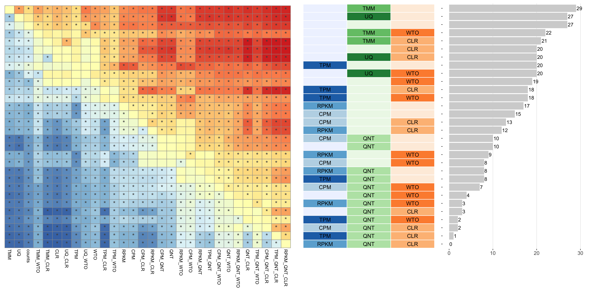
```

### Tissue-aware Standard
```{r echo=FALSE, out.width = '49%'}
knitr::include_graphics("plots/heatmap_legend.png")
```

```{r echo=FALSE, fig.cap="**Dataset-level pairwise comparison of workflow performance.** (**left**) The heatmap shows the relative performance of a pair of workflows, corresponding to a row and a column, directly compared to each other for the resampled GTEx datasets of a given sample size based on the tissue-aware gold standard. The color in each cell (row, column) represents the proportion of datasets for which the workflow along the row has a higher log2(auPRC/prior) than the workflow along the column. Comparisons that are statistically significant (corrected p < 0.01) based on a paired Wilcoxon test are marked with an asterisk. (**middle**) The workflows (rows) are described in terms of the specific method used in the within-sample normalization (blues), between-sample normalization (greens), and network transformation (oranges) stages. (**right**) The barplot shows the number of times each workflow was significantly greater than another workflow.", out.width = '100%'}
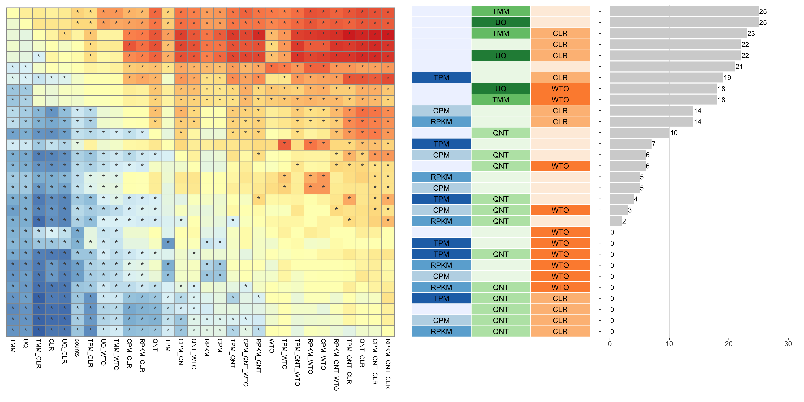
```

## 6 samples {.tabset .tabset-fade .tabset-pills}

### Tissue-naive Standard
```{r echo=FALSE, out.width = '49%'}
knitr::include_graphics("plots/heatmap_legend.png")
```

```{r echo=FALSE, fig.cap="**Dataset-level pairwise comparison of workflow performance.** (**left**) The heatmap shows the relative performance of a pair of workflows, corresponding to a row and a column, directly compared to each other for the resampled GTEx datasets of a given sample size based on the tissue-naive gold standard. The color in each cell (row, column) represents the proportion of datasets for which the workflow along the row has a higher log2(auPRC/prior) than the workflow along the column. Comparisons that are statistically significant (corrected p < 0.01) based on a paired Wilcoxon test are marked with an asterisk. (**middle**) The workflows (rows) are described in terms of the specific method used in the within-sample normalization (blues), between-sample normalization (greens), and network transformation (oranges) stages. (**right**) The barplot shows the number of times each workflow was significantly greater than another workflow.", out.width = '100%'}
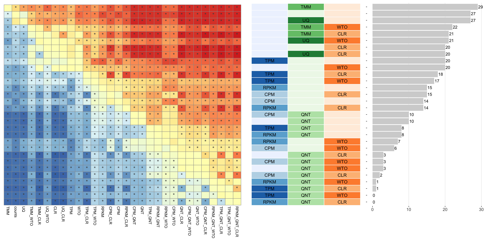
```

### Tissue-aware Standard
```{r echo=FALSE, out.width = '49%'}
knitr::include_graphics("plots/heatmap_legend.png")
```

```{r echo=FALSE, fig.cap="**Dataset-level pairwise comparison of workflow performance.** (**left**) The heatmap shows the relative performance of a pair of workflows, corresponding to a row and a column, directly compared to each other for the resampled GTEx datasets of a given sample size based on the tissue-aware gold standard. The color in each cell (row, column) represents the proportion of datasets for which the workflow along the row has a higher log2(auPRC/prior) than the workflow along the column. Comparisons that are statistically significant (corrected p < 0.01) based on a paired Wilcoxon test are marked with an asterisk. (**middle**) The workflows (rows) are described in terms of the specific method used in the within-sample normalization (blues), between-sample normalization (greens), and network transformation (oranges) stages. (**right**) The barplot shows the number of times each workflow was significantly greater than another workflow.", out.width = '100%'}
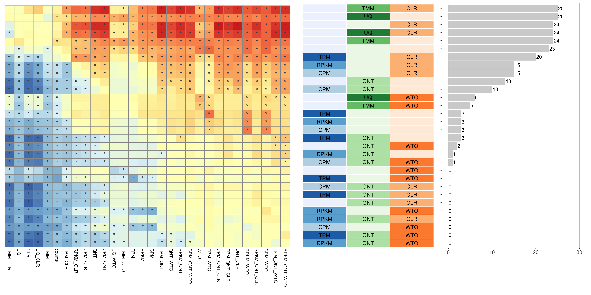
```

## 7 samples {.tabset .tabset-fade .tabset-pills}

### Tissue-naive Standard
```{r echo=FALSE, out.width = '49%'}
knitr::include_graphics("plots/heatmap_legend.png")
```

```{r echo=FALSE, fig.cap="**Dataset-level pairwise comparison of workflow performance.** (**left**) The heatmap shows the relative performance of a pair of workflows, corresponding to a row and a column, directly compared to each other for the resampled GTEx datasets of a given sample size based on the tissue-naive gold standard. The color in each cell (row, column) represents the proportion of datasets for which the workflow along the row has a higher log2(auPRC/prior) than the workflow along the column. Comparisons that are statistically significant (corrected p < 0.01) based on a paired Wilcoxon test are marked with an asterisk. (**middle**) The workflows (rows) are described in terms of the specific method used in the within-sample normalization (blues), between-sample normalization (greens), and network transformation (oranges) stages. (**right**) The barplot shows the number of times each workflow was significantly greater than another workflow.", out.width = '100%'}
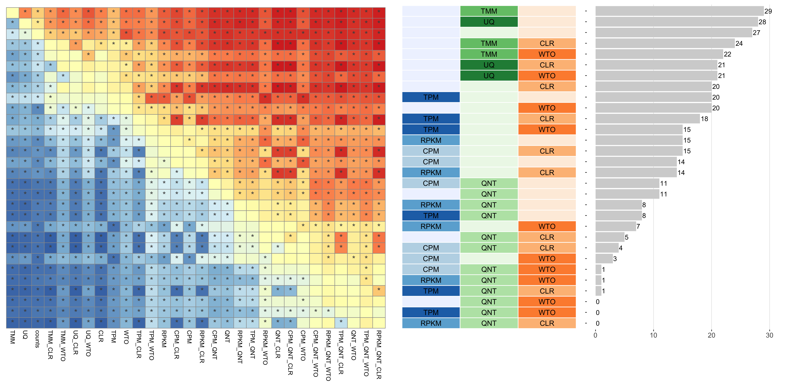
```

### Tissue-aware Standard
```{r echo=FALSE, out.width = '49%'}
knitr::include_graphics("plots/heatmap_legend.png")
```

```{r echo=FALSE, fig.cap="**Dataset-level pairwise comparison of workflow performance.** (**left**) The heatmap shows the relative performance of a pair of workflows, corresponding to a row and a column, directly compared to each other for the resampled GTEx datasets of a given sample size based on the tissue-aware gold standard. The color in each cell (row, column) represents the proportion of datasets for which the workflow along the row has a higher log2(auPRC/prior) than the workflow along the column. Comparisons that are statistically significant (corrected p < 0.01) based on a paired Wilcoxon test are marked with an asterisk. (**middle**) The workflows (rows) are described in terms of the specific method used in the within-sample normalization (blues), between-sample normalization (greens), and network transformation (oranges) stages. (**right**) The barplot shows the number of times each workflow was significantly greater than another workflow.", out.width = '100%'}
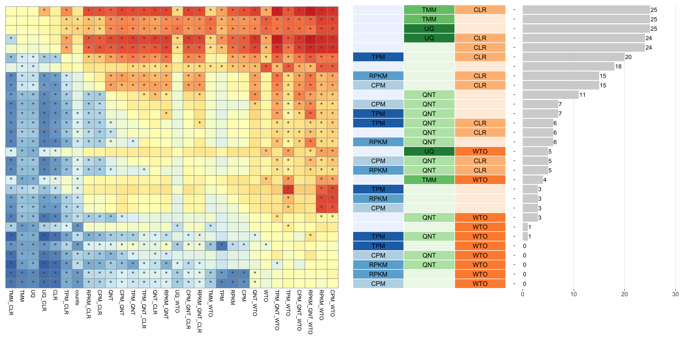
```

## 9 samples {.tabset .tabset-fade .tabset-pills}

### Tissue-naive Standard
```{r echo=FALSE, out.width = '49%'}
knitr::include_graphics("plots/heatmap_legend.png")
```

```{r echo=FALSE, fig.cap="**Dataset-level pairwise comparison of workflow performance.** (**left**) The heatmap shows the relative performance of a pair of workflows, corresponding to a row and a column, directly compared to each other for the resampled GTEx datasets of a given sample size based on the tissue-naive gold standard. The color in each cell (row, column) represents the proportion of datasets for which the workflow along the row has a higher log2(auPRC/prior) than the workflow along the column. Comparisons that are statistically significant (corrected p < 0.01) based on a paired Wilcoxon test are marked with an asterisk. (**middle**) The workflows (rows) are described in terms of the specific method used in the within-sample normalization (blues), between-sample normalization (greens), and network transformation (oranges) stages. (**right**) The barplot shows the number of times each workflow was significantly greater than another workflow.", out.width = '100%'}
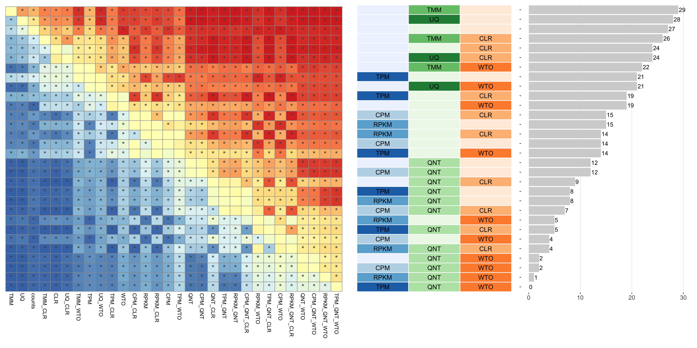
```

### Tissue-aware Standard
```{r echo=FALSE, out.width = '49%'}
knitr::include_graphics("plots/heatmap_legend.png")
```

```{r echo=FALSE, fig.cap="**Dataset-level pairwise comparison of workflow performance.** (**left**) The heatmap shows the relative performance of a pair of workflows, corresponding to a row and a column, directly compared to each other for the resampled GTEx datasets of a given sample size based on the tissue-aware gold standard. The color in each cell (row, column) represents the proportion of datasets for which the workflow along the row has a higher log2(auPRC/prior) than the workflow along the column. Comparisons that are statistically significant (corrected p < 0.01) based on a paired Wilcoxon test are marked with an asterisk. (**middle**) The workflows (rows) are described in terms of the specific method used in the within-sample normalization (blues), between-sample normalization (greens), and network transformation (oranges) stages. (**right**) The barplot shows the number of times each workflow was significantly greater than another workflow.", out.width = '100%'}
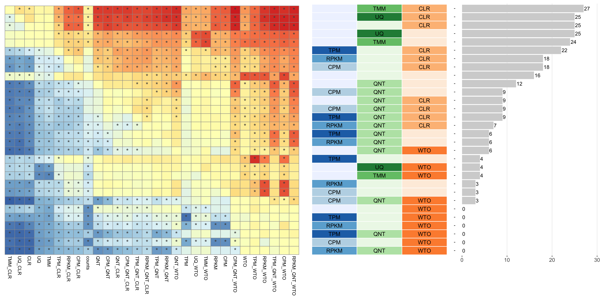
```

## 11 samples {.tabset .tabset-fade .tabset-pills}

### Tissue-naive Standard
```{r echo=FALSE, out.width = '49%'}
knitr::include_graphics("plots/heatmap_legend.png")
```

```{r echo=FALSE, fig.cap="**Dataset-level pairwise comparison of workflow performance.** (**left**) The heatmap shows the relative performance of a pair of workflows, corresponding to a row and a column, directly compared to each other for the resampled GTEx datasets of a given sample size based on the tissue-naive gold standard. The color in each cell (row, column) represents the proportion of datasets for which the workflow along the row has a higher log2(auPRC/prior) than the workflow along the column. Comparisons that are statistically significant (corrected p < 0.01) based on a paired Wilcoxon test are marked with an asterisk. (**middle**) The workflows (rows) are described in terms of the specific method used in the within-sample normalization (blues), between-sample normalization (greens), and network transformation (oranges) stages. (**right**) The barplot shows the number of times each workflow was significantly greater than another workflow.", out.width = '100%'}
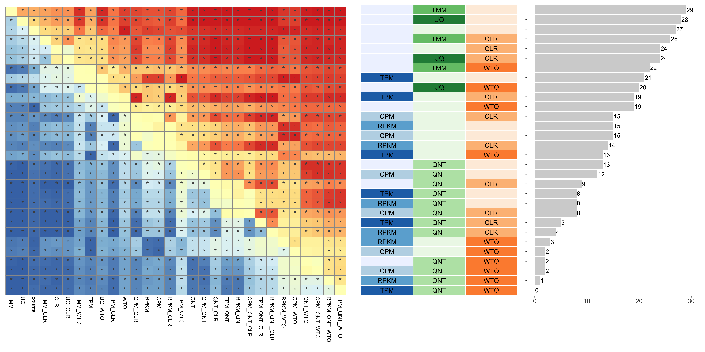
```

### Tissue-aware Standard
```{r echo=FALSE, out.width = '49%'}
knitr::include_graphics("plots/heatmap_legend.png")
```

```{r echo=FALSE, fig.cap="**Dataset-level pairwise comparison of workflow performance.** (**left**) The heatmap shows the relative performance of a pair of workflows, corresponding to a row and a column, directly compared to each other for the resampled GTEx datasets of a given sample size based on the tissue-aware gold standard. The color in each cell (row, column) represents the proportion of datasets for which the workflow along the row has a higher log2(auPRC/prior) than the workflow along the column. Comparisons that are statistically significant (corrected p < 0.01) based on a paired Wilcoxon test are marked with an asterisk. (**middle**) The workflows (rows) are described in terms of the specific method used in the within-sample normalization (blues), between-sample normalization (greens), and network transformation (oranges) stages. (**right**) The barplot shows the number of times each workflow was significantly greater than another workflow.", out.width = '100%'}
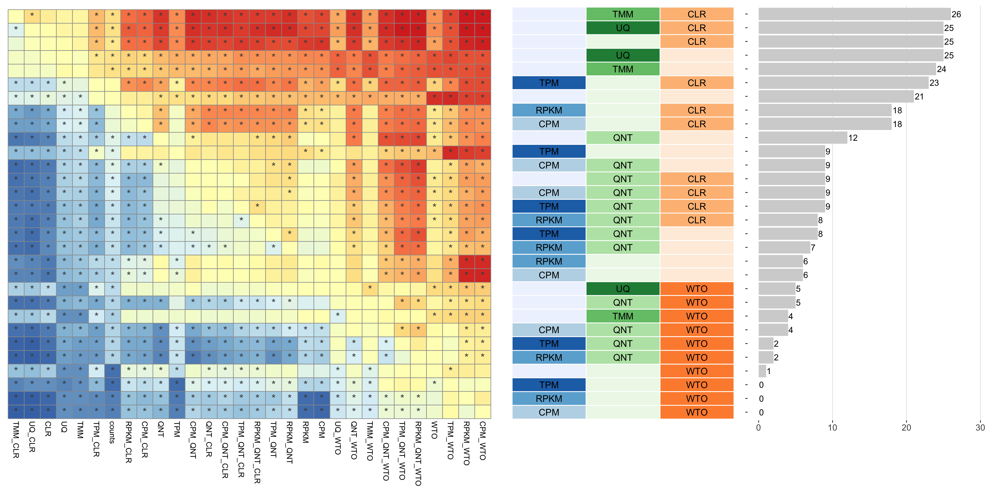
```

## 13 samples {.tabset .tabset-fade .tabset-pills}

### Tissue-naive Standard
```{r echo=FALSE, out.width = '49%'}
knitr::include_graphics("plots/heatmap_legend.png")
```

```{r echo=FALSE, fig.cap="**Dataset-level pairwise comparison of workflow performance.** (**left**) The heatmap shows the relative performance of a pair of workflows, corresponding to a row and a column, directly compared to each other for the resampled GTEx datasets of a given sample size based on the tissue-naive gold standard. The color in each cell (row, column) represents the proportion of datasets for which the workflow along the row has a higher log2(auPRC/prior) than the workflow along the column. Comparisons that are statistically significant (corrected p < 0.01) based on a paired Wilcoxon test are marked with an asterisk. (**middle**) The workflows (rows) are described in terms of the specific method used in the within-sample normalization (blues), between-sample normalization (greens), and network transformation (oranges) stages. (**right**) The barplot shows the number of times each workflow was significantly greater than another workflow.", out.width = '100%'}
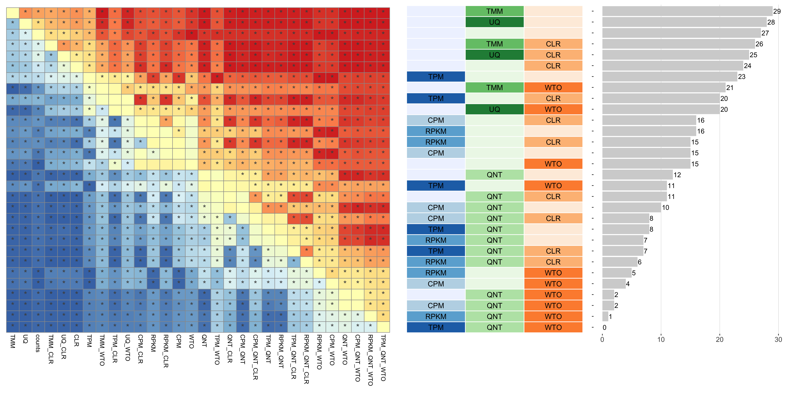
```

### Tissue-aware Standard
```{r echo=FALSE, out.width = '49%'}
knitr::include_graphics("plots/heatmap_legend.png")
```

```{r echo=FALSE, fig.cap="**Dataset-level pairwise comparison of workflow performance.** (**left**) The heatmap shows the relative performance of a pair of workflows, corresponding to a row and a column, directly compared to each other for the resampled GTEx datasets of a given sample size based on the tissue-aware gold standard. The color in each cell (row, column) represents the proportion of datasets for which the workflow along the row has a higher log2(auPRC/prior) than the workflow along the column. Comparisons that are statistically significant (corrected p < 0.01) based on a paired Wilcoxon test are marked with an asterisk. (**middle**) The workflows (rows) are described in terms of the specific method used in the within-sample normalization (blues), between-sample normalization (greens), and network transformation (oranges) stages. (**right**) The barplot shows the number of times each workflow was significantly greater than another workflow.", out.width = '100%'}
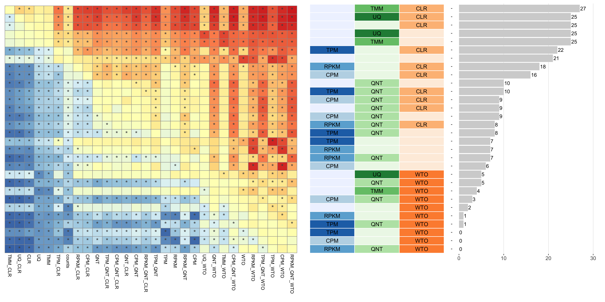
```

## 16 samples {.tabset .tabset-fade .tabset-pills}

### Tissue-naive Standard
```{r echo=FALSE, out.width = '49%'}
knitr::include_graphics("plots/heatmap_legend.png")
```

```{r echo=FALSE, fig.cap="**Dataset-level pairwise comparison of workflow performance.** (**left**) The heatmap shows the relative performance of a pair of workflows, corresponding to a row and a column, directly compared to each other for the resampled GTEx datasets of a given sample size based on the tissue-naive gold standard. The color in each cell (row, column) represents the proportion of datasets for which the workflow along the row has a higher log2(auPRC/prior) than the workflow along the column. Comparisons that are statistically significant (corrected p < 0.01) based on a paired Wilcoxon test are marked with an asterisk. (**middle**) The workflows (rows) are described in terms of the specific method used in the within-sample normalization (blues), between-sample normalization (greens), and network transformation (oranges) stages. (**right**) The barplot shows the number of times each workflow was significantly greater than another workflow.", out.width = '100%'}
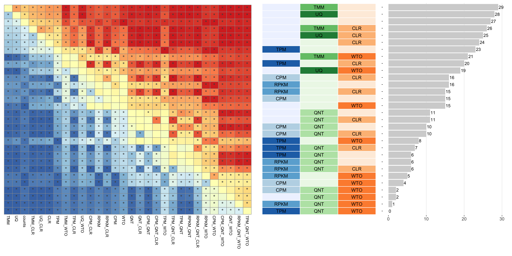
```

### Tissue-aware Standard
```{r echo=FALSE, out.width = '49%'}
knitr::include_graphics("plots/heatmap_legend.png")
```

```{r echo=FALSE, fig.cap="**Dataset-level pairwise comparison of workflow performance.** (**left**) The heatmap shows the relative performance of a pair of workflows, corresponding to a row and a column, directly compared to each other for the resampled GTEx datasets of a given sample size based on the tissue-aware gold standard. The color in each cell (row, column) represents the proportion of datasets for which the workflow along the row has a higher log2(auPRC/prior) than the workflow along the column. Comparisons that are statistically significant (corrected p < 0.01) based on a paired Wilcoxon test are marked with an asterisk. (**middle**) The workflows (rows) are described in terms of the specific method used in the within-sample normalization (blues), between-sample normalization (greens), and network transformation (oranges) stages. (**right**) The barplot shows the number of times each workflow was significantly greater than another workflow.", out.width = '100%'}
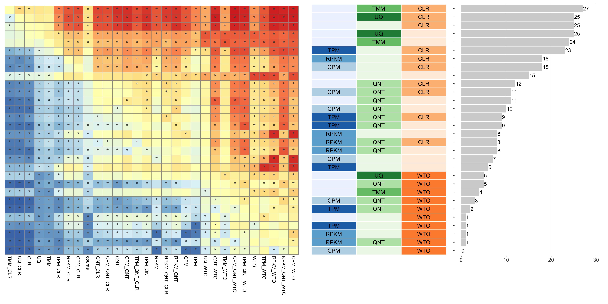
```

## 25 samples {.tabset .tabset-fade .tabset-pills}

### Tissue-naive Standard
```{r echo=FALSE, out.width = '49%'}
knitr::include_graphics("plots/heatmap_legend.png")
```

```{r echo=FALSE, fig.cap="**Dataset-level pairwise comparison of workflow performance.** (**left**) The heatmap shows the relative performance of a pair of workflows, corresponding to a row and a column, directly compared to each other for the resampled GTEx datasets of a given sample size based on the tissue-naive gold standard. The color in each cell (row, column) represents the proportion of datasets for which the workflow along the row has a higher log2(auPRC/prior) than the workflow along the column. Comparisons that are statistically significant (corrected p < 0.01) based on a paired Wilcoxon test are marked with an asterisk. (**middle**) The workflows (rows) are described in terms of the specific method used in the within-sample normalization (blues), between-sample normalization (greens), and network transformation (oranges) stages. (**right**) The barplot shows the number of times each workflow was significantly greater than another workflow.", out.width = '100%'}
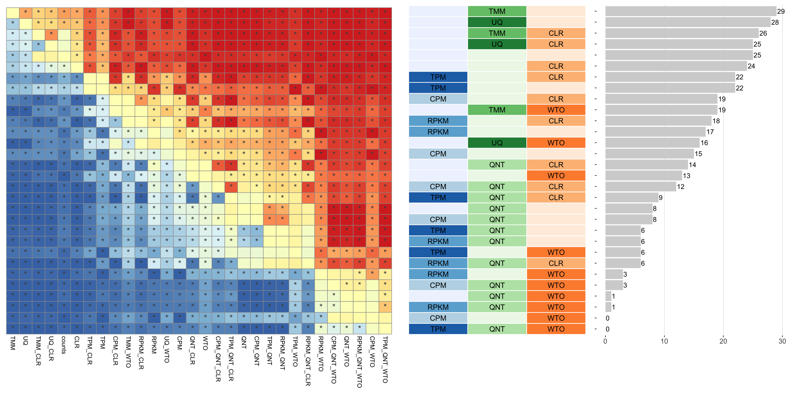
```

### Tissue-aware Standard
```{r echo=FALSE, out.width = '49%'}
knitr::include_graphics("plots/heatmap_legend.png")
```

```{r echo=FALSE, fig.cap="**Dataset-level pairwise comparison of workflow performance.** (**left**) The heatmap shows the relative performance of a pair of workflows, corresponding to a row and a column, directly compared to each other for the resampled GTEx datasets of a given sample size based on the tissue-aware gold standard. The color in each cell (row, column) represents the proportion of datasets for which the workflow along the row has a higher log2(auPRC/prior) than the workflow along the column. Comparisons that are statistically significant (corrected p < 0.01) based on a paired Wilcoxon test are marked with an asterisk. (**middle**) The workflows (rows) are described in terms of the specific method used in the within-sample normalization (blues), between-sample normalization (greens), and network transformation (oranges) stages. (**right**) The barplot shows the number of times each workflow was significantly greater than another workflow.", out.width = '100%'}
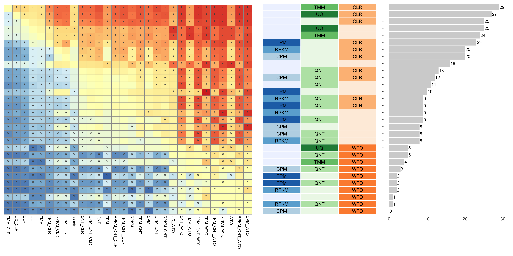
```

## 40 samples {.tabset .tabset-fade .tabset-pills}

### Tissue-naive Standard
```{r echo=FALSE, out.width = '49%'}
knitr::include_graphics("plots/heatmap_legend.png")
```

```{r echo=FALSE, fig.cap="**Dataset-level pairwise comparison of workflow performance.** (**left**) The heatmap shows the relative performance of a pair of workflows, corresponding to a row and a column, directly compared to each other for the resampled GTEx datasets of a given sample size based on the tissue-naive gold standard. The color in each cell (row, column) represents the proportion of datasets for which the workflow along the row has a higher log2(auPRC/prior) than the workflow along the column. Comparisons that are statistically significant (corrected p < 0.01) based on a paired Wilcoxon test are marked with an asterisk. (**middle**) The workflows (rows) are described in terms of the specific method used in the within-sample normalization (blues), between-sample normalization (greens), and network transformation (oranges) stages. (**right**) The barplot shows the number of times each workflow was significantly greater than another workflow.", out.width = '100%'}
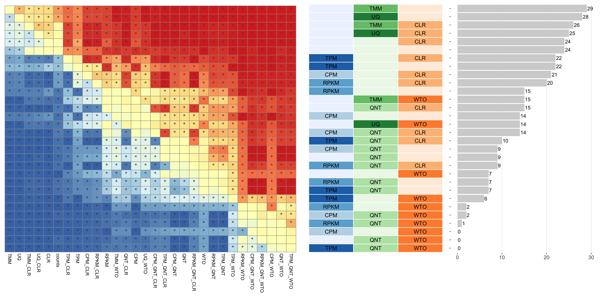
```

### Tissue-aware Standard
```{r echo=FALSE, out.width = '49%'}
knitr::include_graphics("plots/heatmap_legend.png")
```

```{r echo=FALSE, fig.cap="**Dataset-level pairwise comparison of workflow performance.** (**left**) The heatmap shows the relative performance of a pair of workflows, corresponding to a row and a column, directly compared to each other for the resampled GTEx datasets of a given sample size based on the tissue-aware gold standard. The color in each cell (row, column) represents the proportion of datasets for which the workflow along the row has a higher log2(auPRC/prior) than the workflow along the column. Comparisons that are statistically significant (corrected p < 0.01) based on a paired Wilcoxon test are marked with an asterisk. (**middle**) The workflows (rows) are described in terms of the specific method used in the within-sample normalization (blues), between-sample normalization (greens), and network transformation (oranges) stages. (**right**) The barplot shows the number of times each workflow was significantly greater than another workflow.", out.width = '100%'}
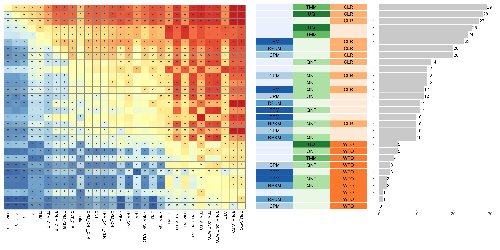
```

# Method Part Comparison {.tabset .tabset-fade .tabset-pills}
```{r include=FALSE}
cpm_methods <- c("CPM", "CPM_QNT", "CPM_CLR", "CPM_QNT_CLR", "CPM_WTO", "CPM_QNT_WTO")
rpkm_methods <- c("RPKM", "RPKM_QNT", "RPKM_CLR", "RPKM_QNT_CLR", "RPKM_WTO", "RPKM_QNT_WTO")
tpm_methods <- c("TPM", "TPM_QNT", "TPM_CLR", "TPM_QNT_CLR", "TPM_WTO", "TPM_QNT_WTO")
no_wi_methods <- c("counts", "QNT", "CLR", "QNT_CLR", "WTO", "QNT_WTO")

tmm_methods <- c("TMM", "TMM_CLR", "TMM_WTO")
uq_methods <- c("UQ", "UQ_CLR", "UQ_WTO")
quantile_methods <- c("QNT", "QNT_CLR", "QNT_WTO")
no_bw_methods <- c("counts", "CLR", "WTO")

clr_methods <- c("CLR", "CPM_CLR", "RPKM_CLR", "TPM_CLR",
                 "QNT_CLR", "TMM_CLR", "UQ_CLR",
                 "CPM_QNT_CLR", "TPM_QNT_CLR", "RPKM_QNT_CLR")
wto_methods <- c("WTO", "CPM_WTO", "RPKM_WTO", "TPM_WTO",
                 "QNT_WTO", "TMM_WTO", "UQ_WTO",
                 "CPM_QNT_WTO", "TPM_QNT_WTO", "RPKM_QNT_WTO")
no_nt_methods <- c("counts", "CPM", "TPM", "RPKM",
                   "TMM", "UQ", "QNT",
                   "CPM_QNT", "TPM_QNT", "RPKM_QNT")

all_within_methods <- c(cpm_methods, tpm_methods, rpkm_methods, no_wi_methods)
all_between_methods <- c(tmm_methods, uq_methods, quantile_methods, no_bw_methods)
all_network_methods <- c(clr_methods, wto_methods, no_nt_methods)
```

```{r include=FALSE}
#functions to build plots
get_times_greater_than_matrix <- function(meth_df){
  #df should be methods_* df (each row is performance on given dataset)
  counts_output <- matrix(rep(0, 900), nrow = 30, ncol = 30)
  colnames(counts_output) <- colnames(meth_df)
  rownames(counts_output) <- colnames(meth_df)
  
  for(num in 1:30){
  a <- pull(meth_df, num)
  for(val in 1:30){
    if (num == val){
      counts_output[val, num] <- 0.5
      next
    }
    b <- pull(meth_df, val)
    s <- sum(a < b)
    s <- s/nrow(meth_df)
    counts_output[val, num] <- s
  }
  }
  return(counts_output)
}

get_significance_matrix <- function(df, performance_col_position, method_col_position){
  #df tidy format with method as a column and performance as a column
  sig_output <- pairwise.wilcox.test(x = pull(df, performance_col_position),
                                     g = pull(df, method_col_position),
                                     paired = TRUE,
                                     p.adjust.method = "BH")$p.value
  
  #add row/col to make 30 by 30
  CLR <- sig_output[1,]
  CLR[1] <- NA
  sig_output <- rbind(CLR, sig_output)
  WTO <- sig_output[,29]
  WTO[30] <- NA
  sig_output <- cbind(sig_output, WTO)
  
  #make symmetric
  diag(sig_output) <- 1
  sig_output <- Matrix::forceSymmetric(sig_output, uplo = "L")
  sig_output <- as.matrix(sig_output)
  #replace p vals with sig/not sig
  sig_wilcox_gtex_naive <- ifelse(sig_output < 0.01, "*", " ")
}

get_method_part_prop_sig_greater <- function(times_matrix, sig_matrix){
  #times_matrix is output of get_times_greater_than_matrix
  #sig_matrix is output of get_significance_matrix
  #make times_matrix into tibble and get times method_one > method_two
  times_greater_than_tibble <- as_tibble(times_matrix)
  times_greater_than_tibble$method_one <- colnames(times_matrix)
  times_greater_than_tibble <- times_greater_than_tibble %>% 
    gather(key = method_two, value = times_method_one_is_greater_than_method_two, 1:30)
  #make sig_matrix into tibble and get times corrected wilcox p value was
  #significant between method_one and method_two
  sig_wilcox_tibble <-  as_tibble(sig_matrix)
  sig_wilcox_tibble$method_one <- colnames(sig_matrix)
  sig_wilcox_tibble <- sig_wilcox_tibble %>%
    gather(key = method_two, value = significance, 1:30)
  sig_wilcox_tibble$significance <- ifelse(sig_wilcox_tibble$significance == "*",
                                           T, F)
  
  #join above two tibbles into one
  greater_than_significance_tibble <- left_join(times_greater_than_tibble,
                                                sig_wilcox_tibble,
                                                by = c("method_one", "method_two"))
  #make T/F column designating whether method_one > method_two AND significant by 
  #corrected wilcox p value
  greater_than_significance_tibble$method_one_greater_than_and_sig <-
    ifelse(greater_than_significance_tibble$times_method_one_is_greater_than_method_two > 0.5 &
       greater_than_significance_tibble$significance == T, T, F)
  
  
  analysis_groups <- c("within", "between", "network")
  
  method_summary <- tibble(group = "group", times_sig_and_greater = 22, prop_times_sig_and_greater = 0.56)
  
  for (ag in analysis_groups){
    if (ag == "within"){
      restricted_methods <- c("TMM", "UQ", "TMM_CLR", "UQ_CLR", "TMM_WTO", "UQ_WTO")
      ag_methods <- all_within_methods
    }
    if (ag == "between"){
      restricted_methods <-  c("CPM_QNT", "TPM_QNT", "RPKM_QNT", "CPM_QNT_CLR", "TPM_QNT_CLR", "RPKM_QNT_CLR", "CPM_QNT_WTO", "TPM_QNT_WTO", "RPKM_QNT_WTO")
      ag_methods <- all_between_methods
    }
    if (ag == "network"){
      restricted_methods <- "none"
      ag_methods <- all_network_methods
    }
    
    #summarize above info by method
    ag_method_summary <- greater_than_significance_tibble %>%
      filter(method_one %in% ag_methods) %>% 
      filter(!method_two %in% restricted_methods) %>%
      group_by(method_one) %>% 
      summarise(times_sig_and_greater = sum(method_one_greater_than_and_sig))
    #change col name from method_one to method
    colnames(ag_method_summary) <- c("method", "times_sig_and_greater")
    
    if (ag == "within"){
      #create T/F columns for each method part (does a method have the given method part?)
      #wi
      ag_method_summary$cpm <- ag_method_summary$method %in% cpm_methods
      ag_method_summary$tpm <- ag_method_summary$method %in% tpm_methods
      ag_method_summary$rpkm <- ag_method_summary$method %in% rpkm_methods
      ag_method_summary$no_wi <- ag_method_summary$method %in% no_wi_methods
      
      #gather T/F method columns into method column/one T/F column
      #keep only true rows so group col reflects methods actually in group
      #don't need membership col anymore (all TRUEs anyway)
      #group by group (method part)
      #sum times sig and greater for each method in method part group
      ag_method_summary <- ag_method_summary %>% 
        gather(3:6, key = group, value = membership) %>% 
        filter(membership == T) %>% 
        select(-membership) %>% 
        group_by(group) %>% 
        summarise(times_sig_and_greater = sum(times_sig_and_greater))
      
      divisor <- 6*23 #6 methods in groups, 6 methods left out of analysis and 29-6=23 
    }
    if (ag == "between"){
      #create T/F columns for each method part (does a method have the given method part?)
      #bw
      ag_method_summary$tmm <- ag_method_summary$method %in% tmm_methods
      ag_method_summary$uq <- ag_method_summary$method %in% uq_methods
      ag_method_summary$qnt <- ag_method_summary$method %in% quantile_methods
      ag_method_summary$no_bw <- ag_method_summary$method %in% no_bw_methods
      
      #gather T/F method columns into method column/one T/F column
      #keep only true rows so group col reflects methods actually in group
      #don't need membership col anymore (all TRUEs anyway)
      #group by group (method part)
      #sum times sig and greater for each method in method part group
      ag_method_summary <- ag_method_summary %>% 
        gather(3:6, key = group, value = membership) %>% 
        filter(membership == T) %>% 
        select(-membership) %>% 
        group_by(group) %>% 
        summarise(times_sig_and_greater = sum(times_sig_and_greater))
    
      divisor <- 3*20 #3 methods in groups, 9 methods left out of analysis and 29-9=20
    }
    if (ag == "network"){
      #create T/F columns for each method part (does a method have the given method part?)
      #nt
      ag_method_summary$wto <- ag_method_summary$method %in% wto_methods
      ag_method_summary$clr <- ag_method_summary$method %in% clr_methods
      ag_method_summary$no_nt <- ag_method_summary$method %in% no_nt_methods
      
      #gather T/F method columns into method column/one T/F column
      #keep only true rows so group col reflects methods actually in group
      #don't need membership col anymore (all TRUEs anyway)
      #group by group (method part)
      #sum times sig and greater for each method in method part group
      ag_method_summary <- ag_method_summary %>% 
        gather(3:5, key = group, value = membership) %>% 
        filter(membership == T) %>% 
        select(-membership) %>% 
        group_by(group) %>% 
        summarise(times_sig_and_greater = sum(times_sig_and_greater))
    
      divisor <- 10*29 #10 methods in groups, 0 methods left out of analysis and 29-0=29
    }
    
    #divide number of times sig and greater by number of chances they had (determined by group length)
    ag_method_summary <- ag_method_summary %>%
      mutate(prop_times_sig_and_greater = times_sig_and_greater/divisor)
    
    #add to method_summary
    method_summary <- bind_rows(method_summary, ag_method_summary)
  }

  #remove top row
  method_summary <- method_summary[-1,]
  #gives better names for plot
  method_summary$group <- toupper(method_summary$group)
  method_summary$group <- gsub("NO_BW", "NO-BW", method_summary$group)
  method_summary$group <- gsub("NO_WI", "NO-WI", method_summary$group)
  method_summary$group <- gsub("NO_NT", "NO-NT", method_summary$group)
  
  return(method_summary)
}
```

## 5 samples {.tabset .tabset-fade .tabset-pills}
```{r include=FALSE}
#naive plot matrices
naive_5_df <- rnr %>% filter(sample_num == 5)
gtex_5_naive_methods <- naive_5_df %>% 
  select(project, tissue, method, trial, log2_auprc_over_prior) %>% 
  spread(key = method, value = log2_auprc_over_prior) %>% 
  select(-project, -tissue, -trial)
gtex_5_naive_times_mat <- get_times_greater_than_matrix(gtex_5_naive_methods)
gtex_5_naive_sig_mat <- get_significance_matrix(naive_5_df, method_col_position = 3, performance_col_position = 6)
gtex_5_naive_method_part_summary <- get_method_part_prop_sig_greater(times_matrix = gtex_5_naive_times_mat,
                                                                                  sig_matrix = gtex_5_naive_sig_mat)

#knowledge plot matrices
knowledge_5_df <- rkr %>% filter(sample_num == 5)
gtex_5_knowledge_methods <- knowledge_5_df %>% 
  select(project, tissue, method, trial, log2_auprc_over_prior) %>% 
  spread(key = method, value = log2_auprc_over_prior) %>% 
  select(-project, -tissue, -trial)
gtex_5_knowledge_times_mat <- get_times_greater_than_matrix(gtex_5_knowledge_methods)
gtex_5_knowledge_sig_mat <- get_significance_matrix(knowledge_5_df, method_col_position = 3, performance_col_position = 6)
gtex_5_knowledge_method_part_summary <- get_method_part_prop_sig_greater(gtex_5_knowledge_times_mat,
                                                                                  gtex_5_knowledge_sig_mat)
```

### Tissue-naive Standard
```{r echo=FALSE, fig.cap="**Impact of individual methods on performance of workflows.** Each bar in the barplot corresponds to a specific method, showing the proportion of times (x-axis) that workflows including that particular method (y-axis) were significantly better than other workflows. In order to make the comparison of between-sample normalization methods fair, workflows also including CPM, RPKM, or TPM were left out because it is not possible to pair them with TMM or UQ normalization. Similarly, TMM and UQ methods are not included for “no within-sample normalization” (NO–WI).", out.width="100%"}
#naive plot
gtex_5_naive_method_part_summary %>% 
  ggplot(aes(x = group, y = prop_times_sig_and_greater, fill = group)) +
  geom_hline(yintercept = 0.25, color = "#999999", size = 0.1) +
  geom_hline(yintercept = 0.5, color = "#999999", size = 0.1) +
  geom_hline(yintercept = 0.75, color = "#999999", size = 0.1) +
  geom_hline(yintercept = 1, color = "#999999", size = 0.1) +
  geom_col() +
  annotation_custom(grob = textGrob(label = "text", hjust = 0, gp = gpar(cex = 1.5)),
                    ymin = 3.5, ymax = 4, xmin = 3, xmax = 5) +
  scale_x_discrete(limits = c("WTO", "CLR", "NO-NT",
                              "UQ", "TMM", "QNT","NO-BW",
                              "TPM", "RPKM", "CPM", "NO-WI")) +
  scale_fill_manual(values = c("WTO" = "#fd8d3c", "CLR" = "#fdbe85", "NO-NT" = "#feedde",
                              "QNT" = "#bae4b3", "UQ" = "#238b45", "TMM" = "#74c476", "NO-BW" = "#edf8e9",
                              "TPM" = "#2171b5", "RPKM" = "#6baed6", "CPM" = "#bdd7e7", "NO-WI" = "#eff3ff")) +
  geom_text(aes(label = round(prop_times_sig_and_greater, 2)), hjust = -0.1, color = "#999999", fontface = "bold") +
  scale_y_continuous(limits = c(0,1)) +
  coord_flip(clip = "off") +
  theme(panel.background = element_rect(fill = "white"), 
        panel.grid.minor = element_blank(), 
        panel.grid.major = element_blank(),
        text = element_text(size = 14),
        axis.title = element_blank()) +
  guides(fill = F) 
```

### Tissue-aware Standard
```{r echo=FALSE, fig.cap="**Impact of individual methods on performance of workflows.** Each bar in the barplot corresponds to a specific method, showing the proportion of times (x-axis) that workflows including that particular method (y-axis) were significantly better than other workflows. In order to make the comparison of between-sample normalization methods fair, workflows also including CPM, RPKM, or TPM were left out because it is not possible to pair them with TMM or UQ normalization. Similarly, TMM and UQ methods are not included for “no within-sample normalization” (NO–WI).", out.width="100%"}
#knowledge plot
gtex_5_knowledge_method_part_summary %>% 
  ggplot(aes(x = group, y = prop_times_sig_and_greater, fill = group)) +
  geom_hline(yintercept = 0.25, color = "#999999", size = 0.1) +
  geom_hline(yintercept = 0.5, color = "#999999", size = 0.1) +
  geom_hline(yintercept = 0.75, color = "#999999", size = 0.1) +
  geom_hline(yintercept = 1, color = "#999999", size = 0.1) +
  geom_col() +
  annotation_custom(grob = textGrob(label = "text", hjust = 0, gp = gpar(cex = 1.5)),
                    ymin = 3.5, ymax = 4, xmin = 3, xmax = 5) +
  scale_x_discrete(limits = c("WTO", "CLR", "NO-NT",
                              "UQ", "TMM", "QNT","NO-BW",
                              "TPM", "RPKM", "CPM", "NO-WI")) +
  scale_fill_manual(values = c("WTO" = "#fd8d3c", "CLR" = "#fdbe85", "NO-NT" = "#feedde",
                              "QNT" = "#bae4b3", "UQ" = "#238b45", "TMM" = "#74c476", "NO-BW" = "#edf8e9",
                              "TPM" = "#2171b5", "RPKM" = "#6baed6", "CPM" = "#bdd7e7", "NO-WI" = "#eff3ff")) +
  geom_text(aes(label = round(prop_times_sig_and_greater, 2)), hjust = -0.1, color = "#999999", fontface = "bold") +
  scale_y_continuous(limits = c(0,1)) +
  coord_flip(clip = "off") +
  theme(panel.background = element_rect(fill = "white"), 
        panel.grid.minor = element_blank(), 
        panel.grid.major = element_blank(),
        text = element_text(size = 14),
        axis.title = element_blank()) +
  guides(fill = F) 
```

## 6 samples {.tabset .tabset-fade .tabset-pills}
```{r include=FALSE}
#naive plot matrices
naive_6_df <- rnr %>% filter(sample_num == 6)
gtex_6_naive_methods <- naive_6_df %>% 
  select(project, tissue, method, trial, log2_auprc_over_prior) %>% 
  spread(key = method, value = log2_auprc_over_prior) %>% 
  select(-project, -tissue, -trial)
gtex_6_naive_times_mat <- get_times_greater_than_matrix(gtex_6_naive_methods)
gtex_6_naive_sig_mat <- get_significance_matrix(naive_6_df, method_col_position = 3, performance_col_position = 6)
gtex_6_naive_method_part_summary <- get_method_part_prop_sig_greater(times_matrix = gtex_6_naive_times_mat,
                                                                     sig_matrix = gtex_6_naive_sig_mat)

#knowledge plot matrices
knowledge_6_df <- rkr %>% filter(sample_num == 6)
gtex_6_knowledge_methods <- knowledge_6_df %>% 
  select(project, tissue, method, trial, log2_auprc_over_prior) %>% 
  spread(key = method, value = log2_auprc_over_prior) %>% 
  select(-project, -tissue, -trial)
gtex_6_knowledge_times_mat <- get_times_greater_than_matrix(gtex_6_knowledge_methods)
gtex_6_knowledge_sig_mat <- get_significance_matrix(knowledge_6_df, method_col_position = 3, performance_col_position = 6)
gtex_6_knowledge_method_part_summary <- get_method_part_prop_sig_greater(gtex_6_knowledge_times_mat,
                                                                         gtex_6_knowledge_sig_mat)
```

### Tissue-naive Standard
```{r echo=FALSE, fig.cap="**Impact of individual methods on performance of workflows.** Each bar in the barplot corresponds to a specific method, showing the proportion of times (x-axis) that workflows including that particular method (y-axis) were significantly better than other workflows. In order to make the comparison of between-sample normalization methods fair, workflows also including CPM, RPKM, or TPM were left out because it is not possible to pair them with TMM or UQ normalization. Similarly, TMM and UQ methods are not included for “no within-sample normalization” (NO–WI).", out.width="100%"}
#naive plot
gtex_6_naive_method_part_summary %>% 
  ggplot(aes(x = group, y = prop_times_sig_and_greater, fill = group)) +
  geom_hline(yintercept = 0.25, color = "#999999", size = 0.1) +
  geom_hline(yintercept = 0.5, color = "#999999", size = 0.1) +
  geom_hline(yintercept = 0.75, color = "#999999", size = 0.1) +
  geom_hline(yintercept = 1, color = "#999999", size = 0.1) +
  geom_col() +
  annotation_custom(grob = textGrob(label = "text", hjust = 0, gp = gpar(cex = 1.5)),
                    ymin = 3.5, ymax = 4, xmin = 3, xmax = 5) +
  scale_x_discrete(limits = c("WTO", "CLR", "NO-NT",
                              "UQ", "TMM", "QNT","NO-BW",
                              "TPM", "RPKM", "CPM", "NO-WI")) +
  scale_fill_manual(values = c("WTO" = "#fd8d3c", "CLR" = "#fdbe85", "NO-NT" = "#feedde",
                               "QNT" = "#bae4b3", "UQ" = "#238b45", "TMM" = "#74c476", "NO-BW" = "#edf8e9",
                               "TPM" = "#2171b5", "RPKM" = "#6baed6", "CPM" = "#bdd7e7", "NO-WI" = "#eff3ff")) +
  geom_text(aes(label = round(prop_times_sig_and_greater, 2)), hjust = -0.1, color = "#999999", fontface = "bold") +
  scale_y_continuous(limits = c(0,1)) +
  coord_flip(clip = "off") +
  theme(panel.background = element_rect(fill = "white"), 
        panel.grid.minor = element_blank(), 
        panel.grid.major = element_blank(),
        text = element_text(size = 14),
        axis.title = element_blank()) +
  guides(fill = F) 
```

### Tissue-aware Standard
```{r echo=FALSE, fig.cap="**Impact of individual methods on performance of workflows.** Each bar in the barplot corresponds to a specific method, showing the proportion of times (x-axis) that workflows including that particular method (y-axis) were significantly better than other workflows. In order to make the comparison of between-sample normalization methods fair, workflows also including CPM, RPKM, or TPM were left out because it is not possible to pair them with TMM or UQ normalization. Similarly, TMM and UQ methods are not included for “no within-sample normalization” (NO–WI).", out.width="100%"}
#knowledge plot
gtex_6_knowledge_method_part_summary %>% 
  ggplot(aes(x = group, y = prop_times_sig_and_greater, fill = group)) +
  geom_hline(yintercept = 0.25, color = "#999999", size = 0.1) +
  geom_hline(yintercept = 0.5, color = "#999999", size = 0.1) +
  geom_hline(yintercept = 0.75, color = "#999999", size = 0.1) +
  geom_hline(yintercept = 1, color = "#999999", size = 0.1) +
  geom_col() +
  annotation_custom(grob = textGrob(label = "text", hjust = 0, gp = gpar(cex = 1.5)),
                    ymin = 3.5, ymax = 4, xmin = 3, xmax = 5) +
  scale_x_discrete(limits = c("WTO", "CLR", "NO-NT",
                              "UQ", "TMM", "QNT","NO-BW",
                              "TPM", "RPKM", "CPM", "NO-WI")) +
  scale_fill_manual(values = c("WTO" = "#fd8d3c", "CLR" = "#fdbe85", "NO-NT" = "#feedde",
                               "QNT" = "#bae4b3", "UQ" = "#238b45", "TMM" = "#74c476", "NO-BW" = "#edf8e9",
                               "TPM" = "#2171b5", "RPKM" = "#6baed6", "CPM" = "#bdd7e7", "NO-WI" = "#eff3ff")) +
  geom_text(aes(label = round(prop_times_sig_and_greater, 2)), hjust = -0.1, color = "#999999", fontface = "bold") +
  scale_y_continuous(limits = c(0,1)) +
  coord_flip(clip = "off") +
  theme(panel.background = element_rect(fill = "white"), 
        panel.grid.minor = element_blank(), 
        panel.grid.major = element_blank(),
        text = element_text(size = 14),
        axis.title = element_blank()) +
  guides(fill = F) 
```

## 7 samples {.tabset .tabset-fade .tabset-pills}
```{r include=FALSE}
#naive plot matrices
naive_7_df <- rnr %>% filter(sample_num == 7)
gtex_7_naive_methods <- naive_7_df %>% 
  select(project, tissue, method, trial, log2_auprc_over_prior) %>% 
  spread(key = method, value = log2_auprc_over_prior) %>% 
  select(-project, -tissue, -trial)
gtex_7_naive_times_mat <- get_times_greater_than_matrix(gtex_7_naive_methods)
gtex_7_naive_sig_mat <- get_significance_matrix(naive_7_df, method_col_position = 3, performance_col_position = 6)
gtex_7_naive_method_part_summary <- get_method_part_prop_sig_greater(times_matrix = gtex_7_naive_times_mat,
                                                                     sig_matrix = gtex_7_naive_sig_mat)

#knowledge plot matrices
knowledge_7_df <- rkr %>% filter(sample_num == 7)
gtex_7_knowledge_methods <- knowledge_7_df %>% 
  select(project, tissue, method, trial, log2_auprc_over_prior) %>% 
  spread(key = method, value = log2_auprc_over_prior) %>% 
  select(-project, -tissue, -trial)
gtex_7_knowledge_times_mat <- get_times_greater_than_matrix(gtex_7_knowledge_methods)
gtex_7_knowledge_sig_mat <- get_significance_matrix(knowledge_7_df, method_col_position = 3, performance_col_position = 6)
gtex_7_knowledge_method_part_summary <- get_method_part_prop_sig_greater(gtex_7_knowledge_times_mat,
                                                                         gtex_7_knowledge_sig_mat)
```

### Tissue-naive Standard
```{r echo=FALSE, fig.cap="**Impact of individual methods on performance of workflows.** Each bar in the barplot corresponds to a specific method, showing the proportion of times (x-axis) that workflows including that particular method (y-axis) were significantly better than other workflows. In order to make the comparison of between-sample normalization methods fair, workflows also including CPM, RPKM, or TPM were left out because it is not possible to pair them with TMM or UQ normalization. Similarly, TMM and UQ methods are not included for “no within-sample normalization” (NO–WI).", out.width="100%"}
#naive plot
gtex_7_naive_method_part_summary %>% 
  ggplot(aes(x = group, y = prop_times_sig_and_greater, fill = group)) +
  geom_hline(yintercept = 0.25, color = "#999999", size = 0.1) +
  geom_hline(yintercept = 0.5, color = "#999999", size = 0.1) +
  geom_hline(yintercept = 0.75, color = "#999999", size = 0.1) +
  geom_hline(yintercept = 1, color = "#999999", size = 0.1) +
  geom_col() +
  annotation_custom(grob = textGrob(label = "text", hjust = 0, gp = gpar(cex = 1.5)),
                    ymin = 3.5, ymax = 4, xmin = 3, xmax = 5) +
  scale_x_discrete(limits = c("WTO", "CLR", "NO-NT",
                              "UQ", "TMM", "QNT","NO-BW",
                              "TPM", "RPKM", "CPM", "NO-WI")) +
  scale_fill_manual(values = c("WTO" = "#fd8d3c", "CLR" = "#fdbe85", "NO-NT" = "#feedde",
                               "QNT" = "#bae4b3", "UQ" = "#238b45", "TMM" = "#74c476", "NO-BW" = "#edf8e9",
                               "TPM" = "#2171b5", "RPKM" = "#6baed6", "CPM" = "#bdd7e7", "NO-WI" = "#eff3ff")) +
  geom_text(aes(label = round(prop_times_sig_and_greater, 2)), hjust = -0.1, color = "#999999", fontface = "bold") +
  scale_y_continuous(limits = c(0,1)) +
  coord_flip(clip = "off") +
  theme(panel.background = element_rect(fill = "white"), 
        panel.grid.minor = element_blank(), 
        panel.grid.major = element_blank(),
        text = element_text(size = 14),
        axis.title = element_blank()) +
  guides(fill = F) 
```

### Tissue-aware Standard
```{r echo=FALSE, fig.cap="**Impact of individual methods on performance of workflows.** Each bar in the barplot corresponds to a specific method, showing the proportion of times (x-axis) that workflows including that particular method (y-axis) were significantly better than other workflows. In order to make the comparison of between-sample normalization methods fair, workflows also including CPM, RPKM, or TPM were left out because it is not possible to pair them with TMM or UQ normalization. Similarly, TMM and UQ methods are not included for “no within-sample normalization” (NO–WI).", out.width="100%"}
#knowledge plot
gtex_7_knowledge_method_part_summary %>% 
  ggplot(aes(x = group, y = prop_times_sig_and_greater, fill = group)) +
  geom_hline(yintercept = 0.25, color = "#999999", size = 0.1) +
  geom_hline(yintercept = 0.5, color = "#999999", size = 0.1) +
  geom_hline(yintercept = 0.75, color = "#999999", size = 0.1) +
  geom_hline(yintercept = 1, color = "#999999", size = 0.1) +
  geom_col() +
  annotation_custom(grob = textGrob(label = "text", hjust = 0, gp = gpar(cex = 1.5)),
                    ymin = 3.5, ymax = 4, xmin = 3, xmax = 5) +
  scale_x_discrete(limits = c("WTO", "CLR", "NO-NT",
                              "UQ", "TMM", "QNT","NO-BW",
                              "TPM", "RPKM", "CPM", "NO-WI")) +
  scale_fill_manual(values = c("WTO" = "#fd8d3c", "CLR" = "#fdbe85", "NO-NT" = "#feedde",
                               "QNT" = "#bae4b3", "UQ" = "#238b45", "TMM" = "#74c476", "NO-BW" = "#edf8e9",
                               "TPM" = "#2171b5", "RPKM" = "#6baed6", "CPM" = "#bdd7e7", "NO-WI" = "#eff3ff")) +
  geom_text(aes(label = round(prop_times_sig_and_greater, 2)), hjust = -0.1, color = "#999999", fontface = "bold") +
  scale_y_continuous(limits = c(0,1)) +
  coord_flip(clip = "off") +
  theme(panel.background = element_rect(fill = "white"), 
        panel.grid.minor = element_blank(), 
        panel.grid.major = element_blank(),
        text = element_text(size = 14),
        axis.title = element_blank()) +
  guides(fill = F) 
```

## 9 samples {.tabset .tabset-fade .tabset-pills}
```{r include=FALSE}
#naive plot matrices
naive_9_df <- rnr %>% filter(sample_num == 9)
gtex_9_naive_methods <- naive_9_df %>% 
  select(project, tissue, method, trial, log2_auprc_over_prior) %>% 
  spread(key = method, value = log2_auprc_over_prior) %>% 
  select(-project, -tissue, -trial)
gtex_9_naive_times_mat <- get_times_greater_than_matrix(gtex_9_naive_methods)
gtex_9_naive_sig_mat <- get_significance_matrix(naive_9_df, method_col_position = 3, performance_col_position = 6)
gtex_9_naive_method_part_summary <- get_method_part_prop_sig_greater(times_matrix = gtex_9_naive_times_mat,
                                                                     sig_matrix = gtex_9_naive_sig_mat)

#knowledge plot matrices
knowledge_9_df <- rkr %>% filter(sample_num == 9)
gtex_9_knowledge_methods <- knowledge_9_df %>% 
  select(project, tissue, method, trial, log2_auprc_over_prior) %>% 
  spread(key = method, value = log2_auprc_over_prior) %>% 
  select(-project, -tissue, -trial)
gtex_9_knowledge_times_mat <- get_times_greater_than_matrix(gtex_9_knowledge_methods)
gtex_9_knowledge_sig_mat <- get_significance_matrix(knowledge_9_df, method_col_position = 3, performance_col_position = 6)
gtex_9_knowledge_method_part_summary <- get_method_part_prop_sig_greater(gtex_9_knowledge_times_mat,
                                                                         gtex_9_knowledge_sig_mat)
```

### Tissue-naive Standard
```{r echo=FALSE, fig.cap="**Impact of individual methods on performance of workflows.** Each bar in the barplot corresponds to a specific method, showing the proportion of times (x-axis) that workflows including that particular method (y-axis) were significantly better than other workflows. In order to make the comparison of between-sample normalization methods fair, workflows also including CPM, RPKM, or TPM were left out because it is not possible to pair them with TMM or UQ normalization. Similarly, TMM and UQ methods are not included for “no within-sample normalization” (NO–WI).", out.width="100%"}
#naive plot
gtex_9_naive_method_part_summary %>% 
  ggplot(aes(x = group, y = prop_times_sig_and_greater, fill = group)) +
  geom_hline(yintercept = 0.25, color = "#999999", size = 0.1) +
  geom_hline(yintercept = 0.5, color = "#999999", size = 0.1) +
  geom_hline(yintercept = 0.75, color = "#999999", size = 0.1) +
  geom_hline(yintercept = 1, color = "#999999", size = 0.1) +
  geom_col() +
  annotation_custom(grob = textGrob(label = "text", hjust = 0, gp = gpar(cex = 1.5)),
                    ymin = 3.5, ymax = 4, xmin = 3, xmax = 5) +
  scale_x_discrete(limits = c("WTO", "CLR", "NO-NT",
                              "UQ", "TMM", "QNT","NO-BW",
                              "TPM", "RPKM", "CPM", "NO-WI")) +
  scale_fill_manual(values = c("WTO" = "#fd8d3c", "CLR" = "#fdbe85", "NO-NT" = "#feedde",
                               "QNT" = "#bae4b3", "UQ" = "#238b45", "TMM" = "#74c476", "NO-BW" = "#edf8e9",
                               "TPM" = "#2171b5", "RPKM" = "#6baed6", "CPM" = "#bdd7e7", "NO-WI" = "#eff3ff")) +
  geom_text(aes(label = round(prop_times_sig_and_greater, 2)), hjust = -0.1, color = "#999999", fontface = "bold") +
  scale_y_continuous(limits = c(0,1)) +
  coord_flip(clip = "off") +
  theme(panel.background = element_rect(fill = "white"), 
        panel.grid.minor = element_blank(), 
        panel.grid.major = element_blank(),
        text = element_text(size = 14),
        axis.title = element_blank()) +
  guides(fill = F) 
```

### Tissue-aware Standard
```{r echo=FALSE, fig.cap="**Impact of individual methods on performance of workflows.** Each bar in the barplot corresponds to a specific method, showing the proportion of times (x-axis) that workflows including that particular method (y-axis) were significantly better than other workflows. In order to make the comparison of between-sample normalization methods fair, workflows also including CPM, RPKM, or TPM were left out because it is not possible to pair them with TMM or UQ normalization. Similarly, TMM and UQ methods are not included for “no within-sample normalization” (NO–WI).", out.width="100%"}
#knowledge plot
gtex_9_knowledge_method_part_summary %>% 
  ggplot(aes(x = group, y = prop_times_sig_and_greater, fill = group)) +
  geom_hline(yintercept = 0.25, color = "#999999", size = 0.1) +
  geom_hline(yintercept = 0.5, color = "#999999", size = 0.1) +
  geom_hline(yintercept = 0.75, color = "#999999", size = 0.1) +
  geom_hline(yintercept = 1, color = "#999999", size = 0.1) +
  geom_col() +
  annotation_custom(grob = textGrob(label = "text", hjust = 0, gp = gpar(cex = 1.5)),
                    ymin = 3.5, ymax = 4, xmin = 3, xmax = 5) +
  scale_x_discrete(limits = c("WTO", "CLR", "NO-NT",
                              "UQ", "TMM", "QNT","NO-BW",
                              "TPM", "RPKM", "CPM", "NO-WI")) +
  scale_fill_manual(values = c("WTO" = "#fd8d3c", "CLR" = "#fdbe85", "NO-NT" = "#feedde",
                               "QNT" = "#bae4b3", "UQ" = "#238b45", "TMM" = "#74c476", "NO-BW" = "#edf8e9",
                               "TPM" = "#2171b5", "RPKM" = "#6baed6", "CPM" = "#bdd7e7", "NO-WI" = "#eff3ff")) +
  geom_text(aes(label = round(prop_times_sig_and_greater, 2)), hjust = -0.1, color = "#999999", fontface = "bold") +
  scale_y_continuous(limits = c(0,1)) +
  coord_flip(clip = "off") +
  theme(panel.background = element_rect(fill = "white"), 
        panel.grid.minor = element_blank(), 
        panel.grid.major = element_blank(),
        text = element_text(size = 14),
        axis.title = element_blank()) +
  guides(fill = F) 
```

## 11 samples {.tabset .tabset-fade .tabset-pills}
```{r include=FALSE}
#naive plot matrices
naive_11_df <- rnr %>% filter(sample_num == 11)
gtex_11_naive_methods <- naive_11_df %>% 
  select(project, tissue, method, trial, log2_auprc_over_prior) %>% 
  spread(key = method, value = log2_auprc_over_prior) %>% 
  select(-project, -tissue, -trial)
gtex_11_naive_times_mat <- get_times_greater_than_matrix(gtex_11_naive_methods)
gtex_11_naive_sig_mat <- get_significance_matrix(naive_11_df, method_col_position = 3, performance_col_position = 6)
gtex_11_naive_method_part_summary <- get_method_part_prop_sig_greater(times_matrix = gtex_11_naive_times_mat,
                                                                     sig_matrix = gtex_11_naive_sig_mat)

#knowledge plot matrices
knowledge_11_df <- rkr %>% filter(sample_num == 11)
gtex_11_knowledge_methods <- knowledge_11_df %>% 
  select(project, tissue, method, trial, log2_auprc_over_prior) %>% 
  spread(key = method, value = log2_auprc_over_prior) %>% 
  select(-project, -tissue, -trial)
gtex_11_knowledge_times_mat <- get_times_greater_than_matrix(gtex_11_knowledge_methods)
gtex_11_knowledge_sig_mat <- get_significance_matrix(knowledge_11_df, method_col_position = 3, performance_col_position = 6)
gtex_11_knowledge_method_part_summary <- get_method_part_prop_sig_greater(gtex_11_knowledge_times_mat,
                                                                         gtex_11_knowledge_sig_mat)
```

### Tissue-naive Standard
```{r echo=FALSE, fig.cap="**Impact of individual methods on performance of workflows.** Each bar in the barplot corresponds to a specific method, showing the proportion of times (x-axis) that workflows including that particular method (y-axis) were significantly better than other workflows. In order to make the comparison of between-sample normalization methods fair, workflows also including CPM, RPKM, or TPM were left out because it is not possible to pair them with TMM or UQ normalization. Similarly, TMM and UQ methods are not included for “no within-sample normalization” (NO–WI).", out.width="100%"}
#naive plot
gtex_11_naive_method_part_summary %>% 
  ggplot(aes(x = group, y = prop_times_sig_and_greater, fill = group)) +
  geom_hline(yintercept = 0.25, color = "#999999", size = 0.1) +
  geom_hline(yintercept = 0.5, color = "#999999", size = 0.1) +
  geom_hline(yintercept = 0.75, color = "#999999", size = 0.1) +
  geom_hline(yintercept = 1, color = "#999999", size = 0.1) +
  geom_col() +
  annotation_custom(grob = textGrob(label = "text", hjust = 0, gp = gpar(cex = 1.5)),
                    ymin = 3.5, ymax = 4, xmin = 3, xmax = 5) +
  scale_x_discrete(limits = c("WTO", "CLR", "NO-NT",
                              "UQ", "TMM", "QNT","NO-BW",
                              "TPM", "RPKM", "CPM", "NO-WI")) +
  scale_fill_manual(values = c("WTO" = "#fd8d3c", "CLR" = "#fdbe85", "NO-NT" = "#feedde",
                               "QNT" = "#bae4b3", "UQ" = "#238b45", "TMM" = "#74c476", "NO-BW" = "#edf8e9",
                               "TPM" = "#2171b5", "RPKM" = "#6baed6", "CPM" = "#bdd7e7", "NO-WI" = "#eff3ff")) +
  geom_text(aes(label = round(prop_times_sig_and_greater, 2)), hjust = -0.1, color = "#999999", fontface = "bold") +
  scale_y_continuous(limits = c(0,1)) +
  coord_flip(clip = "off") +
  theme(panel.background = element_rect(fill = "white"), 
        panel.grid.minor = element_blank(), 
        panel.grid.major = element_blank(),
        text = element_text(size = 14),
        axis.title = element_blank()) +
  guides(fill = F) 
```

### Tissue-aware Standard
```{r echo=FALSE, fig.cap="**Impact of individual methods on performance of workflows.** Each bar in the barplot corresponds to a specific method, showing the proportion of times (x-axis) that workflows including that particular method (y-axis) were significantly better than other workflows. In order to make the comparison of between-sample normalization methods fair, workflows also including CPM, RPKM, or TPM were left out because it is not possible to pair them with TMM or UQ normalization. Similarly, TMM and UQ methods are not included for “no within-sample normalization” (NO–WI).", out.width="100%"}
#knowledge plot
gtex_11_knowledge_method_part_summary %>% 
  ggplot(aes(x = group, y = prop_times_sig_and_greater, fill = group)) +
  geom_hline(yintercept = 0.25, color = "#999999", size = 0.1) +
  geom_hline(yintercept = 0.5, color = "#999999", size = 0.1) +
  geom_hline(yintercept = 0.75, color = "#999999", size = 0.1) +
  geom_hline(yintercept = 1, color = "#999999", size = 0.1) +
  geom_col() +
  annotation_custom(grob = textGrob(label = "text", hjust = 0, gp = gpar(cex = 1.5)),
                    ymin = 3.5, ymax = 4, xmin = 3, xmax = 5) +
  scale_x_discrete(limits = c("WTO", "CLR", "NO-NT",
                              "UQ", "TMM", "QNT","NO-BW",
                              "TPM", "RPKM", "CPM", "NO-WI")) +
  scale_fill_manual(values = c("WTO" = "#fd8d3c", "CLR" = "#fdbe85", "NO-NT" = "#feedde",
                               "QNT" = "#bae4b3", "UQ" = "#238b45", "TMM" = "#74c476", "NO-BW" = "#edf8e9",
                               "TPM" = "#2171b5", "RPKM" = "#6baed6", "CPM" = "#bdd7e7", "NO-WI" = "#eff3ff")) +
  geom_text(aes(label = round(prop_times_sig_and_greater, 2)), hjust = -0.1, color = "#999999", fontface = "bold") +
  scale_y_continuous(limits = c(0,1)) +
  coord_flip(clip = "off") +
  theme(panel.background = element_rect(fill = "white"), 
        panel.grid.minor = element_blank(), 
        panel.grid.major = element_blank(),
        text = element_text(size = 14),
        axis.title = element_blank()) +
  guides(fill = F) 
```

## 13 samples {.tabset .tabset-fade .tabset-pills}
```{r include=FALSE}
#naive plot matrices
naive_13_df <- rnr %>% filter(sample_num == 13)
gtex_13_naive_methods <- naive_13_df %>% 
  select(project, tissue, method, trial, log2_auprc_over_prior) %>% 
  spread(key = method, value = log2_auprc_over_prior) %>% 
  select(-project, -tissue, -trial)
gtex_13_naive_times_mat <- get_times_greater_than_matrix(gtex_13_naive_methods)
gtex_13_naive_sig_mat <- get_significance_matrix(naive_13_df, method_col_position = 3, performance_col_position = 6)
gtex_13_naive_method_part_summary <- get_method_part_prop_sig_greater(times_matrix = gtex_13_naive_times_mat,
                                                                     sig_matrix = gtex_13_naive_sig_mat)

#knowledge plot matrices
knowledge_13_df <- rkr %>% filter(sample_num == 13)
gtex_13_knowledge_methods <- knowledge_13_df %>% 
  select(project, tissue, method, trial, log2_auprc_over_prior) %>% 
  spread(key = method, value = log2_auprc_over_prior) %>% 
  select(-project, -tissue, -trial)
gtex_13_knowledge_times_mat <- get_times_greater_than_matrix(gtex_13_knowledge_methods)
gtex_13_knowledge_sig_mat <- get_significance_matrix(knowledge_13_df, method_col_position = 3, performance_col_position = 6)
gtex_13_knowledge_method_part_summary <- get_method_part_prop_sig_greater(gtex_13_knowledge_times_mat,
                                                                         gtex_13_knowledge_sig_mat)
```

### Tissue-naive Standard
```{r echo=FALSE, fig.cap="**Impact of individual methods on performance of workflows.** Each bar in the barplot corresponds to a specific method, showing the proportion of times (x-axis) that workflows including that particular method (y-axis) were significantly better than other workflows. In order to make the comparison of between-sample normalization methods fair, workflows also including CPM, RPKM, or TPM were left out because it is not possible to pair them with TMM or UQ normalization. Similarly, TMM and UQ methods are not included for “no within-sample normalization” (NO–WI).", out.width="100%"}
#naive plot
gtex_13_naive_method_part_summary %>% 
  ggplot(aes(x = group, y = prop_times_sig_and_greater, fill = group)) +
  geom_hline(yintercept = 0.25, color = "#999999", size = 0.1) +
  geom_hline(yintercept = 0.5, color = "#999999", size = 0.1) +
  geom_hline(yintercept = 0.75, color = "#999999", size = 0.1) +
  geom_hline(yintercept = 1, color = "#999999", size = 0.1) +
  geom_col() +
  annotation_custom(grob = textGrob(label = "text", hjust = 0, gp = gpar(cex = 1.5)),
                    ymin = 3.5, ymax = 4, xmin = 3, xmax = 5) +
  scale_x_discrete(limits = c("WTO", "CLR", "NO-NT",
                              "UQ", "TMM", "QNT","NO-BW",
                              "TPM", "RPKM", "CPM", "NO-WI")) +
  scale_fill_manual(values = c("WTO" = "#fd8d3c", "CLR" = "#fdbe85", "NO-NT" = "#feedde",
                               "QNT" = "#bae4b3", "UQ" = "#238b45", "TMM" = "#74c476", "NO-BW" = "#edf8e9",
                               "TPM" = "#2171b5", "RPKM" = "#6baed6", "CPM" = "#bdd7e7", "NO-WI" = "#eff3ff")) +
  geom_text(aes(label = round(prop_times_sig_and_greater, 2)), hjust = -0.1, color = "#999999", fontface = "bold") +
  scale_y_continuous(limits = c(0,1)) +
  coord_flip(clip = "off") +
  theme(panel.background = element_rect(fill = "white"), 
        panel.grid.minor = element_blank(), 
        panel.grid.major = element_blank(),
        text = element_text(size = 14),
        axis.title = element_blank()) +
  guides(fill = F) 
```

### Tissue-aware Standard
```{r echo=FALSE, fig.cap="**Impact of individual methods on performance of workflows.** Each bar in the barplot corresponds to a specific method, showing the proportion of times (x-axis) that workflows including that particular method (y-axis) were significantly better than other workflows. In order to make the comparison of between-sample normalization methods fair, workflows also including CPM, RPKM, or TPM were left out because it is not possible to pair them with TMM or UQ normalization. Similarly, TMM and UQ methods are not included for “no within-sample normalization” (NO–WI).", out.width="100%"}
#knowledge plot
gtex_13_knowledge_method_part_summary %>% 
  ggplot(aes(x = group, y = prop_times_sig_and_greater, fill = group)) +
  geom_hline(yintercept = 0.25, color = "#999999", size = 0.1) +
  geom_hline(yintercept = 0.5, color = "#999999", size = 0.1) +
  geom_hline(yintercept = 0.75, color = "#999999", size = 0.1) +
  geom_hline(yintercept = 1, color = "#999999", size = 0.1) +
  geom_col() +
  annotation_custom(grob = textGrob(label = "text", hjust = 0, gp = gpar(cex = 1.5)),
                    ymin = 3.5, ymax = 4, xmin = 3, xmax = 5) +
  scale_x_discrete(limits = c("WTO", "CLR", "NO-NT",
                              "UQ", "TMM", "QNT","NO-BW",
                              "TPM", "RPKM", "CPM", "NO-WI")) +
  scale_fill_manual(values = c("WTO" = "#fd8d3c", "CLR" = "#fdbe85", "NO-NT" = "#feedde",
                               "QNT" = "#bae4b3", "UQ" = "#238b45", "TMM" = "#74c476", "NO-BW" = "#edf8e9",
                               "TPM" = "#2171b5", "RPKM" = "#6baed6", "CPM" = "#bdd7e7", "NO-WI" = "#eff3ff")) +
  geom_text(aes(label = round(prop_times_sig_and_greater, 2)), hjust = -0.1, color = "#999999", fontface = "bold") +
  scale_y_continuous(limits = c(0,1)) +
  coord_flip(clip = "off") +
  theme(panel.background = element_rect(fill = "white"), 
        panel.grid.minor = element_blank(), 
        panel.grid.major = element_blank(),
        text = element_text(size = 14),
        axis.title = element_blank()) +
  guides(fill = F) 
```

## 16 samples {.tabset .tabset-fade .tabset-pills}
```{r include=FALSE}
#naive plot matrices
naive_16_df <- rnr %>% filter(sample_num == 16)
gtex_16_naive_methods <- naive_16_df %>% 
  select(project, tissue, method, trial, log2_auprc_over_prior) %>% 
  spread(key = method, value = log2_auprc_over_prior) %>% 
  select(-project, -tissue, -trial)
gtex_16_naive_times_mat <- get_times_greater_than_matrix(gtex_16_naive_methods)
gtex_16_naive_sig_mat <- get_significance_matrix(naive_16_df, method_col_position = 3, performance_col_position = 6)
gtex_16_naive_method_part_summary <- get_method_part_prop_sig_greater(times_matrix = gtex_16_naive_times_mat,
                                                                     sig_matrix = gtex_16_naive_sig_mat)

#knowledge plot matrices
knowledge_16_df <- rkr %>% filter(sample_num == 16)
gtex_16_knowledge_methods <- knowledge_16_df %>% 
  select(project, tissue, method, trial, log2_auprc_over_prior) %>% 
  spread(key = method, value = log2_auprc_over_prior) %>% 
  select(-project, -tissue, -trial)
gtex_16_knowledge_times_mat <- get_times_greater_than_matrix(gtex_16_knowledge_methods)
gtex_16_knowledge_sig_mat <- get_significance_matrix(knowledge_16_df, method_col_position = 3, performance_col_position = 6)
gtex_16_knowledge_method_part_summary <- get_method_part_prop_sig_greater(gtex_16_knowledge_times_mat,
                                                                         gtex_16_knowledge_sig_mat)
```

### Tissue-naive Standard
```{r echo=FALSE, fig.cap="**Impact of individual methods on performance of workflows.** Each bar in the barplot corresponds to a specific method, showing the proportion of times (x-axis) that workflows including that particular method (y-axis) were significantly better than other workflows. In order to make the comparison of between-sample normalization methods fair, workflows also including CPM, RPKM, or TPM were left out because it is not possible to pair them with TMM or UQ normalization. Similarly, TMM and UQ methods are not included for “no within-sample normalization” (NO–WI).", out.width="100%"}
#naive plot
gtex_16_naive_method_part_summary %>% 
  ggplot(aes(x = group, y = prop_times_sig_and_greater, fill = group)) +
  geom_hline(yintercept = 0.25, color = "#999999", size = 0.1) +
  geom_hline(yintercept = 0.5, color = "#999999", size = 0.1) +
  geom_hline(yintercept = 0.75, color = "#999999", size = 0.1) +
  geom_hline(yintercept = 1, color = "#999999", size = 0.1) +
  geom_col() +
  annotation_custom(grob = textGrob(label = "text", hjust = 0, gp = gpar(cex = 1.5)),
                    ymin = 3.5, ymax = 4, xmin = 3, xmax = 5) +
  scale_x_discrete(limits = c("WTO", "CLR", "NO-NT",
                              "UQ", "TMM", "QNT","NO-BW",
                              "TPM", "RPKM", "CPM", "NO-WI")) +
  scale_fill_manual(values = c("WTO" = "#fd8d3c", "CLR" = "#fdbe85", "NO-NT" = "#feedde",
                               "QNT" = "#bae4b3", "UQ" = "#238b45", "TMM" = "#74c476", "NO-BW" = "#edf8e9",
                               "TPM" = "#2171b5", "RPKM" = "#6baed6", "CPM" = "#bdd7e7", "NO-WI" = "#eff3ff")) +
  geom_text(aes(label = round(prop_times_sig_and_greater, 2)), hjust = -0.1, color = "#999999", fontface = "bold") +
  scale_y_continuous(limits = c(0,1)) +
  coord_flip(clip = "off") +
  theme(panel.background = element_rect(fill = "white"), 
        panel.grid.minor = element_blank(), 
        panel.grid.major = element_blank(),
        text = element_text(size = 14),
        axis.title = element_blank()) +
  guides(fill = F) 
```

### Tissue-aware Standard
```{r echo=FALSE, fig.cap="**Impact of individual methods on performance of workflows.** Each bar in the barplot corresponds to a specific method, showing the proportion of times (x-axis) that workflows including that particular method (y-axis) were significantly better than other workflows. In order to make the comparison of between-sample normalization methods fair, workflows also including CPM, RPKM, or TPM were left out because it is not possible to pair them with TMM or UQ normalization. Similarly, TMM and UQ methods are not included for “no within-sample normalization” (NO–WI).", out.width="100%"}
#knowledge plot
gtex_16_knowledge_method_part_summary %>% 
  ggplot(aes(x = group, y = prop_times_sig_and_greater, fill = group)) +
  geom_hline(yintercept = 0.25, color = "#999999", size = 0.1) +
  geom_hline(yintercept = 0.5, color = "#999999", size = 0.1) +
  geom_hline(yintercept = 0.75, color = "#999999", size = 0.1) +
  geom_hline(yintercept = 1, color = "#999999", size = 0.1) +
  geom_col() +
  annotation_custom(grob = textGrob(label = "text", hjust = 0, gp = gpar(cex = 1.5)),
                    ymin = 3.5, ymax = 4, xmin = 3, xmax = 5) +
  scale_x_discrete(limits = c("WTO", "CLR", "NO-NT",
                              "UQ", "TMM", "QNT","NO-BW",
                              "TPM", "RPKM", "CPM", "NO-WI")) +
  scale_fill_manual(values = c("WTO" = "#fd8d3c", "CLR" = "#fdbe85", "NO-NT" = "#feedde",
                               "QNT" = "#bae4b3", "UQ" = "#238b45", "TMM" = "#74c476", "NO-BW" = "#edf8e9",
                               "TPM" = "#2171b5", "RPKM" = "#6baed6", "CPM" = "#bdd7e7", "NO-WI" = "#eff3ff")) +
  geom_text(aes(label = round(prop_times_sig_and_greater, 2)), hjust = -0.1, color = "#999999", fontface = "bold") +
  scale_y_continuous(limits = c(0,1)) +
  coord_flip(clip = "off") +
  theme(panel.background = element_rect(fill = "white"), 
        panel.grid.minor = element_blank(), 
        panel.grid.major = element_blank(),
        text = element_text(size = 14),
        axis.title = element_blank()) +
  guides(fill = F) 
```

## 25 samples {.tabset .tabset-fade .tabset-pills}
```{r include=FALSE}
#naive plot matrices
naive_25_df <- rnr %>% filter(sample_num == 25)
gtex_25_naive_methods <- naive_25_df %>% 
  select(project, tissue, method, trial, log2_auprc_over_prior) %>% 
  spread(key = method, value = log2_auprc_over_prior) %>% 
  select(-project, -tissue, -trial)
gtex_25_naive_times_mat <- get_times_greater_than_matrix(gtex_25_naive_methods)
gtex_25_naive_sig_mat <- get_significance_matrix(naive_25_df, method_col_position = 3, performance_col_position = 6)
gtex_25_naive_method_part_summary <- get_method_part_prop_sig_greater(times_matrix = gtex_25_naive_times_mat,
                                                                     sig_matrix = gtex_25_naive_sig_mat)

#knowledge plot matrices
knowledge_25_df <- rkr %>% filter(sample_num == 25)
gtex_25_knowledge_methods <- knowledge_25_df %>% 
  select(project, tissue, method, trial, log2_auprc_over_prior) %>% 
  spread(key = method, value = log2_auprc_over_prior) %>% 
  select(-project, -tissue, -trial)
gtex_25_knowledge_times_mat <- get_times_greater_than_matrix(gtex_25_knowledge_methods)
gtex_25_knowledge_sig_mat <- get_significance_matrix(knowledge_25_df, method_col_position = 3, performance_col_position = 6)
gtex_25_knowledge_method_part_summary <- get_method_part_prop_sig_greater(gtex_25_knowledge_times_mat,
                                                                         gtex_25_knowledge_sig_mat)
```

### Tissue-naive Standard
```{r echo=FALSE, fig.cap="**Impact of individual methods on performance of workflows.** Each bar in the barplot corresponds to a specific method, showing the proportion of times (x-axis) that workflows including that particular method (y-axis) were significantly better than other workflows. In order to make the comparison of between-sample normalization methods fair, workflows also including CPM, RPKM, or TPM were left out because it is not possible to pair them with TMM or UQ normalization. Similarly, TMM and UQ methods are not included for “no within-sample normalization” (NO–WI).", out.width="100%"}
#naive plot
gtex_25_naive_method_part_summary %>% 
  ggplot(aes(x = group, y = prop_times_sig_and_greater, fill = group)) +
  geom_hline(yintercept = 0.25, color = "#999999", size = 0.1) +
  geom_hline(yintercept = 0.5, color = "#999999", size = 0.1) +
  geom_hline(yintercept = 0.75, color = "#999999", size = 0.1) +
  geom_hline(yintercept = 1, color = "#999999", size = 0.1) +
  geom_col() +
  annotation_custom(grob = textGrob(label = "text", hjust = 0, gp = gpar(cex = 1.5)),
                    ymin = 3.5, ymax = 4, xmin = 3, xmax = 5) +
  scale_x_discrete(limits = c("WTO", "CLR", "NO-NT",
                              "UQ", "TMM", "QNT","NO-BW",
                              "TPM", "RPKM", "CPM", "NO-WI")) +
  scale_fill_manual(values = c("WTO" = "#fd8d3c", "CLR" = "#fdbe85", "NO-NT" = "#feedde",
                               "QNT" = "#bae4b3", "UQ" = "#238b45", "TMM" = "#74c476", "NO-BW" = "#edf8e9",
                               "TPM" = "#2171b5", "RPKM" = "#6baed6", "CPM" = "#bdd7e7", "NO-WI" = "#eff3ff")) +
  geom_text(aes(label = round(prop_times_sig_and_greater, 2)), hjust = -0.1, color = "#999999", fontface = "bold") +
  scale_y_continuous(limits = c(0,1)) +
  coord_flip(clip = "off") +
  theme(panel.background = element_rect(fill = "white"), 
        panel.grid.minor = element_blank(), 
        panel.grid.major = element_blank(),
        text = element_text(size = 14),
        axis.title = element_blank()) +
  guides(fill = F) 
```

### Tissue-aware Standard
```{r echo=FALSE, fig.cap="**Impact of individual methods on performance of workflows.** Each bar in the barplot corresponds to a specific method, showing the proportion of times (x-axis) that workflows including that particular method (y-axis) were significantly better than other workflows. In order to make the comparison of between-sample normalization methods fair, workflows also including CPM, RPKM, or TPM were left out because it is not possible to pair them with TMM or UQ normalization. Similarly, TMM and UQ methods are not included for “no within-sample normalization” (NO–WI).", out.width="100%"}
#knowledge plot
gtex_25_knowledge_method_part_summary %>% 
  ggplot(aes(x = group, y = prop_times_sig_and_greater, fill = group)) +
  geom_hline(yintercept = 0.25, color = "#999999", size = 0.1) +
  geom_hline(yintercept = 0.5, color = "#999999", size = 0.1) +
  geom_hline(yintercept = 0.75, color = "#999999", size = 0.1) +
  geom_hline(yintercept = 1, color = "#999999", size = 0.1) +
  geom_col() +
  annotation_custom(grob = textGrob(label = "text", hjust = 0, gp = gpar(cex = 1.5)),
                    ymin = 3.5, ymax = 4, xmin = 3, xmax = 5) +
  scale_x_discrete(limits = c("WTO", "CLR", "NO-NT",
                              "UQ", "TMM", "QNT","NO-BW",
                              "TPM", "RPKM", "CPM", "NO-WI")) +
  scale_fill_manual(values = c("WTO" = "#fd8d3c", "CLR" = "#fdbe85", "NO-NT" = "#feedde",
                               "QNT" = "#bae4b3", "UQ" = "#238b45", "TMM" = "#74c476", "NO-BW" = "#edf8e9",
                               "TPM" = "#2171b5", "RPKM" = "#6baed6", "CPM" = "#bdd7e7", "NO-WI" = "#eff3ff")) +
  geom_text(aes(label = round(prop_times_sig_and_greater, 2)), hjust = -0.1, color = "#999999", fontface = "bold") +
  scale_y_continuous(limits = c(0,1)) +
  coord_flip(clip = "off") +
  theme(panel.background = element_rect(fill = "white"), 
        panel.grid.minor = element_blank(), 
        panel.grid.major = element_blank(),
        text = element_text(size = 14),
        axis.title = element_blank()) +
  guides(fill = F) 
```

## 40 samples {.tabset .tabset-fade .tabset-pills}
```{r include=FALSE}
#naive plot matrices
naive_40_df <- rnr %>% filter(sample_num == 40)
gtex_40_naive_methods <- naive_40_df %>% 
  select(project, tissue, method, trial, log2_auprc_over_prior) %>% 
  spread(key = method, value = log2_auprc_over_prior) %>% 
  select(-project, -tissue, -trial)
gtex_40_naive_times_mat <- get_times_greater_than_matrix(gtex_40_naive_methods)
gtex_40_naive_sig_mat <- get_significance_matrix(naive_40_df, method_col_position = 3, performance_col_position = 6)
gtex_40_naive_method_part_summary <- get_method_part_prop_sig_greater(times_matrix = gtex_40_naive_times_mat,
                                                                     sig_matrix = gtex_40_naive_sig_mat)

#knowledge plot matrices
knowledge_40_df <- rkr %>% filter(sample_num == 40)
gtex_40_knowledge_methods <- knowledge_40_df %>% 
  select(project, tissue, method, trial, log2_auprc_over_prior) %>% 
  spread(key = method, value = log2_auprc_over_prior) %>% 
  select(-project, -tissue, -trial)
gtex_40_knowledge_times_mat <- get_times_greater_than_matrix(gtex_40_knowledge_methods)
gtex_40_knowledge_sig_mat <- get_significance_matrix(knowledge_40_df, method_col_position = 3, performance_col_position = 6)
gtex_40_knowledge_method_part_summary <- get_method_part_prop_sig_greater(gtex_40_knowledge_times_mat,
                                                                         gtex_40_knowledge_sig_mat)
```

### Tissue-naive Standard
```{r echo=FALSE, fig.cap="**Impact of individual methods on performance of workflows.** Each bar in the barplot corresponds to a specific method, showing the proportion of times (x-axis) that workflows including that particular method (y-axis) were significantly better than other workflows. In order to make the comparison of between-sample normalization methods fair, workflows also including CPM, RPKM, or TPM were left out because it is not possible to pair them with TMM or UQ normalization. Similarly, TMM and UQ methods are not included for “no within-sample normalization” (NO–WI).", out.width="100%"}
#naive plot
gtex_40_naive_method_part_summary %>% 
  ggplot(aes(x = group, y = prop_times_sig_and_greater, fill = group)) +
  geom_hline(yintercept = 0.25, color = "#999999", size = 0.1) +
  geom_hline(yintercept = 0.5, color = "#999999", size = 0.1) +
  geom_hline(yintercept = 0.75, color = "#999999", size = 0.1) +
  geom_hline(yintercept = 1, color = "#999999", size = 0.1) +
  geom_col() +
  annotation_custom(grob = textGrob(label = "text", hjust = 0, gp = gpar(cex = 1.5)),
                    ymin = 3.5, ymax = 4, xmin = 3, xmax = 5) +
  scale_x_discrete(limits = c("WTO", "CLR", "NO-NT",
                              "UQ", "TMM", "QNT","NO-BW",
                              "TPM", "RPKM", "CPM", "NO-WI")) +
  scale_fill_manual(values = c("WTO" = "#fd8d3c", "CLR" = "#fdbe85", "NO-NT" = "#feedde",
                               "QNT" = "#bae4b3", "UQ" = "#238b45", "TMM" = "#74c476", "NO-BW" = "#edf8e9",
                               "TPM" = "#2171b5", "RPKM" = "#6baed6", "CPM" = "#bdd7e7", "NO-WI" = "#eff3ff")) +
  geom_text(aes(label = round(prop_times_sig_and_greater, 2)), hjust = -0.1, color = "#999999", fontface = "bold") +
  scale_y_continuous(limits = c(0,1)) +
  coord_flip(clip = "off") +
  theme(panel.background = element_rect(fill = "white"), 
        panel.grid.minor = element_blank(), 
        panel.grid.major = element_blank(),
        text = element_text(size = 14),
        axis.title = element_blank()) +
  guides(fill = F) 
```

### Tissue-aware Standard
```{r echo=FALSE, fig.cap="**Impact of individual methods on performance of workflows.** Each bar in the barplot corresponds to a specific method, showing the proportion of times (x-axis) that workflows including that particular method (y-axis) were significantly better than other workflows. In order to make the comparison of between-sample normalization methods fair, workflows also including CPM, RPKM, or TPM were left out because it is not possible to pair them with TMM or UQ normalization. Similarly, TMM and UQ methods are not included for “no within-sample normalization” (NO–WI).", out.width="100%"}
#knowledge plot
gtex_40_knowledge_method_part_summary %>% 
  ggplot(aes(x = group, y = prop_times_sig_and_greater, fill = group)) +
  geom_hline(yintercept = 0.25, color = "#999999", size = 0.1) +
  geom_hline(yintercept = 0.5, color = "#999999", size = 0.1) +
  geom_hline(yintercept = 0.75, color = "#999999", size = 0.1) +
  geom_hline(yintercept = 1, color = "#999999", size = 0.1) +
  geom_col() +
  annotation_custom(grob = textGrob(label = "text", hjust = 0, gp = gpar(cex = 1.5)),
                    ymin = 3.5, ymax = 4, xmin = 3, xmax = 5) +
  scale_x_discrete(limits = c("WTO", "CLR", "NO-NT",
                              "UQ", "TMM", "QNT","NO-BW",
                              "TPM", "RPKM", "CPM", "NO-WI")) +
  scale_fill_manual(values = c("WTO" = "#fd8d3c", "CLR" = "#fdbe85", "NO-NT" = "#feedde",
                               "QNT" = "#bae4b3", "UQ" = "#238b45", "TMM" = "#74c476", "NO-BW" = "#edf8e9",
                               "TPM" = "#2171b5", "RPKM" = "#6baed6", "CPM" = "#bdd7e7", "NO-WI" = "#eff3ff")) +
  geom_text(aes(label = round(prop_times_sig_and_greater, 2)), hjust = -0.1, color = "#999999", fontface = "bold") +
  scale_y_continuous(limits = c(0,1)) +
  coord_flip(clip = "off") +
  theme(panel.background = element_rect(fill = "white"), 
        panel.grid.minor = element_blank(), 
        panel.grid.major = element_blank(),
        text = element_text(size = 14),
        axis.title = element_blank()) +
  guides(fill = F) 
```

# Consistency of Workflows with Varying Sample Size {.tabset .tabset-fade .tabset-pills}
Sample size refers to the number of samples used to create a network.

## Tissue-naive Standard
```{r echo=FALSE, fig.cap="The heatmap shows the number of times (cell color) each workflow (row) outperforms other workflows as sample size varies (columns), when the resulting coexpression networks are evaluated based on the tissue-naive gold standard. The darkest colors indicate workflows that are significantly better than the most other workflows. In addition, the top 5 workflows in each column are marked with their rank, with ties given minimum rank.", out.width = '100%'}
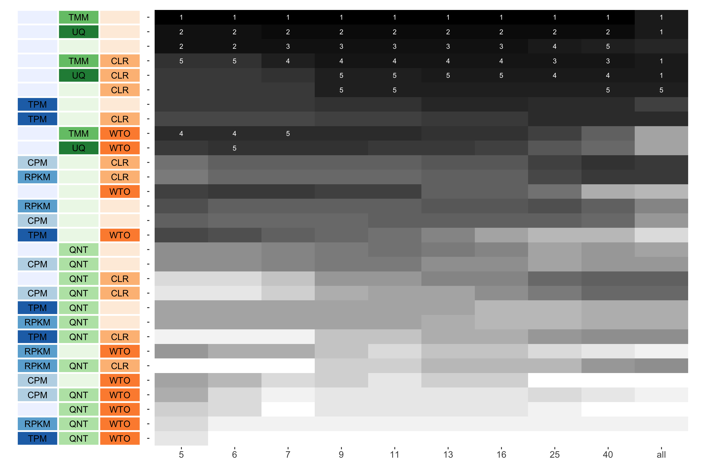
```

## Tissue-aware Standard
```{r echo=FALSE, fig.cap="The heatmap shows the number of times (cell color) each workflow (row) outperforms other workflows as sample size varies (columns), when the resulting coexpression networks are evaluated based on the tissue-aware gold standard. The darkest colors indicate workflows that are significantly better than the most other workflows. In addition, the top 5 workflows in each column are marked with their rank, with ties given minimum rank.", out.width = '100%'}
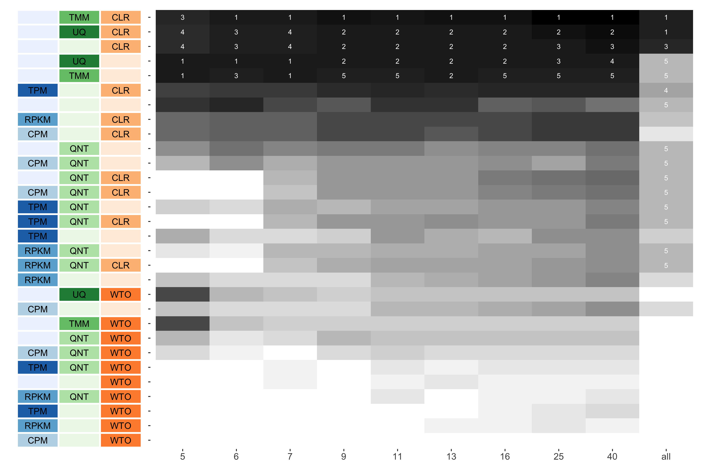
```

# Consistency of Workflows with Varying Sample Similarity {.tabset .tabset-fade .tabset-pills}
Sample gene expression similarity is determined by subsetting all samples to the 50% most variable genes in the tissue it came from, then calculating the spearman correlation between all sample pairs in the experiment and taking the median value.

## Tissue-naive Standard
```{r echo=FALSE, fig.cap="The heatmap shows the number of times (cell color) each workflow (row) outperforms other workflows as sample similarity varies (columns), when the resulting coexpression networks are evaluated based on the tissue-naive gold standard. The darkest colors indicate workflows that are significantly better than the most other workflows. In addition, the top 5 workflows in each column are marked with their rank, with ties given minimum rank.", out.width = '100%'}
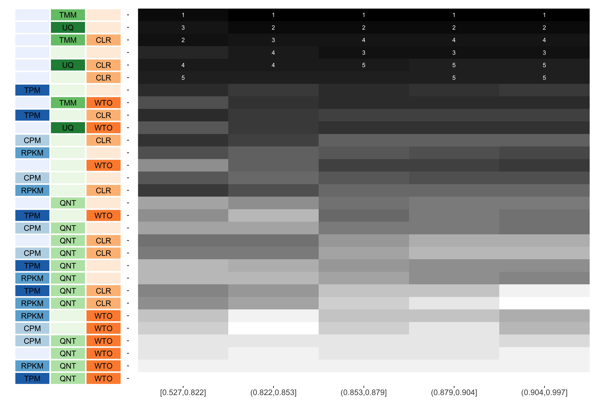
```

## Tissue-aware Standard
```{r echo=FALSE, fig.cap="The heatmap shows the number of times (cell color) each workflow (row) outperforms other workflows as sample similarity varies (columns), when the resulting coexpression networks are evaluated based on the tissue-aware gold standard. The darkest colors indicate workflows that are significantly better than the most other workflows. In addition, the top 5 workflows in each column are marked with their rank, with ties given minimum rank.", out.width = '100%'}
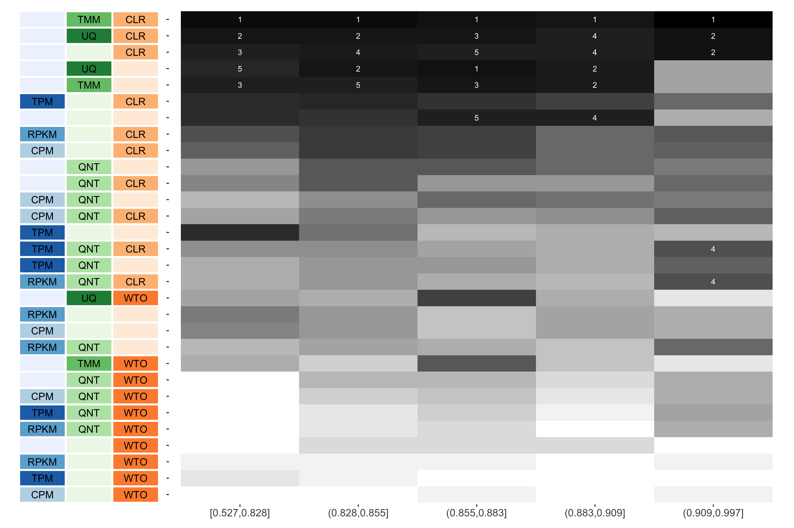
```

# Consistency of Workflows with Varying Read Count Diversity {.tabset .tabset-fade .tabset-pills}
Count sum diversity is calulated for a given experiment by taking the standard deviation of the sum of counts in each sample.

## Tissue-naive Standard
```{r echo=FALSE, fig.cap="The heatmap shows the number of times (cell color) each workflow (row) outperforms other workflows as read count diversity varies (columns), when the resulting coexpression networks are evaluated based on the tissue-naive gold standard. The darkest colors indicate workflows that are significantly better than the most other workflows. In addition, the top 5 workflows in each column are marked with their rank, with ties given minimum rank.", out.width = '100%'}
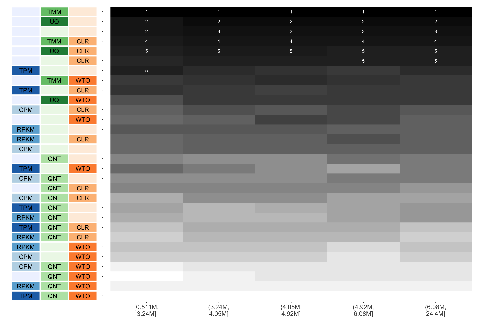
```

## Tissue-aware Standard
```{r echo=FALSE, fig.cap="The heatmap shows the number of times (cell color) each workflow (row) outperforms other workflows as read count diversity varies (columns), when the resulting coexpression networks are evaluated based on the tissue-aware gold standard. The darkest colors indicate workflows that are significantly better than the most other workflows. In addition, the top 5 workflows in each column are marked with their rank, with ties given minimum rank.", out.width = '100%'}
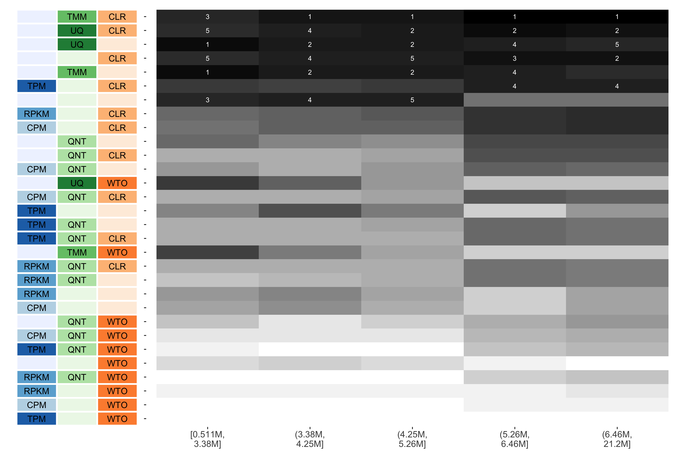
```

# Consistency of Workflows with Varying Tissue {.tabset .tabset-fade .tabset-pills}
Tissue refers to the tissue that the samples were taken from.

## Tissue-naive Standard
```{r echo=FALSE, fig.cap="The heatmap shows the number of times (cell color) each workflow (row) outperforms other workflows in different tissues (columns), when the resulting coexpression networks are evaluated based on the tissue-naive gold standard. The darkest colors indicate workflows that are significantly better than the most other workflows. In addition, the top 5 workflows in each column are marked with their rank, with ties given minimum rank.", out.width = '100%'}
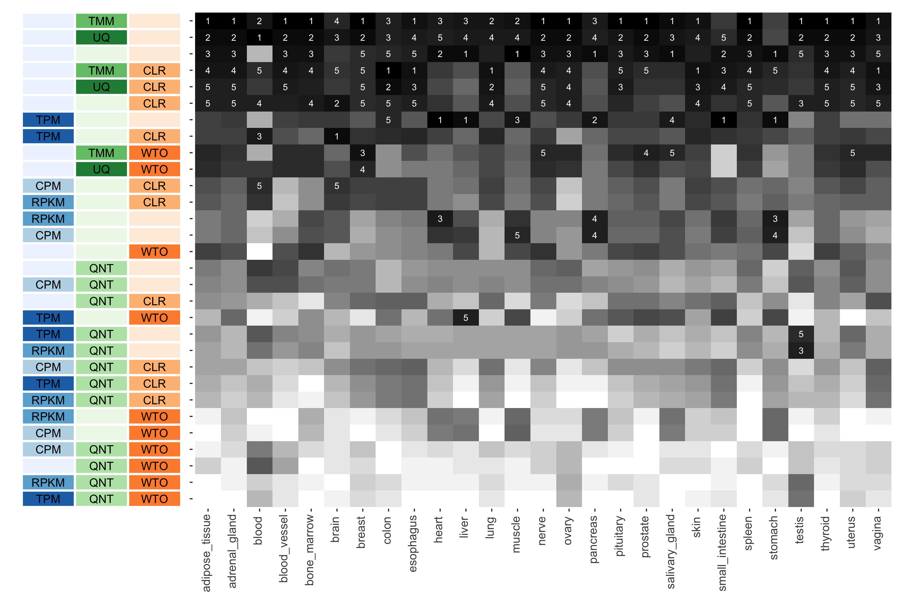
```

## Tissue-aware Standard
```{r echo=FALSE, fig.cap="The heatmap shows the number of times (cell color) each workflow (row) outperforms other workflows in different tissues (columns), when the resulting coexpression networks are evaluated based on the tissue-aware gold standard. The darkest colors indicate workflows that are significantly better than the most other workflows. In addition, the top 5 workflows in each column are marked with their rank, with ties given minimum rank.", out.width = '100%'}
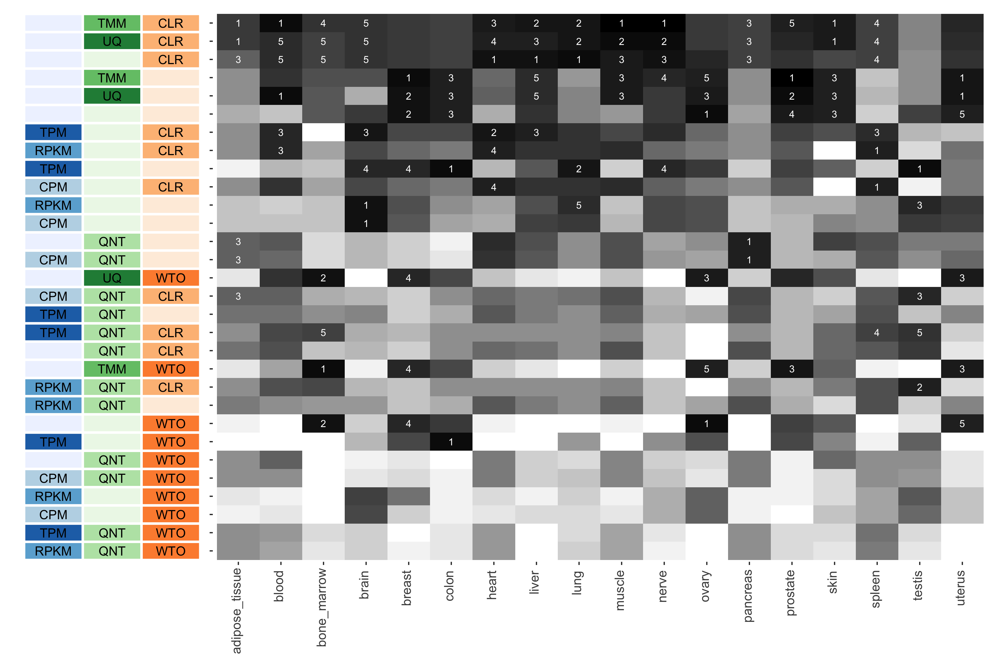
```