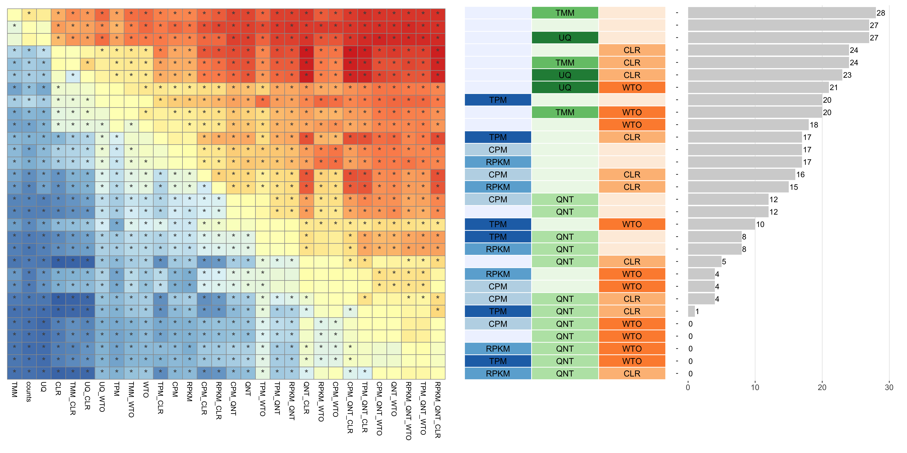
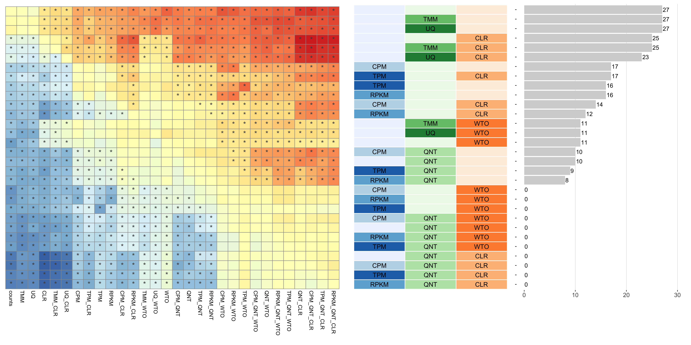
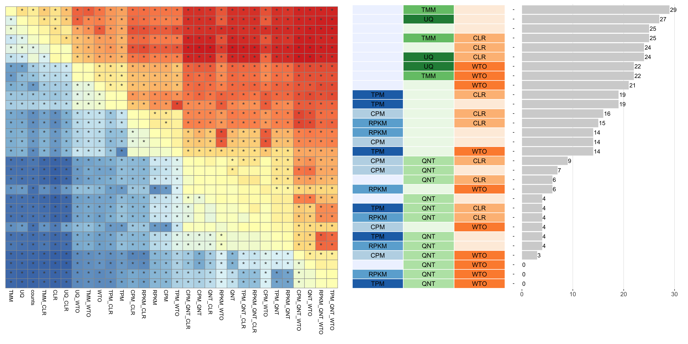
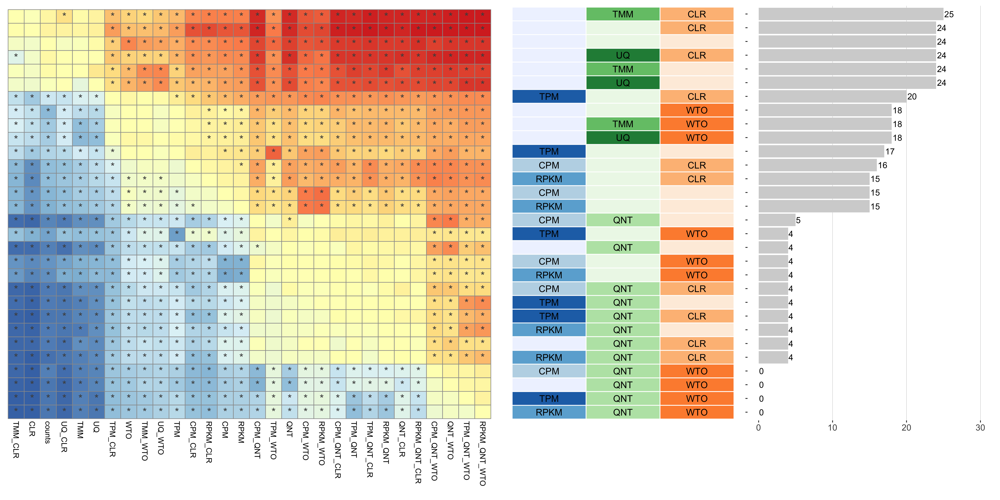
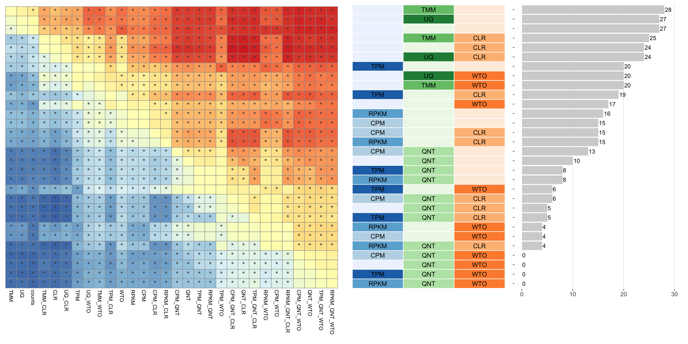
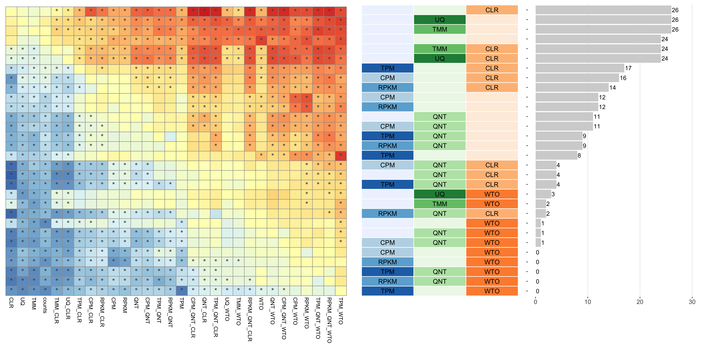

```{r include=FALSE}
library(plotly)
library(tidyverse)
library(knitr)
library(rmarkdown)
library(patchwork)
library(ggfittext)
library(ggplotify)
library(Matrix)
library(grid)
```

```{r include=FALSE}
snr <- read_delim("./data/2020-03-19_sra_naive_results.txt",
                    delim = "\t", col_names = T)
snpr <- read_delim("./data/2020-03-19_prec_recall_sra_naive_results.txt",
                   delim = "\t", col_names = T) %>% 
  filter(recall == 20)
skr <- read_delim("./data/2020-03-19_sra_knowledge_results.txt",
                    delim = "\t", col_names = T)
skpr <- read_delim("./data/2020-03-19_prec_recall_sra_knowledge_results.txt",
                   delim = "\t", col_names = T) %>% 
  filter(recall == 20)
method_codes <- read_delim("./data/2020-03-19_method_codes.txt",
                           delim = "\t", col_names = T)

snr$method <- gsub("quantile", "QNT", snr$method)
snr$method <- gsub("wTO", "WTO", snr$method)
snpr$method <- gsub("quantile", "QNT", snpr$method)
snpr$method <- gsub("wTO", "WTO", snpr$method)

skr$method <- gsub("quantile", "QNT", skr$method)
skr$method <- gsub("wTO", "WTO", skr$method)
skpr$method <- gsub("quantile", "QNT", skpr$method)
skpr$method <- gsub("wTO", "WTO", skpr$method)

method_codes$method <- gsub("quantile", "QNT", method_codes$method)
method_codes$method <- gsub("wTO", "WTO", method_codes$method)

#remove spinal_cord
snr <- snr %>% filter(tissue != "spinal_cord")
skr <- skr %>% filter(tissue != "spinal_cord")
snpr <- snpr %>% filter(tissue != "spinal_cord")
skpr <- skpr %>% filter(tissue != "spinal_cord")
```

```{r include=FALSE}
methods_sn_auprc_prior <- snr %>% 
  select(project, tissue, method, log2_auprc_over_prior) %>% 
  spread(key = method, value = log2_auprc_over_prior) %>% 
  select(-project, -tissue)

methods_sn_auroc <- snr %>% 
  select(project, tissue, method, auROC) %>% 
  spread(key = method, value = auROC) %>% 
  select(-project, -tissue)

methods_sn_pr <- snpr %>% 
  select(project, tissue, method, log2_precision_over_prior) %>% 
  spread(key = method, value = log2_precision_over_prior) %>% 
  select(-project, -tissue)

methods_sk_auprc_prior <- skr %>% 
  select(project, tissue, method, log2_auprc_over_prior) %>% 
  spread(key = method, value = log2_auprc_over_prior) %>% 
  select(-project, -tissue) 
  
methods_sk_auroc <- skr %>% 
  select(project, tissue, method, auROC) %>% 
  spread(key = method, value = auROC) %>% 
  select(-project, -tissue) 

methods_sk_pr <- skpr %>% 
  select(project, tissue, method, log2_precision_over_prior) %>% 
  spread(key = method, value = log2_precision_over_prior) %>% 
  select(-project, -tissue)
```
The results on this page are based on 256 SRA datasets. After preprocessing each dataset using lenient filters in order to keep data for as many genes and samples as possible, we compared methods commonly used in RNA-seq analysis to effectively construct one coexpression network per dataset (i.e. building 256 SRA networks).

Key stages of data processing and network building tested here:
1. Within-sample normalization: counts per million (CPM), transcripts per million (TPM), and reads per kilobase per million (RPKM),
2. Between-sample normalization: quantile (QNT), trimmed mean of M-values (TMM), and upper quartile (UQ), and
3. Network transformation: weighted topological overlap (WTO) and context likelihood of relatedness (CLR).

Individual methods are in regular font (e.g. TPM normalization) and workflows are italicized (e.g. TPM, which TPM combined with no between-sample normalization and no network transformation, or TPM_CLR, which is TPM paired with just CLR).

The evaluation metrics are:

- **Log~2~(auPRC/prior)**; auPRC is the area under the Precision-Recall Curve, prior is the expected auPRC from a random classifier. Focus on this metric to pick the workflow that results in an overall high-quality coexpression network.

- **auROC**; area under the ROC Curve. This commonly-used metric also points to overall quality of the network but is not well-suited for imbalanced problems such as predicting gene functional relationships. We include this metric here for completion.

-  **Log~2~(p20r/prior)**; p20r is precision  at 20% recall. Focus on this metric if you are interested in applying a threshold to the coexpression network and select high-scoring gene pairs for some subsequent analysis.

The evaluations are based on:

- **Naive standard**: Experimentally-verified gene co-annotations to specific Biological Process terms in the Gene Ontology, and

- **Tissue-aware standard**: The naive gold standard subset by genes known to be expressed in a given tissue.

# Data
```{r include=FALSE}
sra_ts_tissues <- unique(skr$tissue)
data_sra <- snr %>% 
  filter(method == "counts") %>% 
  select(project, tissue, sample_num)

data_sra_tissue_projects <- data_sra %>% 
  group_by(tissue) %>% 
  tally() %>%  
  mutate(ts = tissue %in% sra_ts_tissues)

sra_projects_per_tissue_fig <- data_sra_tissue_projects %>% 
  ggplot(aes(x = reorder(tissue, n), y = n, fill = ts)) +
  geom_hline(yintercept = 10, color = "#999999", size = 0.1) +
  geom_hline(yintercept = 20, color = "#999999", size = 0.1) +
  geom_hline(yintercept = 30, color = "#999999", size = 0.1) +
  geom_hline(yintercept = 40, color = "#999999", size = 0.1) +
  geom_col() +
  scale_fill_manual(values = c("light gray", "#2171b5")) +
  scale_y_continuous(limits = c(0,40), breaks = c(0, 10, 20, 30, 40),
                     labels = c("0", "10", "20", "30", "40")) +
  ylab("Number of experiments") +
  geom_text(aes(label = n), hjust = -0.2) +
  coord_flip() +
  theme(panel.background = element_rect(fill = "white"),
        text = element_text(size = 14),
        axis.title.x = element_text(size = 10),
        axis.title.y = element_blank()) +
  guides(fill = FALSE)

sra_data_tissue_order <- data_sra_tissue_projects %>% 
  arrange(n) %>% pull(tissue)
#divide projects into bins according to number of samples
data_sra$bin <- cut(data_sra$sample_num, 
                    breaks = c(4,6,10,16,30,270),
                    labels = c("5-6", "7-10", "11-16", "17-30", "31-270"))
data_sra <- data_sra %>% 
  group_by(tissue, bin) %>% 
  tally()
#add back missing combinations that had zero counts
data_sra_full_na <- tibble(tissue = rep(unique(snr$tissue), 5),
                           bin = c(rep("5-6", 19), rep("7-10", 19),
                                   rep("11-16", 19), rep("17-30", 19),
                                   rep("31-270", 19)), 
                           n = NA)
data_sra_full_na$bin <- factor(data_sra_full_na$bin, levels = c("5-6","7-10","11-16","17-30","31-270"))
data_sra_missing <- anti_join(data_sra_full_na, data_sra, by = c("tissue", "bin"))
#get zero labels for NAs
data_sra <- bind_rows(data_sra, data_sra_missing)
tmp <- data_sra$n
tmp <- replace_na(tmp, 0)
data_sra$nn <- tmp

sra_num_samples_fig <- data_sra %>% 
  ggplot(aes(x = bin, y = factor(tissue, levels = sra_data_tissue_order), fill = factor(n))) +
  geom_tile() +
  geom_text(aes(label = nn), color = "white") +
  xlab("Experiments per sample size range") +
  #scale_fill_viridis_c() +
  scale_fill_brewer(palette = "Blues", na.value = "light gray") +
  theme(panel.background = element_blank(),
        panel.grid.major = element_blank(),
        panel.grid.minor = element_blank(),
        axis.text.y = element_blank(),
        text = element_text(size = 14),
        axis.title.y = element_blank(),
        axis.title.x = element_text(size = 10),
        legend.position = "none")
```

```{r echo=FALSE, fig.cap="**Data.** The barplot shows the number of experiments from each tissue in the SRA data. Blue bars indicate tissues for which we were able to create a tissue-aware gold standard. Tissues with gray bars were evaluated on the tissue-naive standard only. The heatmap on the right shows the number of projects/experiments that have a particular sample size for each tissue.", out.width="100%"}
sra_projects_per_tissue_fig + sra_num_samples_fig
```

# Overall Method Performance  {.tabset .tabset-fade .tabset-pills}

## log<sub>2</sub>(auPRC/prior)
```{r include=FALSE}
overall_l2_order <- snr %>% 
  select(method, log2_auprc_over_prior) %>% 
  group_by(method) %>% 
  summarise(perf = median(log2_auprc_over_prior)) %>% 
  arrange(perf) %>% pull(method)
#naive plot
overall_log2_auprc_prior_naive_plot <- snr %>% 
  ggplot(aes(x = factor(method, overall_l2_order), y = log2_auprc_over_prior)) +
  geom_hline(yintercept = -0.2, color = "#999999", size = 0.1) +
  geom_hline(yintercept = -0.1, color = "#999999", size = 0.1) +
  geom_hline(yintercept = 0, color = "#999999", size = 0.1) +
  geom_hline(yintercept = 0.1, color = "#999999", size = 0.1) +
  geom_hline(yintercept = 0.2, color = "#999999", size = 0.1) +
  geom_hline(yintercept = 0.3, color = "#999999", size = 0.1) +
  geom_hline(yintercept = 0.4, color = "#999999", size = 0.1) +
  geom_hline(yintercept = 0.5, color = "#999999", size = 0.1) +
  geom_hline(yintercept = 0.6, color = "#999999", size = 0.1) +
  geom_boxplot(fill = "lightgray", outlier.size = 0.5) +
  coord_flip() +
  #labs(y=expression(Log[2](auPRC/prior))) +
  scale_y_continuous(breaks = c(-0.2,-0.1,0,0.1,0.2,0.3,0.4,0.5,0.6), labels = c("-0.2","-0.1","0","0.1","0.2","0.3","0.4","0.5","0.6")) +
  theme(panel.background = element_rect(fill = "white"), 
        text = element_text(size = 14),
        axis.text.y = element_blank(), 
        axis.title.y = element_blank(),
        axis.title.x = element_blank(),
        plot.margin = margin(5,0.5,5,0.5)) +
  guides(fill=FALSE)

#knowledge plot
overall_log2_auprc_prior_knowledge_plot <- skr %>% 
  ggplot(aes(x = factor(method, overall_l2_order), y = log2_auprc_over_prior)) +
  geom_hline(yintercept = 0, color = "#999999", size = 0.1) +
  geom_hline(yintercept = 0.5, color = "#999999", size = 0.1) +
  geom_hline(yintercept = 1, color = "#999999", size = 0.1) +
  geom_hline(yintercept = 1.5, color = "#999999", size = 0.1) +
  geom_hline(yintercept = 2, color = "#999999", size = 0.1) +
  geom_boxplot(fill = "lightgray", outlier.size = 0.5) +
  coord_flip() +
  #labs(y=expression(Log[2](auPRC/prior))) +
  scale_y_continuous(breaks = c(0,0.5,1,1.5,2), labels = c("0","0.5","1","1.5","2")) +
  theme(panel.background = element_rect(fill = "white"), 
        text = element_text(size = 14),
        axis.text.y = element_blank(), 
        axis.title.y = element_blank(),
        axis.title.x = element_blank(),
        plot.margin = margin(5,0.5,5,0.5)) +
  guides(fill=FALSE)

#labels
overall_l2_labels <- method_codes %>% 
  ggplot(aes(x = key, y = factor(method, levels = overall_l2_order), fill = value, label = value))+
  geom_tile(color = "white", size = 0.5) +
  geom_text(aes(label = value)) +
  scale_fill_manual(values = c(" " = "#eff3ff", "CPM" = "#bdd7e7",
                    "RPKM" = "#6baed6", "TPM" = "#2171b5",
                    "  " = "#edf8e9", "QNT" = "#bae4b3",  "TMM" = "#74c476",
                    "UQ" = "#238b45", "   " = "#feedde",
                    "CLR" = "#fdbe85", "WTO" = "#fd8d3c")) +
    theme(panel.background = element_blank(),
        panel.grid.major = element_blank(),
        panel.grid.minor = element_blank(),
        axis.text = element_blank(), 
        axis.ticks = element_blank(),
        axis.title = element_blank(),
        plot.margin = margin(5,0.5,5,0.5)) +
  guides(fill = F)
```

```{r echo=FALSE, fig.cap="**Overall performance of workflows.** The plots show the aggregate accuracy of all SRA coexpression networks resulting from each individual workflow evaluated using the (**left**) tissue-naive and (**right**) tissue-aware gold standards. The workflows (rows) are described in terms of the specific method used in the within-sample normalization (blues), between-sample normalization (greens), and network transformation (oranges) stages. The performance of each workflow is presented as boxplots that summarizes the log2(auPRC/prior) of each workflow where auPRC is the area under the precision recall curve. The workflows are ordered by their median log2(auPRC/prior) for the tissue-naive data.", out.width="100%"}
overall_l2_labels + overall_log2_auprc_prior_naive_plot + overall_log2_auprc_prior_knowledge_plot +
  plot_layout(ncol = 3, widths = c(2,5,5))
```

## auROC
```{r include=FALSE}
overall_auroc_order <- snr %>% 
  select(method, auROC) %>% 
  group_by(method) %>% 
  summarise(perf = median(auROC)) %>% 
  arrange(perf) %>% pull(method)
#naive plot
overall_auroc_naive_plot <- snr %>% 
  ggplot(aes(x = factor(method, overall_auroc_order), y = auROC)) +
  geom_hline(yintercept = 0.475, color = "#999999", size = 0.1) +
  geom_hline(yintercept = 0.5, color = "#999999", size = 0.1) +
  geom_hline(yintercept = 0.525, color = "#999999", size = 0.1) +
  geom_hline(yintercept = 0.55, color = "#999999", size = 0.1) +
  geom_hline(yintercept = 0.575, color = "#999999", size = 0.1) +
  geom_hline(yintercept = 0.6, color = "#999999", size = 0.1) +
  geom_boxplot(fill = "lightgray", outlier.size = 0.5) +
  coord_flip() +
  scale_y_continuous(breaks = c(0.475,0.5,0.525,0.55,0.575,0.6,0.625), labels = c("0.475","0.5","0.525","0.55","0.575","0.6","0.625")) +
  theme(panel.background = element_rect(fill = "white"), 
        text = element_text(size = 14),
        axis.text.y = element_blank(), 
        axis.title.y = element_blank(),
        axis.title.x = element_blank(),
        plot.margin = margin(5,0.5,5,0.5)) +
  guides(fill=FALSE)

#knowledge plot
overall_auroc_knowledge_plot <- skr %>% 
  ggplot(aes(x = factor(method, overall_auroc_order), y = auROC)) +
  geom_hline(yintercept = 0.45, color = "#999999", size = 0.1) +
  geom_hline(yintercept = 0.5, color = "#999999", size = 0.1) +
  geom_hline(yintercept = 0.55, color = "#999999", size = 0.1) +
  geom_hline(yintercept = 0.6, color = "#999999", size = 0.1) +
  geom_hline(yintercept = 0.65, color = "#999999", size = 0.1) +
  geom_hline(yintercept = 0.7, color = "#999999", size = 0.1) +
  geom_hline(yintercept = 0.75, color = "#999999", size = 0.1) +
  geom_boxplot(fill = "lightgray", outlier.size = 0.5) +
  coord_flip() +
  scale_y_continuous(breaks = c(0.45,0.5,0.55,0.6,0.65,0.7,0.75), labels = c("0.45","0.5","0.55","0.6","0.65","0.7","0.75")) +
  theme(panel.background = element_rect(fill = "white"), 
        text = element_text(size = 14),
        axis.text.y = element_blank(), 
        axis.title.y = element_blank(),
        axis.title.x = element_blank(),
        plot.margin = margin(5,0.5,5,0.5)) +
  guides(fill=FALSE)

#labels
overall_auroc_labels <- method_codes %>% 
  ggplot(aes(x = key, y = factor(method, levels = overall_auroc_order), fill = value, label = value))+
  geom_tile(color = "white", size = 0.5) +
  geom_text(aes(label = value)) +
  scale_fill_manual(values = c(" " = "#eff3ff", "CPM" = "#bdd7e7",
                    "RPKM" = "#6baed6", "TPM" = "#2171b5",
                    "  " = "#edf8e9", "QNT" = "#bae4b3",  "TMM" = "#74c476",
                    "UQ" = "#238b45", "   " = "#feedde",
                    "CLR" = "#fdbe85", "WTO" = "#fd8d3c")) +
    theme(panel.background = element_blank(),
        panel.grid.major = element_blank(),
        panel.grid.minor = element_blank(),
        axis.text = element_blank(), 
        axis.ticks = element_blank(),
        axis.title = element_blank(),
        plot.margin = margin(5,0.5,5,0.5)) +
  guides(fill = F)
```

```{r echo=FALSE, fig.cap="**Overall performance of workflows.** The plots show the aggregate accuracy of all SRA coexpression networks resulting from each individual workflow evaluated using the (**left**) tissue-naive and (**right**) tissue-aware gold standards. The workflows (rows) are described in terms of the specific method used in the within-sample normalization (blues), between-sample normalization (greens), and network transformation (oranges) stages. The performance of each workflow is presented as boxplots that summarizes the auROC of each workflow where auPRC is the area under the precision recall curve. The workflows are ordered by their median auROC for the tissue-naive data.", out.width="100%"}
overall_auroc_labels + overall_auroc_naive_plot + overall_auroc_knowledge_plot +
  plot_layout(ncol = 3, widths = c(2,5,5))
```

## log<sub>2</sub>(p20r/prior)
```{r include=FALSE}
overall_pr_order <- snpr %>% 
  select(method, log2_precision_over_prior) %>% 
  group_by(method) %>% 
  summarise(perf = median(log2_precision_over_prior)) %>% 
  arrange(perf) %>% pull(method)
#naive plot
overall_pr_naive_plot <- snpr %>% 
  ggplot(aes(x = factor(method, overall_pr_order), y = log2_precision_over_prior)) +
  geom_hline(yintercept = -0.2, color = "#999999", size = 0.1) +
  geom_hline(yintercept = 0, color = "#999999", size = 0.1) +
  geom_hline(yintercept = 0.2, color = "#999999", size = 0.1) +
  geom_hline(yintercept = 0.4, color = "#999999", size = 0.1) +
  geom_hline(yintercept = 0.6, color = "#999999", size = 0.1) +
  geom_hline(yintercept = 0.8, color = "#999999", size = 0.1) +
  geom_hline(yintercept = 1, color = "#999999", size = 0.1) +
  geom_boxplot(fill = "lightgray", outlier.size = 0.5) +
  coord_flip() +
  scale_y_continuous(breaks = c(-0.2,0,0.2,0.4,0.6,0.8,1), labels = c("-0.2","0","0.2","0.4","0.6","0.8","1")) +
  theme(panel.background = element_rect(fill = "white"), 
        text = element_text(size = 14),
        axis.text.y = element_blank(), 
        axis.title.y = element_blank(),
        axis.title.x = element_blank(),
        plot.margin = margin(5,0.5,5,0.5)) +
  guides(fill=FALSE)

#knowledge plot
overall_pr_knowledge_plot <- skpr %>% 
  ggplot(aes(x = factor(method, overall_pr_order), y = log2_precision_over_prior)) +
  geom_hline(yintercept = -1, color = "#999999", size = 0.1) +
  geom_hline(yintercept = 0, color = "#999999", size = 0.1) +
  geom_hline(yintercept = 1, color = "#999999", size = 0.1) +
  geom_hline(yintercept = 2, color = "#999999", size = 0.1) +
  geom_hline(yintercept = 3, color = "#999999", size = 0.1) +
  geom_hline(yintercept = 4, color = "#999999", size = 0.1) +
  geom_boxplot(fill = "lightgray", outlier.size = 0.5) +
  coord_flip() +
  scale_y_continuous(breaks = c(-1,0,1,2,3,4,5), labels = c("-1","0","1","2","3","4","5")) +
  theme(panel.background = element_rect(fill = "white"), 
        text = element_text(size = 14),
        axis.text.y = element_blank(), 
        axis.title.y = element_blank(),
        axis.title.x = element_blank(),
        plot.margin = margin(5,0.5,5,0.5)) +
  guides(fill=FALSE)

#labels
overall_pr_labels <- method_codes %>% 
  ggplot(aes(x = key, y = factor(method, levels = overall_pr_order), fill = value, label = value))+
  geom_tile(color = "white", size = 0.5) +
  geom_text(aes(label = value)) +
  scale_fill_manual(values = c(" " = "#eff3ff", "CPM" = "#bdd7e7",
                    "RPKM" = "#6baed6", "TPM" = "#2171b5",
                    "  " = "#edf8e9", "QNT" = "#bae4b3",  "TMM" = "#74c476",
                    "UQ" = "#238b45", "   " = "#feedde",
                    "CLR" = "#fdbe85", "WTO" = "#fd8d3c")) +
    theme(panel.background = element_blank(),
        panel.grid.major = element_blank(),
        panel.grid.minor = element_blank(),
        axis.text = element_blank(), 
        axis.ticks = element_blank(),
        axis.title = element_blank(),
        plot.margin = margin(5,0.5,5,0.5)) +
  guides(fill = F)
```

```{r echo=FALSE, fig.cap="**Overall performance of workflows.** The plots show the aggregate accuracy of all SRA coexpression networks resulting from each individual workflow evaluated using the (**left**) tissue-naive and (**right**) tissue-aware gold standards. The workflows (rows) are described in terms of the specific method used in the within-sample normalization (blues), between-sample normalization (greens), and network transformation (oranges) stages. The performance of each workflow is presented as boxplots that summarizes the log2(p20r/prior) of each workflow where auPRC is the area under the precision recall curve. The workflows are ordered by their median log2(p20r/prior) for the tissue-naive data.", out.width="100%"}
overall_pr_labels + overall_pr_naive_plot + overall_pr_knowledge_plot +
  plot_layout(ncol = 3, widths = c(2,5,5))
```

# Proportion of Times Each Method Outperforms Another {.tabset .tabset-fade .tabset-pills}

## log<sub>2</sub>(auPRC/prior) {.tabset .tabset-fade .tabset-pills}

### Tissue-naive Standard
```{r echo=FALSE, out.width = '49%'}
knitr::include_graphics("plots/heatmap_legend.png")
```

```{r echo=FALSE, fig.cap="**Dataset-level pairwise comparison of workflow performance.** (**left**) The heatmap shows the relative performance of a pair of workflows, corresponding to a row and a column, directly compared to each other for the SRA datasets based on the tissue-naive gold standard. The color in each cell (row, column) represents the proportion of datasets for which the workflow along the row has a higher log2(auPRC/prior) than the workflow along the column. Comparisons that are statistically significant (corrected p < 0.01) based on a paired Wilcoxon test are marked with an asterisk. (**middle**) The workflows (rows) are described in terms of the specific method used in the within-sample normalization (blues), between-sample normalization (greens), and network transformation (oranges) stages. (**right**) The barplot shows the number of times each workflow was significantly greater than another workflow.", out.width = '100%'}

```
### Tissue-aware Standard
```{r echo=FALSE, out.width = '49%'}
knitr::include_graphics("plots/heatmap_legend.png")
```

```{r echo=FALSE, fig.cap="**Dataset-level pairwise comparison of workflow performance.** (**left**) The heatmap shows the relative performance of a pair of workflows, corresponding to a row and a column, directly compared to each other for the SRA datasets based on the tissue-aware gold standard. The color in each cell (row, column) represents the proportion of datasets for which the workflow along the row has a higher log2(auPRC/prior) than the workflow along the column. Comparisons that are statistically significant (corrected p < 0.01) based on a paired Wilcoxon test are marked with an asterisk. (**middle**) The workflows (rows) are described in terms of the specific method used in the within-sample normalization (blues), between-sample normalization (greens), and network transformation (oranges) stages. (**right**) The barplot shows the number of times each workflow was significantly greater than another workflow.", out.width = '100%'}

```

## auROC {.tabset .tabset-fade .tabset-pills}
### Tissue-naive Standard
```{r echo=FALSE, out.width = '49%'}
knitr::include_graphics("plots/heatmap_legend.png")
```

```{r echo=FALSE, fig.cap="**Dataset-level pairwise comparison of workflow performance.** (**left**) The heatmap shows the relative performance of a pair of workflows, corresponding to a row and a column, directly compared to each other for the SRA datasets based on the tissue-naive gold standard. The color in each cell (row, column) represents the proportion of datasets for which the workflow along the row has a higher auROC than the workflow along the column. Comparisons that are statistically significant (corrected p < 0.01) based on a paired Wilcoxon test are marked with an asterisk. (**middle**) The workflows (rows) are described in terms of the specific method used in the within-sample normalization (blues), between-sample normalization (greens), and network transformation (oranges) stages. (**right**) The barplot shows the number of times each workflow was significantly greater than another workflow.", out.width = '100%'}

```
### Tissue-aware Standard
```{r echo=FALSE, out.width = '49%'}
knitr::include_graphics("plots/heatmap_legend.png")
```

```{r echo=FALSE, fig.cap="**Dataset-level pairwise comparison of workflow performance.** (**left**) The heatmap shows the relative performance of a pair of workflows, corresponding to a row and a column, directly compared to each other for the SRA datasets based on the tissue-aware gold standard. The color in each cell (row, column) represents the proportion of datasets for which the workflow along the row has a higher auROC than the workflow along the column. Comparisons that are statistically significant (corrected p < 0.01) based on a paired Wilcoxon test are marked with an asterisk. (**middle**) The workflows (rows) are described in terms of the specific method used in the within-sample normalization (blues), between-sample normalization (greens), and network transformation (oranges) stages. (**right**) The barplot shows the number of times each workflow was significantly greater than another workflow.", out.width = '100%'}

```

## log<sub>2</sub>(p20r/prior) {.tabset .tabset-fade .tabset-pills}

### Tissue-naive Standard
```{r echo=FALSE, out.width = '49%'}
knitr::include_graphics("plots/heatmap_legend.png")
```

```{r echo=FALSE, fig.cap="**Dataset-level pairwise comparison of workflow performance.** (**left**) The heatmap shows the relative performance of a pair of workflows, corresponding to a row and a column, directly compared to each other for the SRA datasets based on the tissue-naive gold standard. The color in each cell (row, column) represents the proportion of datasets for which the workflow along the row has a higher log2(p20r/prior) than the workflow along the column. Comparisons that are statistically significant (corrected p < 0.01) based on a paired Wilcoxon test are marked with an asterisk. (**middle**) The workflows (rows) are described in terms of the specific method used in the within-sample normalization (blues), between-sample normalization (greens), and network transformation (oranges) stages. (**right**) The barplot shows the number of times each workflow was significantly greater than another workflow.", out.width = '100%'}

```
### Tissue-aware Standard
```{r echo=FALSE, out.width = '49%'}
knitr::include_graphics("plots/heatmap_legend.png")
```

```{r echo=FALSE, fig.cap="**Dataset-level pairwise comparison of workflow performance.** (**left**) The heatmap shows the relative performance of a pair of workflows, corresponding to a row and a column, directly compared to each other for the SRA datasets based on the tissue-aware gold standard. The color in each cell (row, column) represents the proportion of datasets for which the workflow along the row has a higher log2(p20r/prior) than the workflow along the column. Comparisons that are statistically significant (corrected p < 0.01) based on a paired Wilcoxon test are marked with an asterisk. (**middle**) The workflows (rows) are described in terms of the specific method used in the within-sample normalization (blues), between-sample normalization (greens), and network transformation (oranges) stages. (**right**) The barplot shows the number of times each workflow was significantly greater than another workflow.", out.width = '100%'}

```

# Method Part Comparison {.tabset .tabset-fade .tabset-pills}
```{r include=FALSE}
cpm_methods <- c("CPM", "CPM_QNT", "CPM_CLR", "CPM_QNT_CLR", "CPM_WTO", "CPM_QNT_WTO")
rpkm_methods <- c("RPKM", "RPKM_QNT", "RPKM_CLR", "RPKM_QNT_CLR", "RPKM_WTO", "RPKM_QNT_WTO")
tpm_methods <- c("TPM", "TPM_QNT", "TPM_CLR", "TPM_QNT_CLR", "TPM_WTO", "TPM_QNT_WTO")
no_wi_methods <- c("counts", "QNT", "CLR", "QNT_CLR", "WTO", "QNT_WTO")

tmm_methods <- c("TMM", "TMM_CLR", "TMM_WTO")
uq_methods <- c("UQ", "UQ_CLR", "UQ_WTO")
quantile_methods <- c("QNT", "QNT_CLR", "QNT_WTO")
no_bw_methods <- c("counts", "CLR", "WTO")

clr_methods <- c("CLR", "CPM_CLR", "RPKM_CLR", "TPM_CLR",
                 "QNT_CLR", "TMM_CLR", "UQ_CLR",
                 "CPM_QNT_CLR", "TPM_QNT_CLR", "RPKM_QNT_CLR")
wto_methods <- c("WTO", "CPM_WTO", "RPKM_WTO", "TPM_WTO",
                 "QNT_WTO", "TMM_WTO", "UQ_WTO",
                 "CPM_QNT_WTO", "TPM_QNT_WTO", "RPKM_QNT_WTO")
no_nt_methods <- c("counts", "CPM", "TPM", "RPKM",
                   "TMM", "UQ", "QNT",
                   "CPM_QNT", "TPM_QNT", "RPKM_QNT")

all_within_methods <- c(cpm_methods, tpm_methods, rpkm_methods, no_wi_methods)
all_between_methods <- c(tmm_methods, uq_methods, quantile_methods, no_bw_methods)
all_network_methods <- c(clr_methods, wto_methods, no_nt_methods)
```

```{r include=FALSE}
#functions to build plots
get_times_greater_than_matrix <- function(meth_df){
  #df should be methods_* df (each row is performance on given dataset)
  counts_output <- matrix(rep(0, 900), nrow = 30, ncol = 30)
  colnames(counts_output) <- colnames(meth_df)
  rownames(counts_output) <- colnames(meth_df)
  
  for(num in 1:30){
  a <- pull(meth_df, num)
  for(val in 1:30){
    if (num == val){
      counts_output[val, num] <- 0.5
      next
    }
    b <- pull(meth_df, val)
    s <- sum(a < b)
    s <- s/nrow(meth_df)
    counts_output[val, num] <- s
  }
  }
  return(counts_output)
}

get_significance_matrix <- function(df, performance_col_position, method_col_position){
  #df tidy format with method as a column and performance as a column
  sig_output <- pairwise.wilcox.test(x = pull(df, performance_col_position),
                                     g = pull(df, method_col_position),
                                     paired = TRUE,
                                     p.adjust.method = "BH")$p.value
  
  #add row/col to make 30 by 30
  CLR <- sig_output[1,]
  CLR[1] <- NA
  sig_output <- rbind(CLR, sig_output)
  WTO <- sig_output[,29]
  WTO[30] <- NA
  sig_output <- cbind(sig_output, WTO)
  
  #make symmetric
  diag(sig_output) <- 1
  sig_output <- Matrix::forceSymmetric(sig_output, uplo = "L")
  sig_output <- as.matrix(sig_output)
  #replace p vals with sig/not sig
  sig_wilcox_sra_naive <- ifelse(sig_output < 0.01, "*", " ")
}

get_method_part_prop_sig_greater <- function(times_matrix, sig_matrix){
  #times_matrix is output of get_times_greater_than_matrix
  #sig_matrix is output of get_significance_matrix
  #make times_matrix into tibble and get times method_one > method_two
  times_greater_than_tibble <- as_tibble(times_matrix)
  times_greater_than_tibble$method_one <- colnames(times_matrix)
  times_greater_than_tibble <- times_greater_than_tibble %>% 
    gather(key = method_two, value = times_method_one_is_greater_than_method_two, 1:30)
  #make sig_matrix into tibble and get times corrected wilcox p value was
  #significant between method_one and method_two
  sig_wilcox_tibble <-  as_tibble(sig_matrix)
  sig_wilcox_tibble$method_one <- colnames(sig_matrix)
  sig_wilcox_tibble <- sig_wilcox_tibble %>%
    gather(key = method_two, value = significance, 1:30)
  sig_wilcox_tibble$significance <- ifelse(sig_wilcox_tibble$significance == "*",
                                           T, F)
  
  #join above two tibbles into one
  greater_than_significance_tibble <- left_join(times_greater_than_tibble,
                                                sig_wilcox_tibble,
                                                by = c("method_one", "method_two"))
  #make T/F column designating whether method_one > method_two AND significant by 
  #corrected wilcox p value
  greater_than_significance_tibble$method_one_greater_than_and_sig <-
    ifelse(greater_than_significance_tibble$times_method_one_is_greater_than_method_two > 0.5 &
       greater_than_significance_tibble$significance == T, T, F)
  
  
  analysis_groups <- c("within", "between", "network")
  
  method_summary <- tibble(group = "group", times_sig_and_greater = 22, prop_times_sig_and_greater = 0.56)
  
  for (ag in analysis_groups){
    if (ag == "within"){
      restricted_methods <- c("TMM", "UQ", "TMM_CLR", "UQ_CLR", "TMM_WTO", "UQ_WTO")
      ag_methods <- all_within_methods
    }
    if (ag == "between"){
      restricted_methods <-  c("CPM_QNT", "TPM_QNT", "RPKM_QNT", "CPM_QNT_CLR", "TPM_QNT_CLR", "RPKM_QNT_CLR", "CPM_QNT_WTO", "TPM_QNT_WTO", "RPKM_QNT_WTO")
      ag_methods <- all_between_methods
    }
    if (ag == "network"){
      restricted_methods <- "none"
      ag_methods <- all_network_methods
    }
    
    #summarize above info by method
    ag_method_summary <- greater_than_significance_tibble %>%
      filter(method_one %in% ag_methods) %>% 
      filter(!method_two %in% restricted_methods) %>%
      group_by(method_one) %>% 
      summarise(times_sig_and_greater = sum(method_one_greater_than_and_sig))
    #change col name from method_one to method
    colnames(ag_method_summary) <- c("method", "times_sig_and_greater")
    
    if (ag == "within"){
      #create T/F columns for each method part (does a method have the given method part?)
      #wi
      ag_method_summary$cpm <- ag_method_summary$method %in% cpm_methods
      ag_method_summary$tpm <- ag_method_summary$method %in% tpm_methods
      ag_method_summary$rpkm <- ag_method_summary$method %in% rpkm_methods
      ag_method_summary$no_wi <- ag_method_summary$method %in% no_wi_methods
      
      #gather T/F method columns into method column/one T/F column
      #keep only true rows so group col reflects methods actually in group
      #don't need membership col anymore (all TRUEs anyway)
      #group by group (method part)
      #sum times sig and greater for each method in method part group
      ag_method_summary <- ag_method_summary %>% 
        gather(3:6, key = group, value = membership) %>% 
        filter(membership == T) %>% 
        select(-membership) %>% 
        group_by(group) %>% 
        summarise(times_sig_and_greater = sum(times_sig_and_greater))
      
      divisor <- 6*23 #6 methods in groups, 6 methods left out of analysis and 29-6=23 
    }
    if (ag == "between"){
      #create T/F columns for each method part (does a method have the given method part?)
      #bw
      ag_method_summary$tmm <- ag_method_summary$method %in% tmm_methods
      ag_method_summary$uq <- ag_method_summary$method %in% uq_methods
      ag_method_summary$qnt <- ag_method_summary$method %in% quantile_methods
      ag_method_summary$no_bw <- ag_method_summary$method %in% no_bw_methods
      
      #gather T/F method columns into method column/one T/F column
      #keep only true rows so group col reflects methods actually in group
      #don't need membership col anymore (all TRUEs anyway)
      #group by group (method part)
      #sum times sig and greater for each method in method part group
      ag_method_summary <- ag_method_summary %>% 
        gather(3:6, key = group, value = membership) %>% 
        filter(membership == T) %>% 
        select(-membership) %>% 
        group_by(group) %>% 
        summarise(times_sig_and_greater = sum(times_sig_and_greater))
    
      divisor <- 3*20 #3 methods in groups, 9 methods left out of analysis and 29-9=20
    }
    if (ag == "network"){
      #create T/F columns for each method part (does a method have the given method part?)
      #nt
      ag_method_summary$wto <- ag_method_summary$method %in% wto_methods
      ag_method_summary$clr <- ag_method_summary$method %in% clr_methods
      ag_method_summary$no_nt <- ag_method_summary$method %in% no_nt_methods
      
      #gather T/F method columns into method column/one T/F column
      #keep only true rows so group col reflects methods actually in group
      #don't need membership col anymore (all TRUEs anyway)
      #group by group (method part)
      #sum times sig and greater for each method in method part group
      ag_method_summary <- ag_method_summary %>% 
        gather(3:5, key = group, value = membership) %>% 
        filter(membership == T) %>% 
        select(-membership) %>% 
        group_by(group) %>% 
        summarise(times_sig_and_greater = sum(times_sig_and_greater))
    
      divisor <- 10*29 #10 methods in groups, 0 methods left out of analysis and 29-0=29
    }
    
    #divide number of times sig and greater by number of chances they had (determined by group length)
    ag_method_summary <- ag_method_summary %>%
      mutate(prop_times_sig_and_greater = times_sig_and_greater/divisor)
    
    #add to method_summary
    method_summary <- bind_rows(method_summary, ag_method_summary)
  }

  #remove top row
  method_summary <- method_summary[-1,]
  #gives better names for plot
  method_summary$group <- toupper(method_summary$group)
  method_summary$group <- gsub("NO_BW", "NO-BW", method_summary$group)
  method_summary$group <- gsub("NO_WI", "NO-WI", method_summary$group)
  method_summary$group <- gsub("NO_NT", "NO-NT", method_summary$group)
  
  return(method_summary)
}
```

## log<sub>2</sub>(auPRC/prior) {.tabset .tabset-fade .tabset-pills}
```{r include=FALSE}
#naive plot matrices
l2_auprc_prior_sra_naive_times_mat <- get_times_greater_than_matrix(methods_sn_auprc_prior)
l2_auprc_prior_sra_naive_sig_mat <- get_significance_matrix(snr, method_col_position = 3, performance_col_position = 4)
l2_auprc_prior_sra_naive_method_part_summary <- get_method_part_prop_sig_greater(times_matrix = l2_auprc_prior_sra_naive_times_mat,
                                                                                  sig_matrix =l2_auprc_prior_sra_naive_sig_mat)

#knowledge plot matrices
l2_auprc_prior_sra_knowledge_times_mat <- get_times_greater_than_matrix(methods_sk_auprc_prior)
l2_auprc_prior_sra_knowledge_sig_mat <- get_significance_matrix(skr, method_col_position = 3, performance_col_position = 4)
l2_auprc_prior_sra_knowledge_method_part_summary <- get_method_part_prop_sig_greater(l2_auprc_prior_sra_knowledge_times_mat,
                                                                                  l2_auprc_prior_sra_knowledge_sig_mat)
```

### Tissue-naive Standard
```{r echo=FALSE, fig.cap="**Impact of individual methods on performance of workflows.** Each bar in the barplot corresponds to a specific method, showing the proportion of times (x-axis) that workflows including that particular method (y-axis) were significantly better than other workflows. In order to make the comparison of between-sample normalization methods fair, workflows also including CPM, RPKM, or TPM were left out because it is not possible to pair them with TMM or UQ normalization. Similarly, TMM and UQ methods are not included for “no within-sample normalization” (NO–WI).", out.width="100%"}
#naive plot
l2_auprc_prior_sra_naive_method_part_summary %>% 
  ggplot(aes(x = group, y = prop_times_sig_and_greater, fill = group)) +
  geom_hline(yintercept = 0.25, color = "#999999", size = 0.1) +
  geom_hline(yintercept = 0.5, color = "#999999", size = 0.1) +
  geom_hline(yintercept = 0.75, color = "#999999", size = 0.1) +
  geom_hline(yintercept = 1, color = "#999999", size = 0.1) +
  #geom_segment(aes(x = 3.5, xend = 3.5, y = -0.25, yend = 0)) +
  #annotate("segment", x=3.5, y=0.25, xend=3.5, yend=0,
  #             col="red", arrow=arrow(length=unit(0.3, "cm"))) +
  geom_col() +
  annotation_custom(grob = textGrob(label = "text", hjust = 0, gp = gpar(cex = 1.5)),
                    ymin = 3.5, ymax = 4, xmin = 3, xmax = 5) +
  scale_x_discrete(limits = c("WTO", "CLR", "NO-NT",
                              "UQ", "TMM", "QNT","NO-BW",
                              "TPM", "RPKM", "CPM", "NO-WI")) +
  scale_fill_manual(values = c("WTO" = "#fd8d3c", "CLR" = "#fdbe85", "NO-NT" = "#feedde",
                              "QNT" = "#bae4b3", "UQ" = "#238b45", "TMM" = "#74c476", "NO-BW" = "#edf8e9",
                              "TPM" = "#2171b5", "RPKM" = "#6baed6", "CPM" = "#bdd7e7", "NO-WI" = "#eff3ff")) +
  geom_text(aes(label = round(prop_times_sig_and_greater, 2)), hjust = -0.1, color = "#999999", fontface = "bold") +
  scale_y_continuous(limits = c(0,1)) +
  coord_flip(clip = "off") +
  theme(panel.background = element_rect(fill = "white"), 
        panel.grid.minor = element_blank(), 
        panel.grid.major = element_blank(),
        text = element_text(size = 14),
        axis.title = element_blank()) +
  guides(fill = F) 
```

### Tissue-aware Standard
```{r echo=FALSE, fig.cap="**Impact of individual methods on performance of workflows.** Each bar in the barplot corresponds to a specific method, showing the proportion of times (x-axis) that workflows including that particular method (y-axis) were significantly better than other workflows. In order to make the comparison of between-sample normalization methods fair, workflows also including CPM, RPKM, or TPM were left out because it is not possible to pair them with TMM or UQ normalization. Similarly, TMM and UQ methods are not included for “no within-sample normalization” (NO–WI).", out.width="100%"}
#knowledge plot
l2_auprc_prior_sra_knowledge_method_part_summary %>% 
  ggplot(aes(x = group, y = prop_times_sig_and_greater, fill = group)) +
  geom_hline(yintercept = 0.25, color = "#999999", size = 0.1) +
  geom_hline(yintercept = 0.5, color = "#999999", size = 0.1) +
  geom_hline(yintercept = 0.75, color = "#999999", size = 0.1) +
  geom_hline(yintercept = 1, color = "#999999", size = 0.1) +
  #geom_segment(aes(x = 3.5, xend = 3.5, y = -0.25, yend = 0)) +
  #annotate("segment", x=3.5, y=0.25, xend=3.5, yend=0,
  #             col="red", arrow=arrow(length=unit(0.3, "cm"))) +
  geom_col() +
  annotation_custom(grob = textGrob(label = "text", hjust = 0, gp = gpar(cex = 1.5)),
                    ymin = 3.5, ymax = 4, xmin = 3, xmax = 5) +
  scale_x_discrete(limits = c("WTO", "CLR", "NO-NT",
                              "UQ", "TMM", "QNT","NO-BW",
                              "TPM", "RPKM", "CPM", "NO-WI")) +
  scale_fill_manual(values = c("WTO" = "#fd8d3c", "CLR" = "#fdbe85", "NO-NT" = "#feedde",
                              "QNT" = "#bae4b3", "UQ" = "#238b45", "TMM" = "#74c476", "NO-BW" = "#edf8e9",
                              "TPM" = "#2171b5", "RPKM" = "#6baed6", "CPM" = "#bdd7e7", "NO-WI" = "#eff3ff")) +
  geom_text(aes(label = round(prop_times_sig_and_greater, 2)), hjust = -0.1, color = "#999999", fontface = "bold") +
  scale_y_continuous(limits = c(0,1)) +
  coord_flip(clip = "off") +
  theme(panel.background = element_rect(fill = "white"), 
        panel.grid.minor = element_blank(), 
        panel.grid.major = element_blank(),
        text = element_text(size = 14),
        axis.title = element_blank()) +
  guides(fill = F) 
```

## auROC {.tabset .tabset-fade .tabset-pills}
```{r include=FALSE}
#naive plot matrices
auroc_sra_naive_times_mat <- get_times_greater_than_matrix(methods_sn_auroc)
auroc_sra_naive_sig_mat <- get_significance_matrix(snr, method_col_position = 3, performance_col_position = 5)
auroc_sra_naive_method_part_summary <- get_method_part_prop_sig_greater(times_matrix = auroc_sra_naive_times_mat,
                                                                                  sig_matrix =auroc_sra_naive_sig_mat)

#knowledge plot matrices
auroc_sra_knowledge_times_mat <- get_times_greater_than_matrix(methods_sk_auroc)
auroc_sra_knowledge_sig_mat <- get_significance_matrix(skr, method_col_position = 3, performance_col_position = 6)
auroc_sra_knowledge_method_part_summary <- get_method_part_prop_sig_greater(auroc_sra_knowledge_times_mat,
                                                                                  auroc_sra_knowledge_sig_mat)
```
### Tissue-naive Standard
```{r echo=FALSE, fig.cap="**Impact of individual methods on performance of workflows.** Each bar in the barplot corresponds to a specific method, showing the proportion of times (x-axis) that workflows including that particular method (y-axis) were significantly better than other workflows. In order to make the comparison of between-sample normalization methods fair, workflows also including CPM, RPKM, or TPM were left out because it is not possible to pair them with TMM or UQ normalization. Similarly, TMM and UQ methods are not included for “no within-sample normalization” (NO–WI).", out.width="100%"}
#naive plot
auroc_sra_naive_method_part_summary %>% 
  ggplot(aes(x = group, y = prop_times_sig_and_greater, fill = group)) +
  geom_hline(yintercept = 0.25, color = "#999999", size = 0.1) +
  geom_hline(yintercept = 0.5, color = "#999999", size = 0.1) +
  geom_hline(yintercept = 0.75, color = "#999999", size = 0.1) +
  geom_hline(yintercept = 1, color = "#999999", size = 0.1) +
  #geom_segment(aes(x = 3.5, xend = 3.5, y = -0.25, yend = 0)) +
  #annotate("segment", x=3.5, y=0.25, xend=3.5, yend=0,
  #             col="red", arrow=arrow(length=unit(0.3, "cm"))) +
  geom_col() +
  annotation_custom(grob = textGrob(label = "text", hjust = 0, gp = gpar(cex = 1.5)),
                    ymin = 3.5, ymax = 4, xmin = 3, xmax = 5) +
  scale_x_discrete(limits = c("WTO", "CLR", "NO-NT",
                              "UQ", "TMM", "QNT","NO-BW",
                              "TPM", "RPKM", "CPM", "NO-WI")) +
  scale_fill_manual(values = c("WTO" = "#fd8d3c", "CLR" = "#fdbe85", "NO-NT" = "#feedde",
                              "QNT" = "#bae4b3", "UQ" = "#238b45", "TMM" = "#74c476", "NO-BW" = "#edf8e9",
                              "TPM" = "#2171b5", "RPKM" = "#6baed6", "CPM" = "#bdd7e7", "NO-WI" = "#eff3ff")) +
  geom_text(aes(label = round(prop_times_sig_and_greater, 2)), hjust = -0.1, color = "#999999", fontface = "bold") +
  scale_y_continuous(limits = c(0,1)) +
  coord_flip(clip = "off") +
  theme(panel.background = element_rect(fill = "white"), 
        panel.grid.minor = element_blank(), 
        panel.grid.major = element_blank(),
        text = element_text(size = 14),
        axis.title = element_blank()) +
  guides(fill = F) 
```
### Tissue-aware Standard
```{r echo=FALSE, fig.cap="**Impact of individual methods on performance of workflows.** Each bar in the barplot corresponds to a specific method, showing the proportion of times (x-axis) that workflows including that particular method (y-axis) were significantly better than other workflows. In order to make the comparison of between-sample normalization methods fair, workflows also including CPM, RPKM, or TPM were left out because it is not possible to pair them with TMM or UQ normalization. Similarly, TMM and UQ methods are not included for “no within-sample normalization” (NO–WI).", out.width="100%"}
#knowledge plot
auroc_sra_knowledge_method_part_summary %>% 
  ggplot(aes(x = group, y = prop_times_sig_and_greater, fill = group)) +
  geom_hline(yintercept = 0.25, color = "#999999", size = 0.1) +
  geom_hline(yintercept = 0.5, color = "#999999", size = 0.1) +
  geom_hline(yintercept = 0.75, color = "#999999", size = 0.1) +
  geom_hline(yintercept = 1, color = "#999999", size = 0.1) +
  #geom_segment(aes(x = 3.5, xend = 3.5, y = -0.25, yend = 0)) +
  #annotate("segment", x=3.5, y=0.25, xend=3.5, yend=0,
  #             col="red", arrow=arrow(length=unit(0.3, "cm"))) +
  geom_col() +
  annotation_custom(grob = textGrob(label = "text", hjust = 0, gp = gpar(cex = 1.5)),
                    ymin = 3.5, ymax = 4, xmin = 3, xmax = 5) +
  scale_x_discrete(limits = c("WTO", "CLR", "NO-NT",
                              "UQ", "TMM", "QNT","NO-BW",
                              "TPM", "RPKM", "CPM", "NO-WI")) +
  scale_fill_manual(values = c("WTO" = "#fd8d3c", "CLR" = "#fdbe85", "NO-NT" = "#feedde",
                              "QNT" = "#bae4b3", "UQ" = "#238b45", "TMM" = "#74c476", "NO-BW" = "#edf8e9",
                              "TPM" = "#2171b5", "RPKM" = "#6baed6", "CPM" = "#bdd7e7", "NO-WI" = "#eff3ff")) +
  geom_text(aes(label = round(prop_times_sig_and_greater, 2)), hjust = -0.1, color = "#999999", fontface = "bold") +
  scale_y_continuous(limits = c(0,1)) +
  coord_flip(clip = "off") +
  theme(panel.background = element_rect(fill = "white"), 
        panel.grid.minor = element_blank(), 
        panel.grid.major = element_blank(),
        text = element_text(size = 14),
        axis.title = element_blank()) +
  guides(fill = F) 
```

## log<sub>2</sub>(p20r/prior) {.tabset .tabset-fade .tabset-pills}
```{r include=FALSE}
#naive plot matrices
l2_prec_at_recall20_sra_naive_times_mat <- get_times_greater_than_matrix(methods_sn_pr)
l2_prec_at_recall20_sra_naive_sig_mat <- get_significance_matrix(snpr, method_col_position = 3, performance_col_position = 7)
l2_prec_at_recall20_sra_naive_method_part_summary <- get_method_part_prop_sig_greater(times_matrix = l2_prec_at_recall20_sra_naive_times_mat,
                                                                                  sig_matrix =l2_prec_at_recall20_sra_naive_sig_mat)

#knowledge plot matrices
l2_prec_at_recall20_sra_knowledge_times_mat <- get_times_greater_than_matrix(methods_sk_pr)
l2_prec_at_recall20_sra_knowledge_sig_mat <- get_significance_matrix(skpr, method_col_position = 3, performance_col_position = 10)
l2_prec_at_recall20_sra_knowledge_method_part_summary <- get_method_part_prop_sig_greater(l2_prec_at_recall20_sra_knowledge_times_mat,
                                                                                  l2_prec_at_recall20_sra_knowledge_sig_mat)
```
### Tissue-naive Standard
```{r echo=FALSE, fig.cap="**Impact of individual methods on performance of workflows.** Each bar in the barplot corresponds to a specific method, showing the proportion of times (x-axis) that workflows including that particular method (y-axis) were significantly better than other workflows. In order to make the comparison of between-sample normalization methods fair, workflows also including CPM, RPKM, or TPM were left out because it is not possible to pair them with TMM or UQ normalization. Similarly, TMM and UQ methods are not included for “no within-sample normalization” (NO–WI).", out.width="100%"}
#naive plot
l2_prec_at_recall20_sra_naive_method_part_summary %>% 
  ggplot(aes(x = group, y = prop_times_sig_and_greater, fill = group)) +
  geom_hline(yintercept = 0.25, color = "#999999", size = 0.1) +
  geom_hline(yintercept = 0.5, color = "#999999", size = 0.1) +
  geom_hline(yintercept = 0.75, color = "#999999", size = 0.1) +
  geom_hline(yintercept = 1, color = "#999999", size = 0.1) +
  #geom_segment(aes(x = 3.5, xend = 3.5, y = -0.25, yend = 0)) +
  #annotate("segment", x=3.5, y=0.25, xend=3.5, yend=0,
  #             col="red", arrow=arrow(length=unit(0.3, "cm"))) +
  geom_col() +
  annotation_custom(grob = textGrob(label = "text", hjust = 0, gp = gpar(cex = 1.5)),
                    ymin = 3.5, ymax = 4, xmin = 3, xmax = 5) +
  scale_x_discrete(limits = c("WTO", "CLR", "NO-NT",
                              "UQ", "TMM", "QNT","NO-BW",
                              "TPM", "RPKM", "CPM", "NO-WI")) +
  scale_fill_manual(values = c("WTO" = "#fd8d3c", "CLR" = "#fdbe85", "NO-NT" = "#feedde",
                              "QNT" = "#bae4b3", "UQ" = "#238b45", "TMM" = "#74c476", "NO-BW" = "#edf8e9",
                              "TPM" = "#2171b5", "RPKM" = "#6baed6", "CPM" = "#bdd7e7", "NO-WI" = "#eff3ff")) +
  geom_text(aes(label = round(prop_times_sig_and_greater, 2)), hjust = -0.1, color = "#999999", fontface = "bold") +
  scale_y_continuous(limits = c(0,1)) +
  coord_flip(clip = "off") +
  theme(panel.background = element_rect(fill = "white"), 
        panel.grid.minor = element_blank(), 
        panel.grid.major = element_blank(),
        text = element_text(size = 14),
        axis.title = element_blank()) +
  guides(fill = F) 
```
### Tissue-aware Standard
```{r echo=FALSE, fig.cap="**Impact of individual methods on performance of workflows.** Each bar in the barplot corresponds to a specific method, showing the proportion of times (x-axis) that workflows including that particular method (y-axis) were significantly better than other workflows. In order to make the comparison of between-sample normalization methods fair, workflows also including CPM, RPKM, or TPM were left out because it is not possible to pair them with TMM or UQ normalization. Similarly, TMM and UQ methods are not included for “no within-sample normalization” (NO–WI).", out.width="100%"}
#knowledge plot
l2_prec_at_recall20_sra_knowledge_method_part_summary %>% 
  ggplot(aes(x = group, y = prop_times_sig_and_greater, fill = group)) +
  geom_hline(yintercept = 0.25, color = "#999999", size = 0.1) +
  geom_hline(yintercept = 0.5, color = "#999999", size = 0.1) +
  geom_hline(yintercept = 0.75, color = "#999999", size = 0.1) +
  geom_hline(yintercept = 1, color = "#999999", size = 0.1) +
  #geom_segment(aes(x = 3.5, xend = 3.5, y = -0.25, yend = 0)) +
  #annotate("segment", x=3.5, y=0.25, xend=3.5, yend=0,
  #             col="red", arrow=arrow(length=unit(0.3, "cm"))) +
  geom_col() +
  annotation_custom(grob = textGrob(label = "text", hjust = 0, gp = gpar(cex = 1.5)),
                    ymin = 3.5, ymax = 4, xmin = 3, xmax = 5) +
  scale_x_discrete(limits = c("WTO", "CLR", "NO-NT",
                              "UQ", "TMM", "QNT","NO-BW",
                              "TPM", "RPKM", "CPM", "NO-WI")) +
  scale_fill_manual(values = c("WTO" = "#fd8d3c", "CLR" = "#fdbe85", "NO-NT" = "#feedde",
                              "QNT" = "#bae4b3", "UQ" = "#238b45", "TMM" = "#74c476", "NO-BW" = "#edf8e9",
                              "TPM" = "#2171b5", "RPKM" = "#6baed6", "CPM" = "#bdd7e7", "NO-WI" = "#eff3ff")) +
  geom_text(aes(label = round(prop_times_sig_and_greater, 2)), hjust = -0.1, color = "#999999", fontface = "bold") +
  scale_y_continuous(limits = c(0,1)) +
  coord_flip(clip = "off") +
  theme(panel.background = element_rect(fill = "white"), 
        panel.grid.minor = element_blank(), 
        panel.grid.major = element_blank(),
        text = element_text(size = 14),
        axis.title = element_blank()) +
  guides(fill = F) 
```

# Impact of Sample Size {.tabset .tabset-fade .tabset-pills}
Sample size refers to the number of samples used to create a network. Each barplot shows the Spearman correlation of sample size and performance for each workflow.

## log<sub>2</sub>(auPRC/prior) {.tabset .tabset-fade .tabset-pills}

### Tissue-naive Standard

```{r echo=FALSE}
l2_auprc_prior_ss_cors <- snr %>% 
  group_by(method) %>% 
  summarise(correlation = cor(log2_auprc_over_prior, sample_num, method = "spearman")) %>% 
  arrange(desc(correlation))

l2_auprc_prior_ss_cors %>% 
  ggplot(aes(x = reorder(method, correlation), y = correlation)) +
  geom_col(fill = "lightgray") +
  geom_text(aes(label = round(correlation, digits = 3), hjust = ifelse(correlation > 0, 1, 0))) +
  ylab("Spearman Correlation") +
  coord_flip() +
  theme(panel.background = element_rect(fill = "white"),
        panel.grid.major = element_line(colour = "lightgray", size = 0.1),
        panel.grid.minor = element_blank(),
        text = element_text(size = 14),
        axis.title.y = element_blank())
```

### Tissue-aware Standard

```{r echo=FALSE}
l2_auprc_prior_ss_cors_ts <- skr %>% 
  group_by(method) %>% 
  summarise(correlation = cor(log2_auprc_over_prior, sample_num, method = "spearman")) %>% 
  arrange(desc(correlation))

l2_auprc_prior_ss_cors_ts %>% 
  ggplot(aes(x = reorder(method, correlation), y = correlation)) +
  geom_col(fill = "lightgray") +
  geom_text(aes(label = round(correlation, digits = 3), hjust = ifelse(correlation > 0, 1, 0))) +
  ylab("Spearman Correlation") +
  coord_flip() +
  theme(panel.background = element_rect(fill = "white"),
        panel.grid.major = element_line(colour = "lightgray", size = 0.1),
        panel.grid.minor = element_blank(),
        text = element_text(size = 14),
        axis.title.y = element_blank())
```

## auROC {.tabset .tabset-fade .tabset-pills}

### Tissue-naive Standard

```{r echo=FALSE}
l2_auroc_ss_cors <- snr %>% 
  group_by(method) %>% 
  summarise(correlation = cor(auROC, sample_num, method = "spearman")) %>% 
  arrange(desc(correlation))

l2_auroc_ss_cors %>% 
  ggplot(aes(x = reorder(method, correlation), y = correlation)) +
  geom_col(fill = "lightgray") +
  geom_text(aes(label = round(correlation, digits = 3), hjust = ifelse(correlation > 0, 1, 0))) +
  ylab("Spearman Correlation") +
  coord_flip() +
  theme(panel.background = element_rect(fill = "white"),
        panel.grid.major = element_line(colour = "lightgray", size = 0.1),
        panel.grid.minor = element_blank(),
        text = element_text(size = 14),
        axis.title.y = element_blank())
```

### Tissue-aware Standard

```{r echo=FALSE}
l2_auroc_ss_cors_ts <- skr %>% 
  group_by(method) %>% 
  summarise(correlation = cor(auROC, sample_num, method = "spearman")) %>% 
  arrange(desc(correlation))

l2_auroc_ss_cors_ts %>% 
  ggplot(aes(x = reorder(method, correlation), y = correlation)) +
  geom_col(fill = "lightgray") +
  geom_text(aes(label = round(correlation, digits = 3), hjust = ifelse(correlation > 0, 1, 0))) +
  ylab("Spearman Correlation") +
  coord_flip() +
  theme(panel.background = element_rect(fill = "white"),
        panel.grid.major = element_line(colour = "lightgray", size = 0.1),
        panel.grid.minor = element_blank(),
        text = element_text(size = 14),
        axis.title.y = element_blank())
```

## log<sub>2</sub>(p20r/prior) {.tabset .tabset-fade .tabset-pills}

```{r include=FALSE}
tmp <- snr %>% select(dataset, sample_num, median_spearman, counts_sample_sums_median, counts_sample_sums_variance)
lrg_snpr <- left_join(snpr, tmp, by = "dataset")

tmp <- skr %>% select(dataset, sample_num, median_spearman, counts_sample_sums_median, counts_sample_sums_variance)
lrg_skpr <- left_join(skpr, tmp, by = "dataset")
```

### Tissue-naive Standard

```{r echo=FALSE}
l2_prec_at_recall20_ss_cors <- lrg_snpr %>% 
  group_by(method) %>% 
  summarise(correlation = cor(log2_precision_over_prior, sample_num, method = "spearman")) %>% 
  arrange(desc(correlation))

l2_prec_at_recall20_ss_cors %>% 
  ggplot(aes(x = reorder(method, correlation), y = correlation)) +
  geom_col(fill = "lightgray") +
  geom_text(aes(label = round(correlation, digits = 3), hjust = ifelse(correlation > 0, 1, 0))) +
  ylab("Spearman Correlation") +
  coord_flip() +
  theme(panel.background = element_rect(fill = "white"),
        panel.grid.major = element_line(colour = "lightgray", size = 0.1),
        panel.grid.minor = element_blank(),
        text = element_text(size = 14),
        axis.title.y = element_blank())
```

### Tissue-aware Standard

```{r echo=FALSE}
l2_prec_at_recall20_ss_cors_ts <- lrg_skpr %>% 
  group_by(method) %>% 
  summarise(correlation = cor(log2_precision_over_prior, sample_num, method = "spearman")) %>% 
  arrange(desc(correlation))

l2_prec_at_recall20_ss_cors_ts %>% 
  ggplot(aes(x = reorder(method, correlation), y = correlation)) +
  geom_col(fill = "lightgray") +
  geom_text(aes(label = round(correlation, digits = 3), hjust = ifelse(correlation > 0, 1, 0))) +
  ylab("Spearman Correlation") +
  coord_flip() +
  theme(panel.background = element_rect(fill = "white"),
        panel.grid.major = element_line(colour = "lightgray", size = 0.1),
        panel.grid.minor = element_blank(),
        text = element_text(size = 14),
        axis.title.y = element_blank())
```

# Impact of Sample Similarity {.tabset .tabset-fade .tabset-pills}
Sample similarity is determined by subsetting all samples to the 50% most variable genes in the experiment, then calculating the spearman correlation between all sample pairs in the experiment and taking the median value. Each barplot shows the Spearman correlation of sample similarity and performance for each workflow. 

## log<sub>2</sub>(auPRC/prior) {.tabset .tabset-fade .tabset-pills}

### Tissue-naive Standard

```{r echo=FALSE}
l2_auprc_prior_sexps_cors <- snr %>%
  group_by(method) %>% 
  summarise(correlation = cor(log2_auprc_over_prior, median_spearman, method = "spearman")) %>% 
  arrange(desc(correlation))

l2_auprc_prior_sexps_cors %>% 
  ggplot(aes(x = reorder(method, correlation), y = correlation)) +
  geom_col(fill = "lightgray") +
  geom_text(aes(label = round(correlation, digits = 3), hjust = ifelse(correlation > 0, 1, 0))) +
  ylab("Spearman Correlation") +
  coord_flip() +
  theme(panel.background = element_rect(fill = "white"),
        panel.grid.major = element_line(colour = "lightgray", size = 0.1),
        panel.grid.minor = element_blank(),
        text = element_text(size = 14),
        axis.title.y = element_blank())
```

### Tissue-aware Standard

```{r echo=FALSE}
l2_auprc_prior_sexps_cors_ts <- skr %>% 
  group_by(method) %>% 
  summarise(correlation = cor(log2_auprc_over_prior, median_spearman, method = "spearman")) %>% 
  arrange(desc(correlation))

l2_auprc_prior_sexps_cors_ts %>% 
  ggplot(aes(x = reorder(method, correlation), y = correlation)) +
  geom_col(fill = "lightgray") +
  geom_text(aes(label = round(correlation, digits = 3), hjust = ifelse(correlation > 0, 1, 0))) +
  ylab("Spearman Correlation") +
  coord_flip() +
  theme(panel.background = element_rect(fill = "white"),
        panel.grid.major = element_line(colour = "lightgray", size = 0.1),
        panel.grid.minor = element_blank(),
        text = element_text(size = 14),
        axis.title.y = element_blank())
```

## auROC {.tabset .tabset-fade .tabset-pills}

### Tissue-naive Standard

```{r echo=FALSE}
l2_auroc_sexps_cors <- snr %>%
  group_by(method) %>% 
  summarise(correlation = cor(auROC, median_spearman, method = "spearman")) %>% 
  arrange(desc(correlation))

l2_auroc_sexps_cors %>% 
  ggplot(aes(x = reorder(method, correlation), y = correlation)) +
  geom_col(fill = "lightgray") +
  geom_text(aes(label = round(correlation, digits = 3), hjust = ifelse(correlation > 0, 1, 0))) +
  ylab("Spearman Correlation") +
  coord_flip() +
  theme(panel.background = element_rect(fill = "white"),
        panel.grid.major = element_line(colour = "lightgray", size = 0.1),
        panel.grid.minor = element_blank(),
        text = element_text(size = 14),
        axis.title.y = element_blank())
```

### Tissue-aware Standard

```{r echo=FALSE}
l2_auroc_sexps_cors_ts <- skr %>% 
  group_by(method) %>% 
  summarise(correlation = cor(auROC, median_spearman, method = "spearman")) %>% 
  arrange(desc(correlation))

l2_auroc_sexps_cors_ts %>% 
  ggplot(aes(x = reorder(method, correlation), y = correlation)) +
  geom_col(fill = "lightgray") +
  geom_text(aes(label = round(correlation, digits = 3), hjust = ifelse(correlation > 0, 1, 0))) +
  ylab("Spearman Correlation") +
  coord_flip() +
  theme(panel.background = element_rect(fill = "white"),
        panel.grid.major = element_line(colour = "lightgray", size = 0.1),
        panel.grid.minor = element_blank(),
        text = element_text(size = 14),
        axis.title.y = element_blank())
```

## log<sub>2</sub>(p20r/prior) {.tabset .tabset-fade .tabset-pills}

### Tissue-naive Standard

```{r echo=FALSE}
l2_prec_at_recall20_sexps_cors <- lrg_snpr %>% 
  group_by(method) %>% 
  summarise(correlation = cor(log2_precision_over_prior, median_spearman, method = "spearman")) %>% 
  arrange(desc(correlation))

l2_prec_at_recall20_sexps_cors %>% 
  ggplot(aes(x = reorder(method, correlation), y = correlation)) +
  geom_col(fill = "lightgray") +
  geom_text(aes(label = round(correlation, digits = 3), hjust = ifelse(correlation > 0, 1, 0))) +
  ylab("Spearman Correlation") +
  coord_flip() +
  theme(panel.background = element_rect(fill = "white"),
        panel.grid.major = element_line(colour = "lightgray", size = 0.1),
        panel.grid.minor = element_blank(),
        text = element_text(size = 14),
        axis.title.y = element_blank())
```

### Tissue-aware Standard

```{r echo=FALSE}
l2_prec_at_recall20_sexps_cors_ts <- lrg_skpr %>% 
  group_by(method) %>% 
  summarise(correlation = cor(log2_precision_over_prior, median_spearman, method = "spearman")) %>% 
  arrange(desc(correlation))

l2_prec_at_recall20_sexps_cors_ts %>% 
  ggplot(aes(x = reorder(method, correlation), y = correlation)) +
  geom_col(fill = "lightgray") +
  geom_text(aes(label = round(correlation, digits = 3), hjust = ifelse(correlation > 0, 1, 0))) +
  ylab("Spearman Correlation") +
  coord_flip() +
  theme(panel.background = element_rect(fill = "white"),
        panel.grid.major = element_line(colour = "lightgray", size = 0.1),
        panel.grid.minor = element_blank(),
        text = element_text(size = 14),
        axis.title.y = element_blank())
```

# Impact of Read Count Diversity {.tabset .tabset-fade .tabset-pills}
Read count diversity is calulated for a given experiment by taking the standard deviation of the sum of the counts in each sample. Each barplot shows the Spearman correlation of read count diversity and performance for each workflow.

## log<sub>2</sub>(auPRC/prior) {.tabset .tabset-fade .tabset-pills}

### Tissue-naive Standard

```{r echo=FALSE}
l2_auprc_prior_sizediv_cors <- snr %>% 
  group_by(method) %>% 
  summarise(correlation = cor(log2_auprc_over_prior, sqrt(counts_sample_sums_variance), method = "spearman")) %>% 
  arrange(desc(correlation))

l2_auprc_prior_sizediv_cors %>% 
  ggplot(aes(x = reorder(method, correlation), y = correlation)) +
  geom_col(fill = "lightgray") +
  geom_text(aes(label = round(correlation, digits = 3), hjust = ifelse(correlation > 0, 1, 0))) +
  ylab("Spearman Correlation") +
  coord_flip() +
  theme(panel.background = element_rect(fill = "white"),
        panel.grid.major = element_line(colour = "lightgray", size = 0.1),
        panel.grid.minor = element_blank(),
        text = element_text(size = 14),
        axis.title.y = element_blank())
```

### Tissue-aware Standard

```{r echo=FALSE}
l2_auprc_prior_sizediv_cors_ts <- skr %>% 
  group_by(method) %>% 
  summarise(correlation = cor(log2_auprc_over_prior, sqrt(counts_sample_sums_variance), method = "spearman")) %>% 
  arrange(desc(correlation))

l2_auprc_prior_sizediv_cors_ts %>% 
  ggplot(aes(x = reorder(method, correlation), y = correlation)) +
  geom_col(fill = "lightgray") +
  geom_text(aes(label = round(correlation, digits = 3), hjust = ifelse(correlation > 0, 1, 0))) +
  ylab("Spearman Correlation") +
  coord_flip() +
  theme(panel.background = element_rect(fill = "white"),
        panel.grid.major = element_line(colour = "lightgray", size = 0.1),
        panel.grid.minor = element_blank(),
        text = element_text(size = 14),
        axis.title.y = element_blank()) 
```

## auROC {.tabset .tabset-fade .tabset-pills}

### Tissue-naive Standard

```{r echo=FALSE}
l2_auroc_sizediv_cors <- snr %>% 
  group_by(method) %>% 
  summarise(correlation = cor(auROC, sqrt(counts_sample_sums_variance), method = "spearman")) %>% 
  arrange(desc(correlation))

l2_auroc_sizediv_cors %>% 
  ggplot(aes(x = reorder(method, correlation), y = correlation)) +
  geom_col(fill = "lightgray") +
  geom_text(aes(label = round(correlation, digits = 3), hjust = ifelse(correlation > 0, 1, 0))) +
  ylab("Spearman Correlation") +
  coord_flip() +
  theme(panel.background = element_rect(fill = "white"),
        panel.grid.major = element_line(colour = "lightgray", size = 0.1),
        panel.grid.minor = element_blank(),
        text = element_text(size = 14),
        axis.title.y = element_blank()) 
```

### Tissue-aware Standard

```{r echo=FALSE}
l2_auroc_sizediv_cors_ts <- skr %>% 
  group_by(method) %>% 
  summarise(correlation = cor(auROC, sqrt(counts_sample_sums_variance), method = "spearman")) %>% 
  arrange(desc(correlation))

l2_auroc_sizediv_cors_ts %>% 
  ggplot(aes(x = reorder(method, correlation), y = correlation)) +
  geom_col(fill = "lightgray") +
  geom_text(aes(label = round(correlation, digits = 3), hjust = ifelse(correlation > 0, 1, 0))) +
  ylab("Spearman Correlation") +
  coord_flip() +
  theme(panel.background = element_rect(fill = "white"),
        panel.grid.major = element_line(colour = "lightgray", size = 0.1),
        panel.grid.minor = element_blank(),
        text = element_text(size = 14),
        axis.title.y = element_blank()) 
```

## log<sub>2</sub>(p20r/prior) {.tabset .tabset-fade .tabset-pills}

### Tissue-naive Standard

```{r echo=FALSE}
l2_prec_at_recall20_sizediv_cors <- lrg_snpr %>% 
  group_by(method) %>% 
  summarise(correlation = cor(log2_precision_over_prior, sqrt(counts_sample_sums_variance), method = "spearman")) %>% 
  arrange(desc(correlation))

l2_prec_at_recall20_sizediv_cors %>% 
  ggplot(aes(x = reorder(method, correlation), y = correlation)) +
  geom_col(fill = "lightgray") +
  geom_text(aes(label = round(correlation, digits = 3), hjust = ifelse(correlation > 0, 1, 0))) +
  ylab("Spearman Correlation") +
  coord_flip() +
  theme(panel.background = element_rect(fill = "white"),
        panel.grid.major = element_line(colour = "lightgray", size = 0.1),
        panel.grid.minor = element_blank(),
        text = element_text(size = 14),
        axis.title.y = element_blank()) 
```

### Tissue-aware Standard

```{r echo=FALSE}
l2_prec_at_recall20_sizediv_cors_ts <- lrg_skpr %>% 
  group_by(method) %>% 
  summarise(correlation = cor(log2_precision_over_prior, sqrt(counts_sample_sums_variance), method = "spearman")) %>% 
  arrange(desc(correlation))

l2_prec_at_recall20_sizediv_cors_ts %>% 
  ggplot(aes(x = reorder(method, correlation), y = correlation)) +
  geom_col(fill = "lightgray") +
  geom_text(aes(label = round(correlation, digits = 3), hjust = ifelse(correlation > 0, 1, 0))) +
  ylab("Spearman Correlation") +
  coord_flip() +
  theme(panel.background = element_rect(fill = "white"),
        panel.grid.major = element_line(colour = "lightgray", size = 0.1),
        panel.grid.minor = element_blank(),
        text = element_text(size = 14),
        axis.title.y = element_blank()) 
```

# Impact of Tissue {.tabset .tabset-fade .tabset-pills}
Each point in the interactive scatterplots represents the median performance (y-axis) of each workflow (color of the point) in each tissue (x-axis).

## log<sub>2</sub>(auPRC/prior) {.tabset .tabset-fade .tabset-pills}

### Tissue-naive Standard
```{r echo=FALSE}
l2_auprc_prior_tis_plot <- snr %>% 
  select(method, tissue, log2_auprc_over_prior) %>% 
  group_by(method, tissue) %>% 
  summarise(median_perf = median(log2_auprc_over_prior)) %>% 
  ggplot(aes(x = tissue, y = median_perf, color = method)) +
  geom_point() +
  ylab("median log2(auPRC/prior)") +
  theme(panel.background = element_rect(fill = "white"), 
        panel.grid.major = element_line(colour = "#999999", size = 0.1),
        panel.grid.minor = element_line(colour = "#999999", size = 0.1),
        axis.text.x = element_text(angle = 90),
        axis.title.x = element_blank(),
        text = element_text(size = 14),
        legend.key = element_blank())

ggplotly(l2_auprc_prior_tis_plot)
```

### Tissue-aware Standard
```{r echo=FALSE}
l2_auprc_prior_tis_plot_ts <- skr %>% 
  select(method, tissue, log2_auprc_over_prior) %>% 
  group_by(method, tissue) %>% 
  summarise(median_perf = median(log2_auprc_over_prior)) %>% 
  ggplot(aes(x = tissue, y = median_perf, color = method)) +
  geom_point() +
  ylab("median log2(auPRC/prior)") +
  theme(panel.background = element_rect(fill = "white"), 
        panel.grid.major = element_line(colour = "#999999", size = 0.1),
        panel.grid.minor = element_line(colour = "#999999", size = 0.1),
        axis.text.x = element_text(angle = 90),
        axis.title.x = element_blank(),
        text = element_text(size = 14),
        legend.key = element_blank())

ggplotly(l2_auprc_prior_tis_plot_ts)
```

## auROC {.tabset .tabset-fade .tabset-pills}

### Tissue-naive Standard
```{r echo=FALSE}
l2_auroc_tis_plot <- snr %>% 
  select(method, tissue, auROC) %>% 
  group_by(method, tissue) %>% 
  summarise(median_perf = median(auROC)) %>% 
  ggplot(aes(x = tissue, y = median_perf, color = method)) +
  geom_point() +
  ylab("median auROC") +
  theme(panel.background = element_rect(fill = "white"), 
        panel.grid.major = element_line(colour = "#999999", size = 0.1),
        panel.grid.minor = element_line(colour = "#999999", size = 0.1),
        axis.text.x = element_text(angle = 90),
        axis.title.x = element_blank(),
        text = element_text(size = 14),
        legend.key = element_blank())

ggplotly(l2_auroc_tis_plot)
```

### Tissue-aware Standard
```{r echo=FALSE}
l2_auroc_tis_plot_ts <- skr %>% 
  select(method, tissue, auROC) %>% 
  group_by(method, tissue) %>% 
  summarise(median_perf = median(auROC)) %>% 
  ggplot(aes(x = tissue, y = median_perf, color = method)) +
  geom_point() +
  ylab("median auROC") +
  theme(panel.background = element_rect(fill = "white"), 
        panel.grid.major = element_line(colour = "#999999", size = 0.1),
        panel.grid.minor = element_line(colour = "#999999", size = 0.1),
        axis.text.x = element_text(angle = 90),
        axis.title.x = element_blank(),
        text = element_text(size = 14),
        legend.key = element_blank())

ggplotly(l2_auroc_tis_plot_ts)
```

## log<sub>2</sub>(p20r/prior) {.tabset .tabset-fade .tabset-pills}

### Tissue-naive Standard
```{r echo=FALSE}
l2_prec_at_recall20_tis_plot <- lrg_snpr %>% 
  select(method, tissue, log2_precision_over_prior) %>% 
  group_by(method, tissue) %>% 
  summarise(median_perf = median(log2_precision_over_prior)) %>% 
  ggplot(aes(x = tissue, y = median_perf, color = method)) +
  geom_point() +
  ylab("median log2(p20r/prior)") +
  theme(panel.background = element_rect(fill = "white"), 
        panel.grid.major = element_line(colour = "#999999", size = 0.1),
        panel.grid.minor = element_line(colour = "#999999", size = 0.1),
        axis.text.x = element_text(angle = 90),
        axis.title.x = element_blank(),
        text = element_text(size = 14),
        legend.key = element_blank())

ggplotly(l2_prec_at_recall20_tis_plot)
```

### Tissue-aware Standard
```{r echo=FALSE}
l2_prec_at_recall20_tis_plot_ts <- lrg_skpr %>% 
  select(method, tissue, log2_precision_over_prior) %>% 
  group_by(method, tissue) %>% 
  summarise(median_perf = median(log2_precision_over_prior)) %>% 
  ggplot(aes(x = tissue, y = median_perf, color = method)) +
  geom_point() +
  ylab("median log2(p20r/prior)") +
  theme(panel.background = element_rect(fill = "white"), 
        panel.grid.major = element_line(colour = "#999999", size = 0.1),
        panel.grid.minor = element_line(colour = "#999999", size = 0.1),
        axis.text.x = element_text(angle = 90),
        axis.title.x = element_blank(),
        text = element_text(size = 14),
        legend.key = element_blank())

ggplotly(l2_prec_at_recall20_tis_plot_ts)
```