```{r include=FALSE}
library(tidyverse)
library(knitr)
library(rmarkdown)
library(patchwork)
library(ggfittext)
library(ggplotify)
library(Matrix)
library(grid)
```

```{r include=FALSE}
rnr <- read_delim("./data/final_36_workflows_gtex-resampling_naive-std_results_auroc_auprc.tsv",
                  delim = "\t", col_names = T)
rkr <- read_delim("./data/final_36_workflows_gtex-resampling_knowledge-std_results_auroc_auprc.tsv",
                  delim = "\t", col_names = T)
```
To investigate the effect of sample size, we randomly selected a number of samples (5, 6, 7, 9, 11, 13, 16, 25, 40) from each GTEx tissue that had at least 70 samples to choose from. Ten trials were done for each chosen sample size. Below, we have plotted the performance of the networks created with a given number of samples by each workflow. In addition, we examined effects of similarity of gene expression across samples, standard deviation of counts sums across samples, and tissue type. Although only Log~2~(auPRC/prior) results are shown here, other measures (Precision at 20% recall and Area under the ROC curve) yield very similar results and figures.

# Overall Method Performance {.tabset .tabset-fade .tabset-pills}

## 5 samples
```{r echo=FALSE, fig.cap="**Overall performance of workflows.** The plots show the aggregate accuracy of all resampled GTEx coexpression networks of a given sample size resulting from each individual workflow evaluated using the (**left**) tissue-naive and (**right**) tissue-aware gold standards. The workflows (rows) are described in terms of the specific method used in the within-sample normalization (blues), between-sample normalization (greens), and network transformation (oranges) stages. The performance of each workflow is presented as boxplots that summarizes the log2(auPRC/prior) of each workflow where auPRC is the area under the precision recall curve. The workflows are ordered by their median log2(auPRC/prior) for the tissue-naive data.", out.width="100%"}
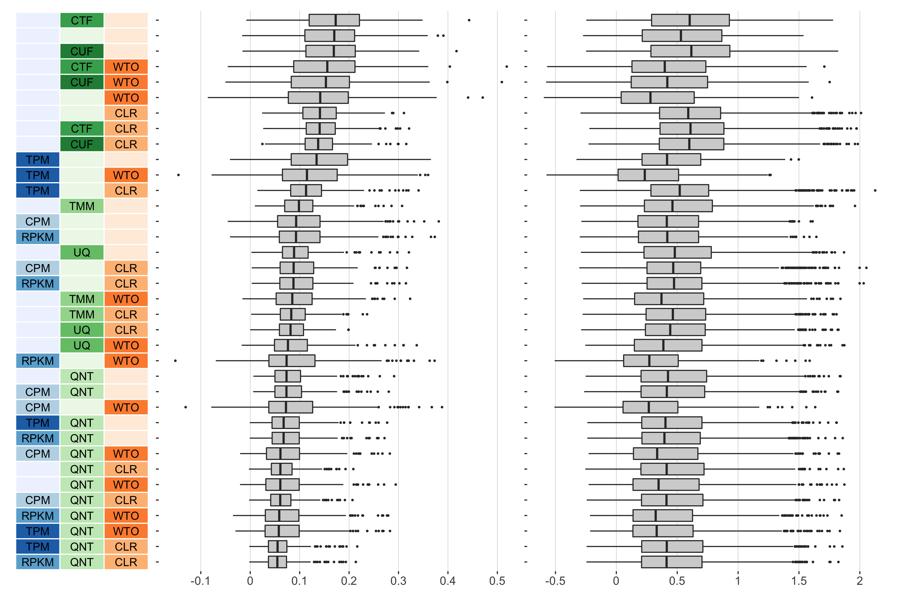
```

## 6 samples
```{r echo=FALSE, fig.cap="**Overall performance of workflows.** The plots show the aggregate accuracy of all resampled GTEx coexpression networks of a given sample size resulting from each individual workflow evaluated using the (**left**) tissue-naive and (**right**) tissue-aware gold standards. The workflows (rows) are described in terms of the specific method used in the within-sample normalization (blues), between-sample normalization (greens), and network transformation (oranges) stages. The performance of each workflow is presented as boxplots that summarizes the log2(auPRC/prior) of each workflow where auPRC is the area under the precision recall curve. The workflows are ordered by their median log2(auPRC/prior) for the tissue-naive data.", out.width="100%"}
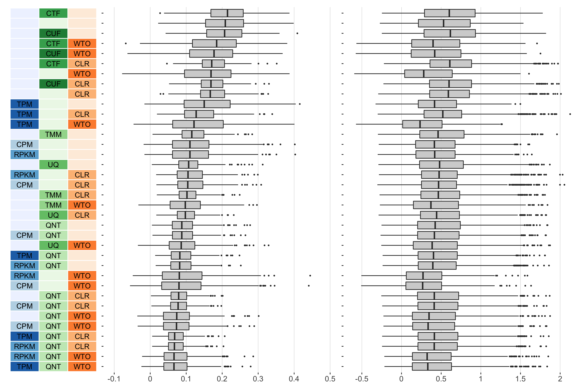
```

## 7 samples
```{r echo=FALSE, fig.cap="**Overall performance of workflows.** The plots show the aggregate accuracy of all resampled GTEx coexpression networks of a given sample size resulting from each individual workflow evaluated using the (**left**) tissue-naive and (**right**) tissue-aware gold standards. The workflows (rows) are described in terms of the specific method used in the within-sample normalization (blues), between-sample normalization (greens), and network transformation (oranges) stages. The performance of each workflow is presented as boxplots that summarizes the log2(auPRC/prior) of each workflow where auPRC is the area under the precision recall curve. The workflows are ordered by their median log2(auPRC/prior) for the tissue-naive data.", out.width="100%"}
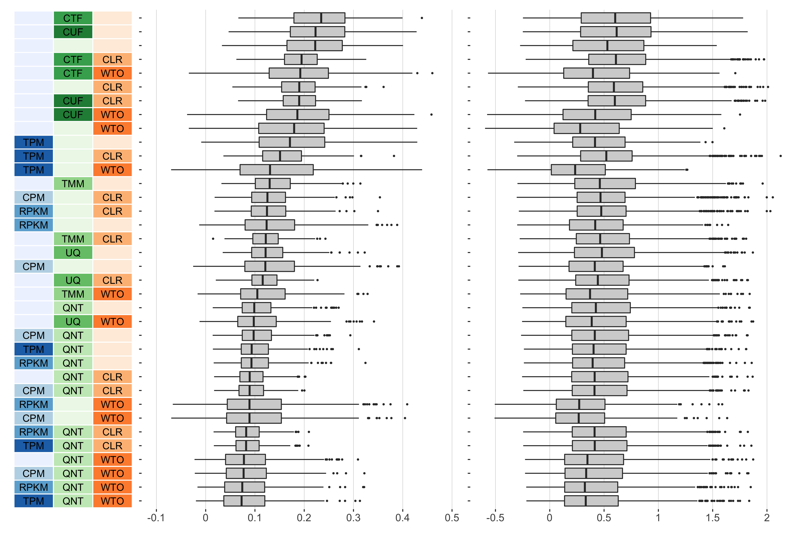
```

## 9 samples
```{r echo=FALSE, fig.cap="**Overall performance of workflows.** The plots show the aggregate accuracy of all resampled GTEx coexpression networks of a given sample size resulting from each individual workflow evaluated using the (**left**) tissue-naive and (**right**) tissue-aware gold standards. The workflows (rows) are described in terms of the specific method used in the within-sample normalization (blues), between-sample normalization (greens), and network transformation (oranges) stages. The performance of each workflow is presented as boxplots that summarizes the log2(auPRC/prior) of each workflow where auPRC is the area under the precision recall curve. The workflows are ordered by their median log2(auPRC/prior) for the tissue-naive data.", out.width="100%"}
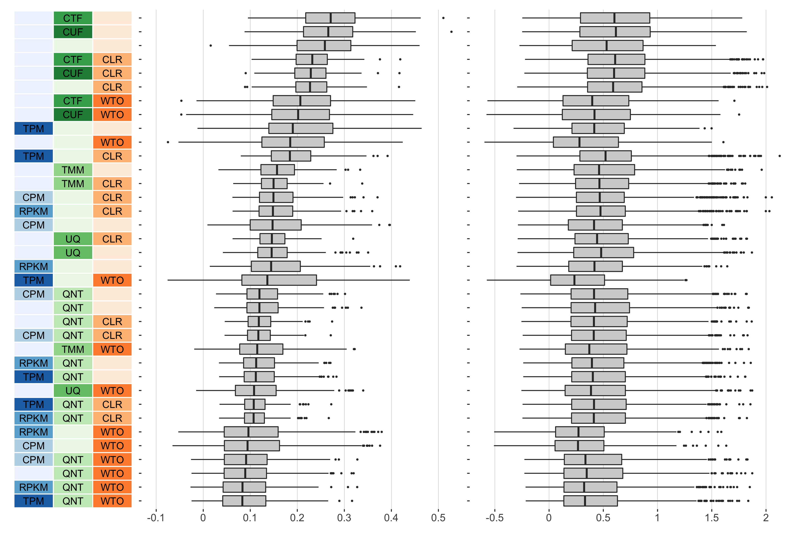
```

## 11 samples
```{r echo=FALSE, fig.cap="**Overall performance of workflows.** The plots show the aggregate accuracy of all resampled GTEx coexpression networks of a given sample size resulting from each individual workflow evaluated using the (**left**) tissue-naive and (**right**) tissue-aware gold standards. The workflows (rows) are described in terms of the specific method used in the within-sample normalization (blues), between-sample normalization (greens), and network transformation (oranges) stages. The performance of each workflow is presented as boxplots that summarizes the log2(auPRC/prior) of each workflow where auPRC is the area under the precision recall curve. The workflows are ordered by their median log2(auPRC/prior) for the tissue-naive data.", out.width="100%"}
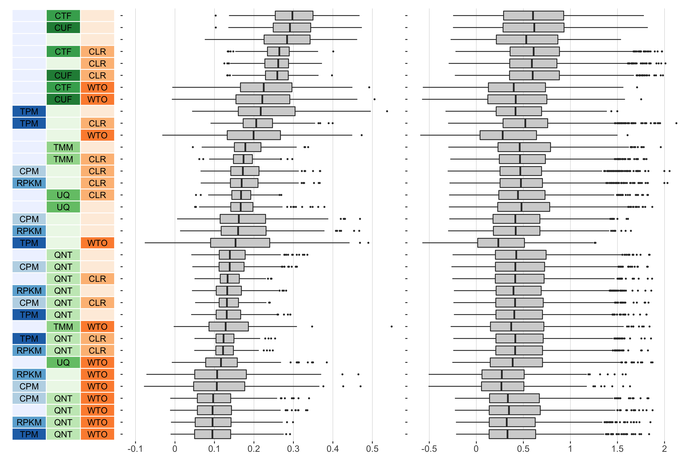
```

## 13 samples 
```{r echo=FALSE, fig.cap="**Overall performance of workflows.** The plots show the aggregate accuracy of all resampled GTEx coexpression networks of a given sample size resulting from each individual workflow evaluated using the (**left**) tissue-naive and (**right**) tissue-aware gold standards. The workflows (rows) are described in terms of the specific method used in the within-sample normalization (blues), between-sample normalization (greens), and network transformation (oranges) stages. The performance of each workflow is presented as boxplots that summarizes the log2(auPRC/prior) of each workflow where auPRC is the area under the precision recall curve. The workflows are ordered by their median log2(auPRC/prior) for the tissue-naive data.", out.width="100%"}
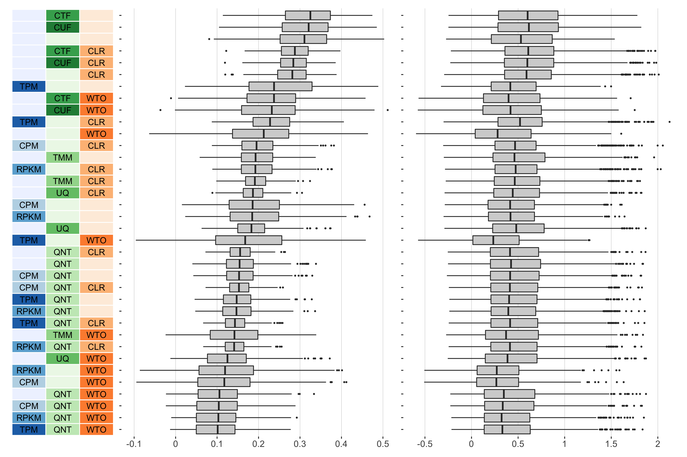
```

## 16 samples
```{r echo=FALSE, fig.cap="**Overall performance of workflows.** The plots show the aggregate accuracy of all resampled GTEx coexpression networks of a given sample size resulting from each individual workflow evaluated using the (**left**) tissue-naive and (**right**) tissue-aware gold standards. The workflows (rows) are described in terms of the specific method used in the within-sample normalization (blues), between-sample normalization (greens), and network transformation (oranges) stages. The performance of each workflow is presented as boxplots that summarizes the log2(auPRC/prior) of each workflow where auPRC is the area under the precision recall curve. The workflows are ordered by their median log2(auPRC/prior) for the tissue-naive data.", out.width="100%"}
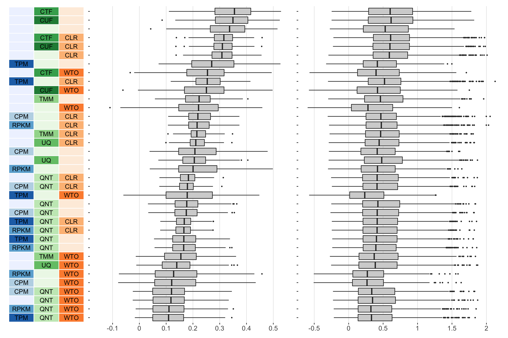
```

## 25 samples
```{r echo=FALSE, fig.cap="**Overall performance of workflows.** The plots show the aggregate accuracy of all resampled GTEx coexpression networks of a given sample size resulting from each individual workflow evaluated using the (**left**) tissue-naive and (**right**) tissue-aware gold standards. The workflows (rows) are described in terms of the specific method used in the within-sample normalization (blues), between-sample normalization (greens), and network transformation (oranges) stages. The performance of each workflow is presented as boxplots that summarizes the log2(auPRC/prior) of each workflow where auPRC is the area under the precision recall curve. The workflows are ordered by their median log2(auPRC/prior) for the tissue-naive data.", out.width="100%"}
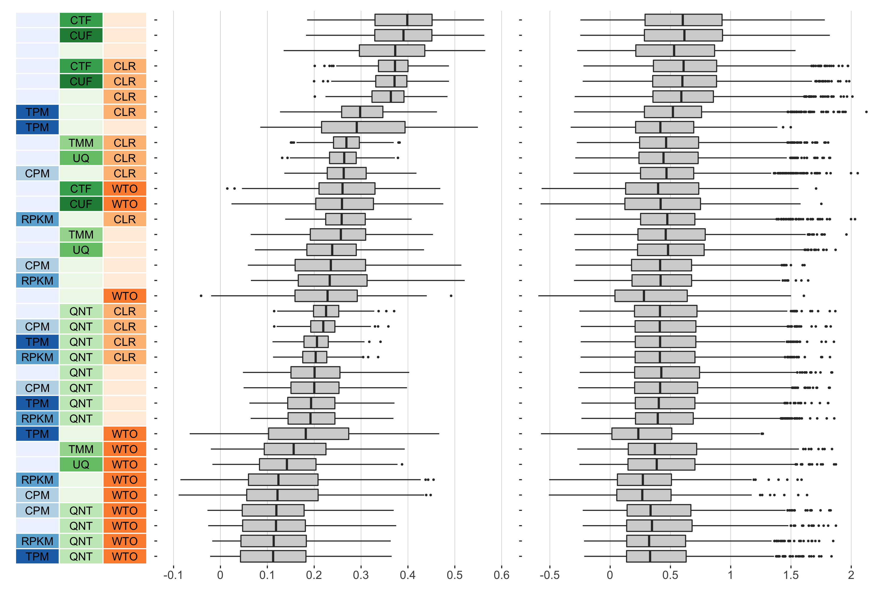
```

## 40 samples
```{r echo=FALSE, fig.cap="**Overall performance of workflows.** The plots show the aggregate accuracy of all resampled GTEx coexpression networks of a given sample size resulting from each individual workflow evaluated using the (**left**) tissue-naive and (**right**) tissue-aware gold standards. The workflows (rows) are described in terms of the specific method used in the within-sample normalization (blues), between-sample normalization (greens), and network transformation (oranges) stages. The performance of each workflow is presented as boxplots that summarizes the log2(auPRC/prior) of each workflow where auPRC is the area under the precision recall curve. The workflows are ordered by their median log2(auPRC/prior) for the tissue-naive data.", out.width="100%"}
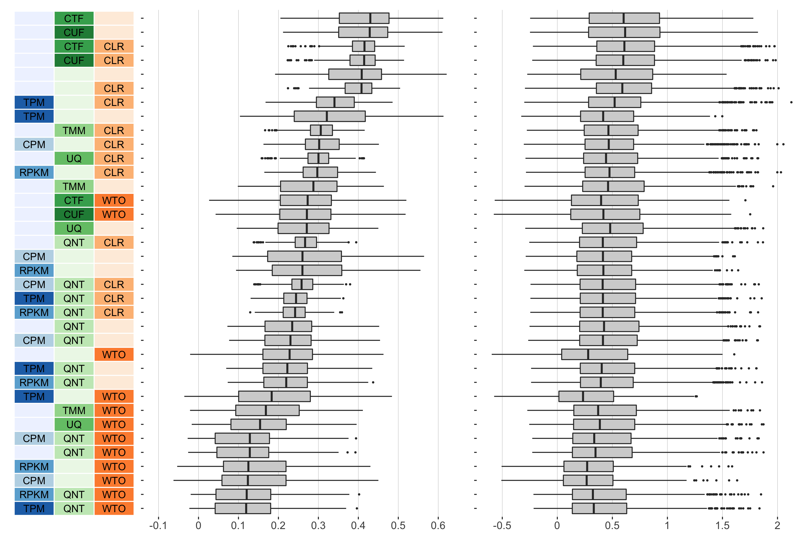
```

# Proportion of Times Each Method Outperforms Another {.tabset .tabset-fade .tabset-pills}

## 5 samples {.tabset .tabset-fade .tabset-pills}

### Tissue-naive Standard
```{r echo=FALSE, out.width = '49%'}
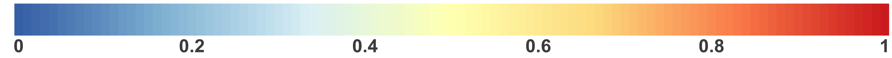
```

```{r echo=FALSE, fig.cap="**Dataset-level pairwise comparison of workflow performance.** (**left**) The heatmap shows the relative performance of a pair of workflows, corresponding to a row and a column, directly compared to each other for the resampled GTEx datasets of a given sample size based on the tissue-naive gold standard. The color in each cell (row, column) represents the proportion of datasets for which the workflow along the row has a higher log2(auPRC/prior) than the workflow along the column. Comparisons that are statistically significant (corrected p < 0.01) based on a paired Wilcoxon test are marked with an asterisk. (**middle**) The workflows (rows) are described in terms of the specific method used in the within-sample normalization (blues), between-sample normalization (greens), and network transformation (oranges) stages. (**right**) The barplot shows the number of times each workflow was significantly greater than another workflow.", out.width = '100%'}
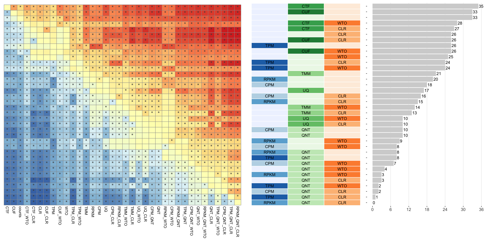
```

### Tissue-aware Standard
```{r echo=FALSE, out.width = '49%'}

```

```{r echo=FALSE, fig.cap="**Dataset-level pairwise comparison of workflow performance.** (**left**) The heatmap shows the relative performance of a pair of workflows, corresponding to a row and a column, directly compared to each other for the resampled GTEx datasets of a given sample size based on the tissue-aware gold standard. The color in each cell (row, column) represents the proportion of datasets for which the workflow along the row has a higher log2(auPRC/prior) than the workflow along the column. Comparisons that are statistically significant (corrected p < 0.01) based on a paired Wilcoxon test are marked with an asterisk. (**middle**) The workflows (rows) are described in terms of the specific method used in the within-sample normalization (blues), between-sample normalization (greens), and network transformation (oranges) stages. (**right**) The barplot shows the number of times each workflow was significantly greater than another workflow.", out.width = '100%'}
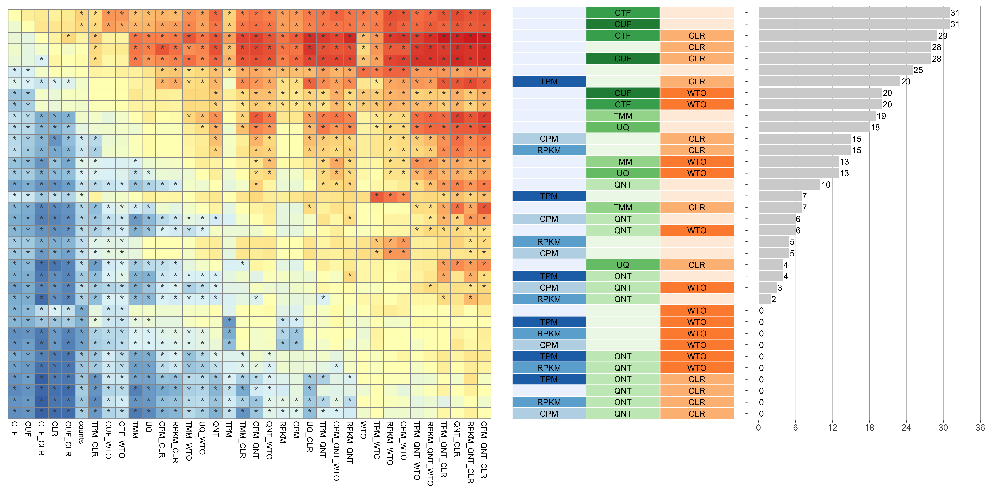
```

## 6 samples {.tabset .tabset-fade .tabset-pills}

### Tissue-naive Standard
```{r echo=FALSE, out.width = '49%'}

```

```{r echo=FALSE, fig.cap="**Dataset-level pairwise comparison of workflow performance.** (**left**) The heatmap shows the relative performance of a pair of workflows, corresponding to a row and a column, directly compared to each other for the resampled GTEx datasets of a given sample size based on the tissue-naive gold standard. The color in each cell (row, column) represents the proportion of datasets for which the workflow along the row has a higher log2(auPRC/prior) than the workflow along the column. Comparisons that are statistically significant (corrected p < 0.01) based on a paired Wilcoxon test are marked with an asterisk. (**middle**) The workflows (rows) are described in terms of the specific method used in the within-sample normalization (blues), between-sample normalization (greens), and network transformation (oranges) stages. (**right**) The barplot shows the number of times each workflow was significantly greater than another workflow.", out.width = '100%'}
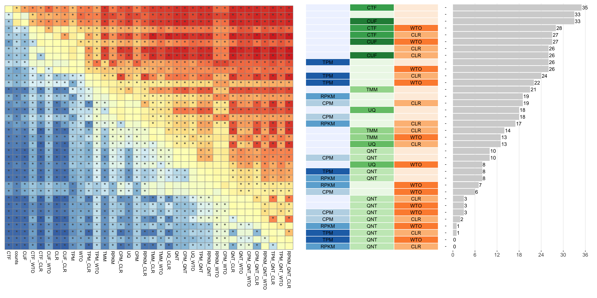
```

### Tissue-aware Standard
```{r echo=FALSE, out.width = '49%'}

```

```{r echo=FALSE, fig.cap="**Dataset-level pairwise comparison of workflow performance.** (**left**) The heatmap shows the relative performance of a pair of workflows, corresponding to a row and a column, directly compared to each other for the resampled GTEx datasets of a given sample size based on the tissue-aware gold standard. The color in each cell (row, column) represents the proportion of datasets for which the workflow along the row has a higher log2(auPRC/prior) than the workflow along the column. Comparisons that are statistically significant (corrected p < 0.01) based on a paired Wilcoxon test are marked with an asterisk. (**middle**) The workflows (rows) are described in terms of the specific method used in the within-sample normalization (blues), between-sample normalization (greens), and network transformation (oranges) stages. (**right**) The barplot shows the number of times each workflow was significantly greater than another workflow.", out.width = '100%'}
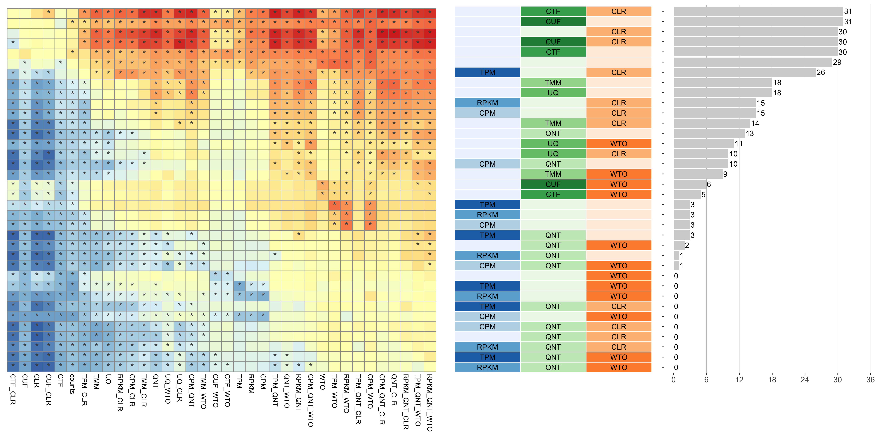
```

## 7 samples {.tabset .tabset-fade .tabset-pills}

### Tissue-naive Standard
```{r echo=FALSE, out.width = '49%'}

```

```{r echo=FALSE, fig.cap="**Dataset-level pairwise comparison of workflow performance.** (**left**) The heatmap shows the relative performance of a pair of workflows, corresponding to a row and a column, directly compared to each other for the resampled GTEx datasets of a given sample size based on the tissue-naive gold standard. The color in each cell (row, column) represents the proportion of datasets for which the workflow along the row has a higher log2(auPRC/prior) than the workflow along the column. Comparisons that are statistically significant (corrected p < 0.01) based on a paired Wilcoxon test are marked with an asterisk. (**middle**) The workflows (rows) are described in terms of the specific method used in the within-sample normalization (blues), between-sample normalization (greens), and network transformation (oranges) stages. (**right**) The barplot shows the number of times each workflow was significantly greater than another workflow.", out.width = '100%'}
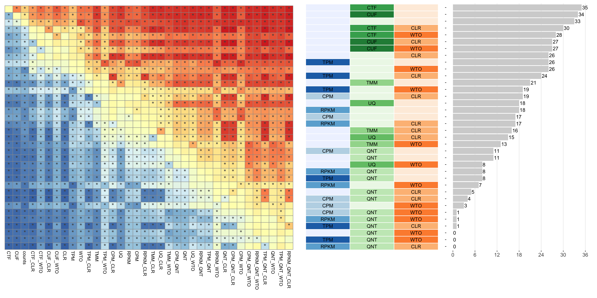
```

### Tissue-aware Standard
```{r echo=FALSE, out.width = '49%'}

```

```{r echo=FALSE, fig.cap="**Dataset-level pairwise comparison of workflow performance.** (**left**) The heatmap shows the relative performance of a pair of workflows, corresponding to a row and a column, directly compared to each other for the resampled GTEx datasets of a given sample size based on the tissue-aware gold standard. The color in each cell (row, column) represents the proportion of datasets for which the workflow along the row has a higher log2(auPRC/prior) than the workflow along the column. Comparisons that are statistically significant (corrected p < 0.01) based on a paired Wilcoxon test are marked with an asterisk. (**middle**) The workflows (rows) are described in terms of the specific method used in the within-sample normalization (blues), between-sample normalization (greens), and network transformation (oranges) stages. (**right**) The barplot shows the number of times each workflow was significantly greater than another workflow.", out.width = '100%'}
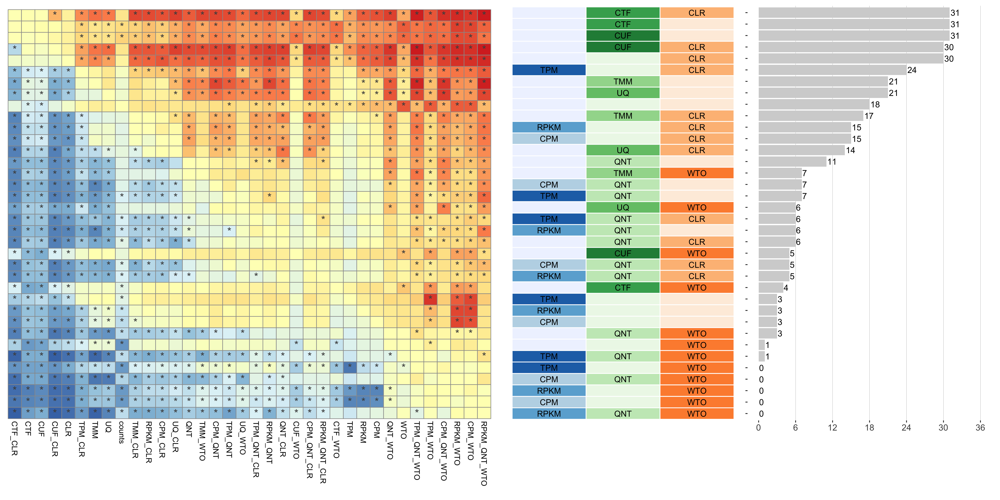
```

## 9 samples {.tabset .tabset-fade .tabset-pills}

### Tissue-naive Standard
```{r echo=FALSE, out.width = '49%'}

```

```{r echo=FALSE, fig.cap="**Dataset-level pairwise comparison of workflow performance.** (**left**) The heatmap shows the relative performance of a pair of workflows, corresponding to a row and a column, directly compared to each other for the resampled GTEx datasets of a given sample size based on the tissue-naive gold standard. The color in each cell (row, column) represents the proportion of datasets for which the workflow along the row has a higher log2(auPRC/prior) than the workflow along the column. Comparisons that are statistically significant (corrected p < 0.01) based on a paired Wilcoxon test are marked with an asterisk. (**middle**) The workflows (rows) are described in terms of the specific method used in the within-sample normalization (blues), between-sample normalization (greens), and network transformation (oranges) stages. (**right**) The barplot shows the number of times each workflow was significantly greater than another workflow.", out.width = '100%'}
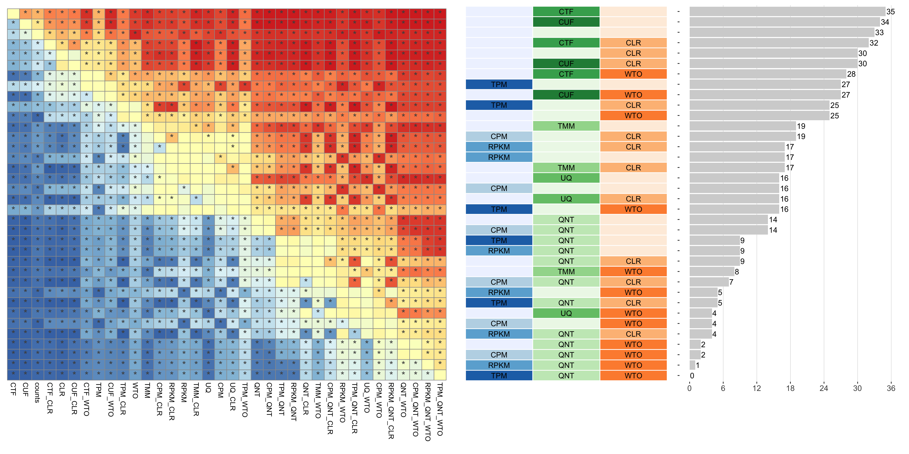
```

### Tissue-aware Standard
```{r echo=FALSE, out.width = '49%'}

```

```{r echo=FALSE, fig.cap="**Dataset-level pairwise comparison of workflow performance.** (**left**) The heatmap shows the relative performance of a pair of workflows, corresponding to a row and a column, directly compared to each other for the resampled GTEx datasets of a given sample size based on the tissue-aware gold standard. The color in each cell (row, column) represents the proportion of datasets for which the workflow along the row has a higher log2(auPRC/prior) than the workflow along the column. Comparisons that are statistically significant (corrected p < 0.01) based on a paired Wilcoxon test are marked with an asterisk. (**middle**) The workflows (rows) are described in terms of the specific method used in the within-sample normalization (blues), between-sample normalization (greens), and network transformation (oranges) stages. (**right**) The barplot shows the number of times each workflow was significantly greater than another workflow.", out.width = '100%'}
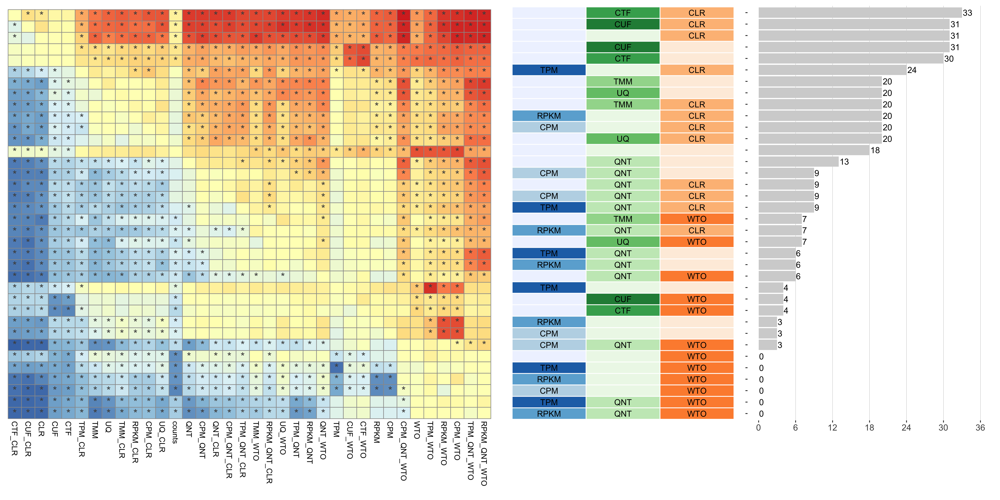
```

## 11 samples {.tabset .tabset-fade .tabset-pills}

### Tissue-naive Standard
```{r echo=FALSE, out.width = '49%'}

```

```{r echo=FALSE, fig.cap="**Dataset-level pairwise comparison of workflow performance.** (**left**) The heatmap shows the relative performance of a pair of workflows, corresponding to a row and a column, directly compared to each other for the resampled GTEx datasets of a given sample size based on the tissue-naive gold standard. The color in each cell (row, column) represents the proportion of datasets for which the workflow along the row has a higher log2(auPRC/prior) than the workflow along the column. Comparisons that are statistically significant (corrected p < 0.01) based on a paired Wilcoxon test are marked with an asterisk. (**middle**) The workflows (rows) are described in terms of the specific method used in the within-sample normalization (blues), between-sample normalization (greens), and network transformation (oranges) stages. (**right**) The barplot shows the number of times each workflow was significantly greater than another workflow.", out.width = '100%'}
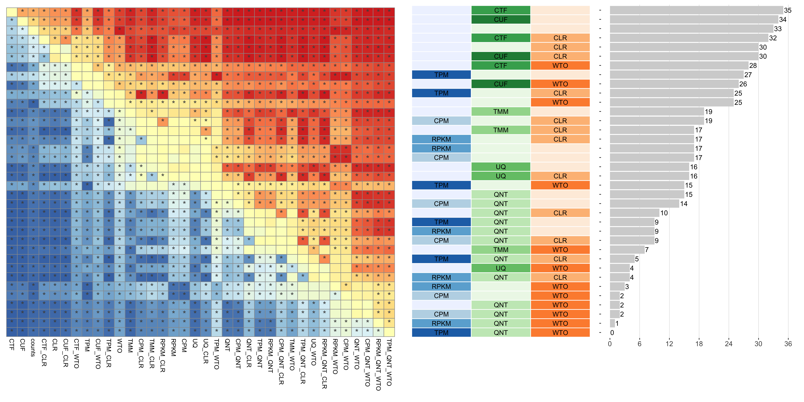
```

### Tissue-aware Standard
```{r echo=FALSE, out.width = '49%'}

```

```{r echo=FALSE, fig.cap="**Dataset-level pairwise comparison of workflow performance.** (**left**) The heatmap shows the relative performance of a pair of workflows, corresponding to a row and a column, directly compared to each other for the resampled GTEx datasets of a given sample size based on the tissue-aware gold standard. The color in each cell (row, column) represents the proportion of datasets for which the workflow along the row has a higher log2(auPRC/prior) than the workflow along the column. Comparisons that are statistically significant (corrected p < 0.01) based on a paired Wilcoxon test are marked with an asterisk. (**middle**) The workflows (rows) are described in terms of the specific method used in the within-sample normalization (blues), between-sample normalization (greens), and network transformation (oranges) stages. (**right**) The barplot shows the number of times each workflow was significantly greater than another workflow.", out.width = '100%'}
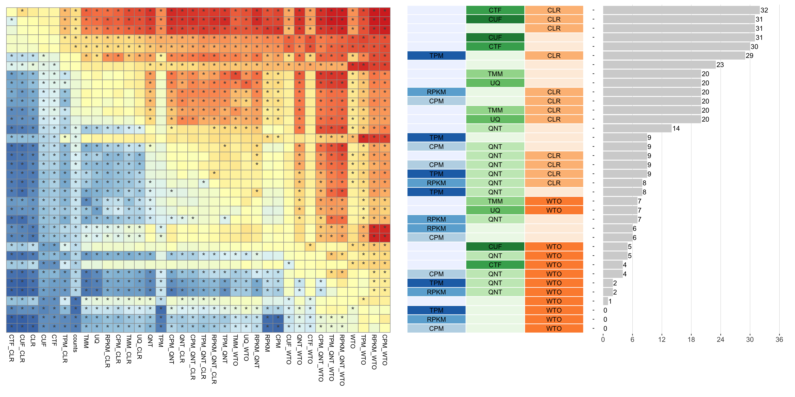
```

## 13 samples {.tabset .tabset-fade .tabset-pills}

### Tissue-naive Standard
```{r echo=FALSE, out.width = '49%'}

```

```{r echo=FALSE, fig.cap="**Dataset-level pairwise comparison of workflow performance.** (**left**) The heatmap shows the relative performance of a pair of workflows, corresponding to a row and a column, directly compared to each other for the resampled GTEx datasets of a given sample size based on the tissue-naive gold standard. The color in each cell (row, column) represents the proportion of datasets for which the workflow along the row has a higher log2(auPRC/prior) than the workflow along the column. Comparisons that are statistically significant (corrected p < 0.01) based on a paired Wilcoxon test are marked with an asterisk. (**middle**) The workflows (rows) are described in terms of the specific method used in the within-sample normalization (blues), between-sample normalization (greens), and network transformation (oranges) stages. (**right**) The barplot shows the number of times each workflow was significantly greater than another workflow.", out.width = '100%'}
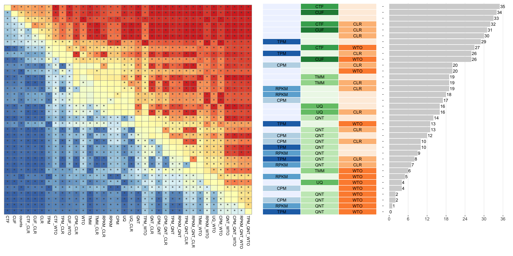
```

### Tissue-aware Standard
```{r echo=FALSE, out.width = '49%'}

```

```{r echo=FALSE, fig.cap="**Dataset-level pairwise comparison of workflow performance.** (**left**) The heatmap shows the relative performance of a pair of workflows, corresponding to a row and a column, directly compared to each other for the resampled GTEx datasets of a given sample size based on the tissue-aware gold standard. The color in each cell (row, column) represents the proportion of datasets for which the workflow along the row has a higher log2(auPRC/prior) than the workflow along the column. Comparisons that are statistically significant (corrected p < 0.01) based on a paired Wilcoxon test are marked with an asterisk. (**middle**) The workflows (rows) are described in terms of the specific method used in the within-sample normalization (blues), between-sample normalization (greens), and network transformation (oranges) stages. (**right**) The barplot shows the number of times each workflow was significantly greater than another workflow.", out.width = '100%'}
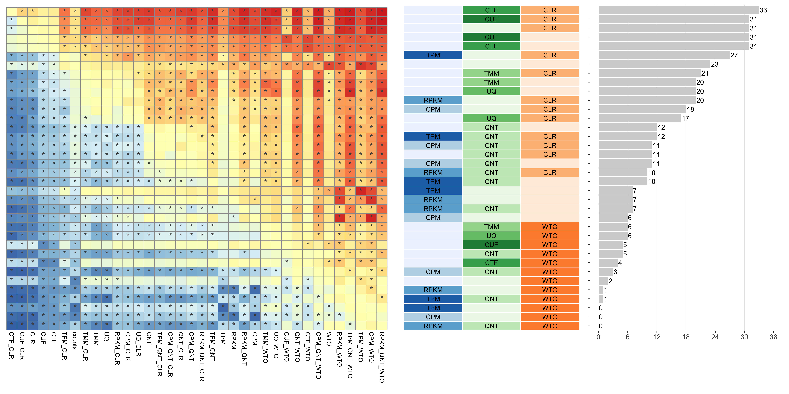
```

## 16 samples {.tabset .tabset-fade .tabset-pills}

### Tissue-naive Standard
```{r echo=FALSE, out.width = '49%'}

```

```{r echo=FALSE, fig.cap="**Dataset-level pairwise comparison of workflow performance.** (**left**) The heatmap shows the relative performance of a pair of workflows, corresponding to a row and a column, directly compared to each other for the resampled GTEx datasets of a given sample size based on the tissue-naive gold standard. The color in each cell (row, column) represents the proportion of datasets for which the workflow along the row has a higher log2(auPRC/prior) than the workflow along the column. Comparisons that are statistically significant (corrected p < 0.01) based on a paired Wilcoxon test are marked with an asterisk. (**middle**) The workflows (rows) are described in terms of the specific method used in the within-sample normalization (blues), between-sample normalization (greens), and network transformation (oranges) stages. (**right**) The barplot shows the number of times each workflow was significantly greater than another workflow.", out.width = '100%'}
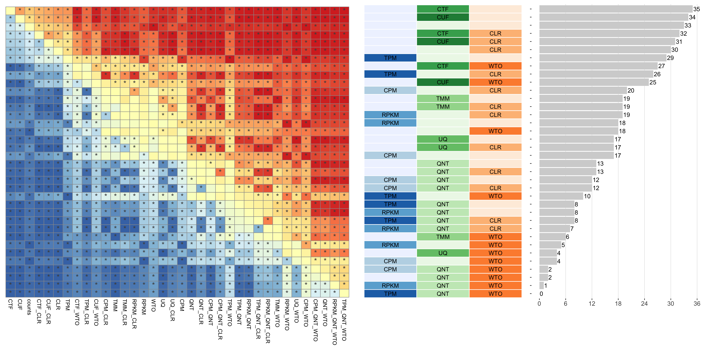
```

### Tissue-aware Standard
```{r echo=FALSE, out.width = '49%'}

```

```{r echo=FALSE, fig.cap="**Dataset-level pairwise comparison of workflow performance.** (**left**) The heatmap shows the relative performance of a pair of workflows, corresponding to a row and a column, directly compared to each other for the resampled GTEx datasets of a given sample size based on the tissue-aware gold standard. The color in each cell (row, column) represents the proportion of datasets for which the workflow along the row has a higher log2(auPRC/prior) than the workflow along the column. Comparisons that are statistically significant (corrected p < 0.01) based on a paired Wilcoxon test are marked with an asterisk. (**middle**) The workflows (rows) are described in terms of the specific method used in the within-sample normalization (blues), between-sample normalization (greens), and network transformation (oranges) stages. (**right**) The barplot shows the number of times each workflow was significantly greater than another workflow.", out.width = '100%'}
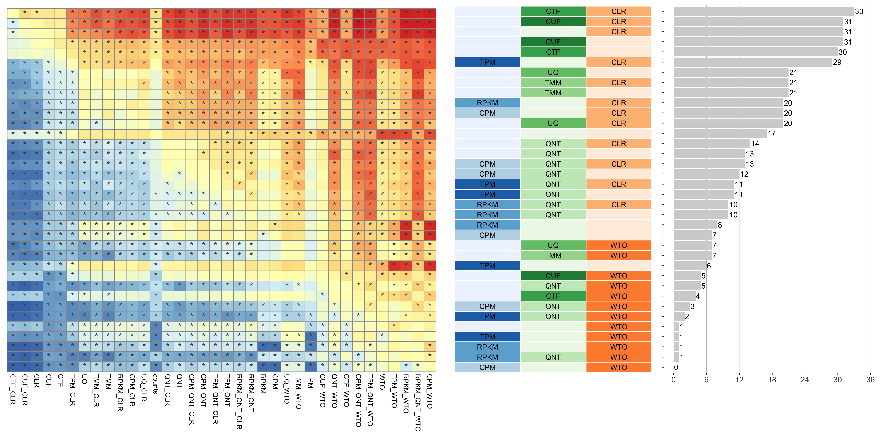
```

## 25 samples {.tabset .tabset-fade .tabset-pills}

### Tissue-naive Standard
```{r echo=FALSE, out.width = '49%'}

```

```{r echo=FALSE, fig.cap="**Dataset-level pairwise comparison of workflow performance.** (**left**) The heatmap shows the relative performance of a pair of workflows, corresponding to a row and a column, directly compared to each other for the resampled GTEx datasets of a given sample size based on the tissue-naive gold standard. The color in each cell (row, column) represents the proportion of datasets for which the workflow along the row has a higher log2(auPRC/prior) than the workflow along the column. Comparisons that are statistically significant (corrected p < 0.01) based on a paired Wilcoxon test are marked with an asterisk. (**middle**) The workflows (rows) are described in terms of the specific method used in the within-sample normalization (blues), between-sample normalization (greens), and network transformation (oranges) stages. (**right**) The barplot shows the number of times each workflow was significantly greater than another workflow.", out.width = '100%'}
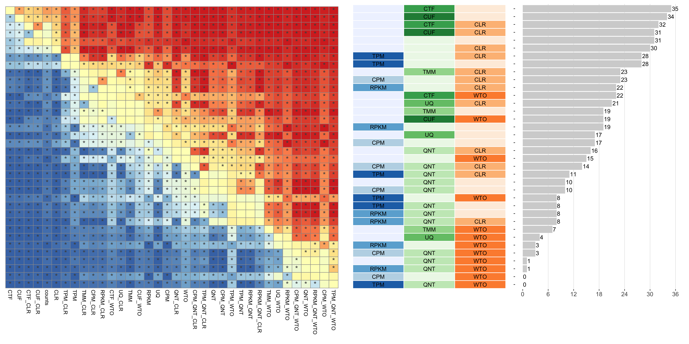
```

### Tissue-aware Standard
```{r echo=FALSE, out.width = '49%'}

```

```{r echo=FALSE, fig.cap="**Dataset-level pairwise comparison of workflow performance.** (**left**) The heatmap shows the relative performance of a pair of workflows, corresponding to a row and a column, directly compared to each other for the resampled GTEx datasets of a given sample size based on the tissue-aware gold standard. The color in each cell (row, column) represents the proportion of datasets for which the workflow along the row has a higher log2(auPRC/prior) than the workflow along the column. Comparisons that are statistically significant (corrected p < 0.01) based on a paired Wilcoxon test are marked with an asterisk. (**middle**) The workflows (rows) are described in terms of the specific method used in the within-sample normalization (blues), between-sample normalization (greens), and network transformation (oranges) stages. (**right**) The barplot shows the number of times each workflow was significantly greater than another workflow.", out.width = '100%'}
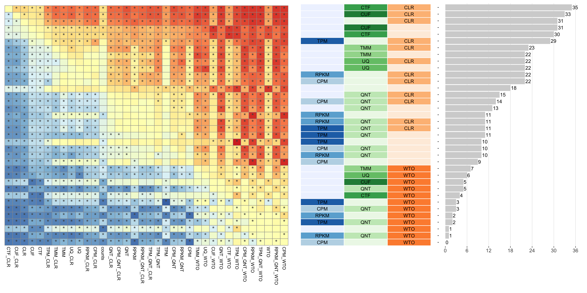
```

## 40 samples {.tabset .tabset-fade .tabset-pills}

### Tissue-naive Standard
```{r echo=FALSE, out.width = '49%'}

```

```{r echo=FALSE, fig.cap="**Dataset-level pairwise comparison of workflow performance.** (**left**) The heatmap shows the relative performance of a pair of workflows, corresponding to a row and a column, directly compared to each other for the resampled GTEx datasets of a given sample size based on the tissue-naive gold standard. The color in each cell (row, column) represents the proportion of datasets for which the workflow along the row has a higher log2(auPRC/prior) than the workflow along the column. Comparisons that are statistically significant (corrected p < 0.01) based on a paired Wilcoxon test are marked with an asterisk. (**middle**) The workflows (rows) are described in terms of the specific method used in the within-sample normalization (blues), between-sample normalization (greens), and network transformation (oranges) stages. (**right**) The barplot shows the number of times each workflow was significantly greater than another workflow.", out.width = '100%'}
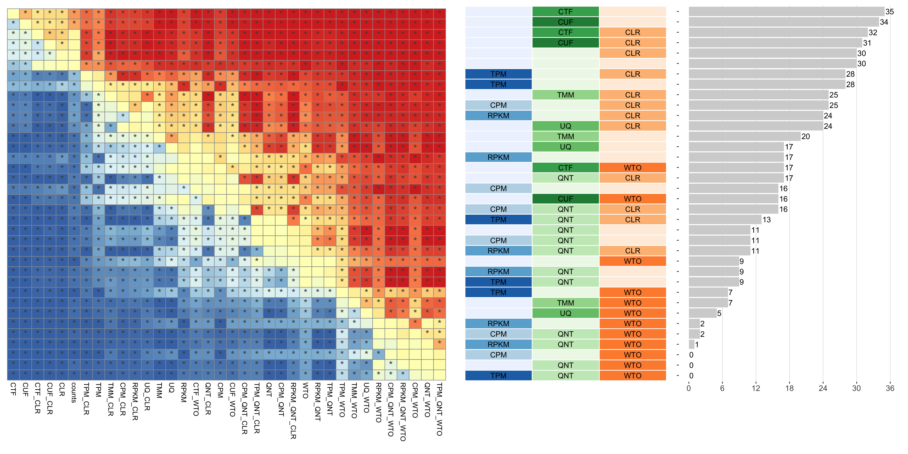
```

### Tissue-aware Standard
```{r echo=FALSE, out.width = '49%'}

```

```{r echo=FALSE, fig.cap="**Dataset-level pairwise comparison of workflow performance.** (**left**) The heatmap shows the relative performance of a pair of workflows, corresponding to a row and a column, directly compared to each other for the resampled GTEx datasets of a given sample size based on the tissue-aware gold standard. The color in each cell (row, column) represents the proportion of datasets for which the workflow along the row has a higher log2(auPRC/prior) than the workflow along the column. Comparisons that are statistically significant (corrected p < 0.01) based on a paired Wilcoxon test are marked with an asterisk. (**middle**) The workflows (rows) are described in terms of the specific method used in the within-sample normalization (blues), between-sample normalization (greens), and network transformation (oranges) stages. (**right**) The barplot shows the number of times each workflow was significantly greater than another workflow.", out.width = '100%'}
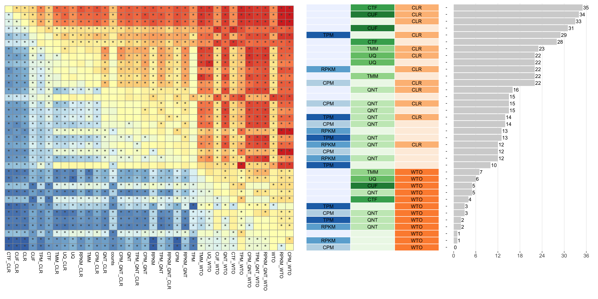
```

# Method Part Comparison {.tabset .tabset-fade .tabset-pills}

## 5 samples {.tabset .tabset-fade .tabset-pills}

### Tissue-naive Standard
```{r echo=FALSE, fig.cap="**Impact of individual methods on performance of workflows.** Each bar in the barplot corresponds to a specific method, showing the proportion of times (x-axis) that workflows including that particular method (y-axis) were significantly better than other workflows. In order to make the comparison of between-sample normalization methods fair, workflows also including CPM, RPKM, or TPM were left out because it is not possible to pair them with TMM or UQ normalization. Similarly, TMM and UQ methods are not included for “no within-sample normalization” (NO–WI).", out.width="100%"}
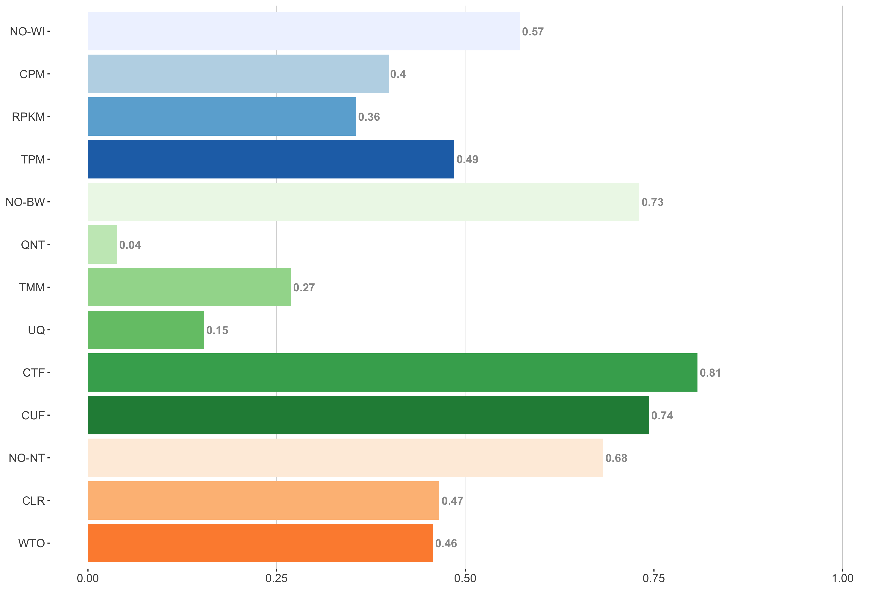
```

### Tissue-aware Standard
```{r echo=FALSE, fig.cap="**Impact of individual methods on performance of workflows.** Each bar in the barplot corresponds to a specific method, showing the proportion of times (x-axis) that workflows including that particular method (y-axis) were significantly better than other workflows. In order to make the comparison of between-sample normalization methods fair, workflows also including CPM, RPKM, or TPM were left out because it is not possible to pair them with TMM or UQ normalization. Similarly, TMM and UQ methods are not included for “no within-sample normalization” (NO–WI).", out.width="100%"}
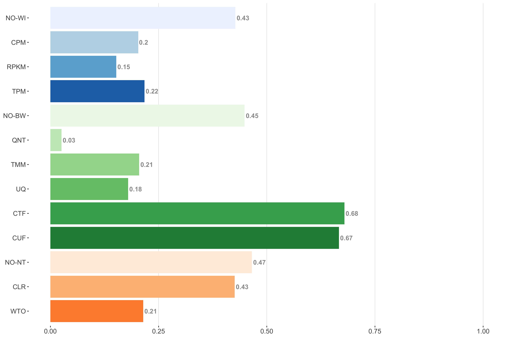
```

## 6 samples {.tabset .tabset-fade .tabset-pills}

### Tissue-naive Standard
```{r echo=FALSE, fig.cap="**Impact of individual methods on performance of workflows.** Each bar in the barplot corresponds to a specific method, showing the proportion of times (x-axis) that workflows including that particular method (y-axis) were significantly better than other workflows. In order to make the comparison of between-sample normalization methods fair, workflows also including CPM, RPKM, or TPM were left out because it is not possible to pair them with TMM or UQ normalization. Similarly, TMM and UQ methods are not included for “no within-sample normalization” (NO–WI).", out.width="100%"}
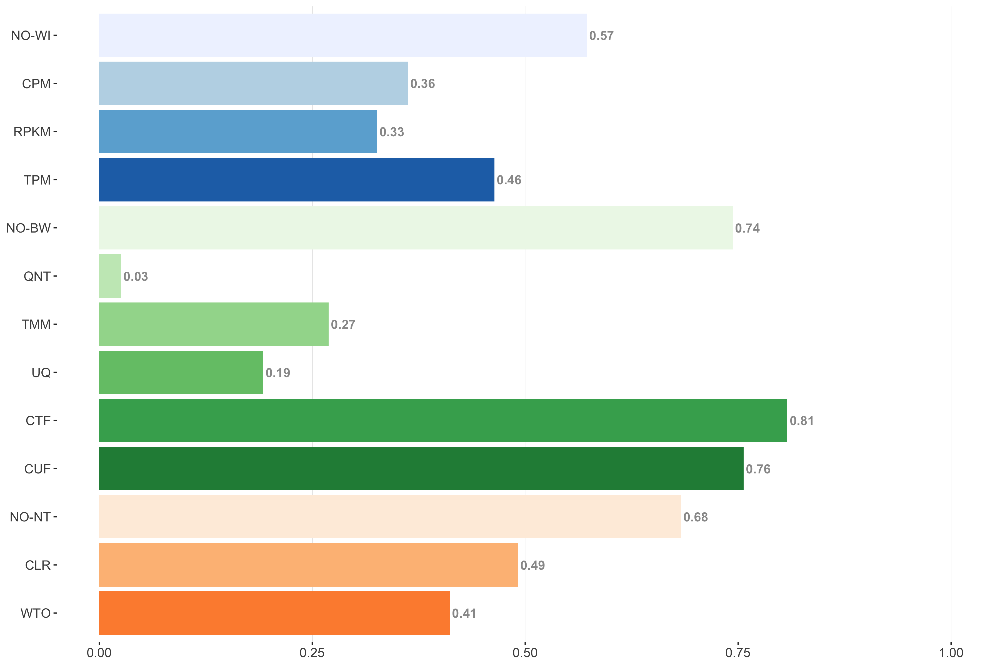
```

### Tissue-aware Standard
```{r echo=FALSE, fig.cap="**Impact of individual methods on performance of workflows.** Each bar in the barplot corresponds to a specific method, showing the proportion of times (x-axis) that workflows including that particular method (y-axis) were significantly better than other workflows. In order to make the comparison of between-sample normalization methods fair, workflows also including CPM, RPKM, or TPM were left out because it is not possible to pair them with TMM or UQ normalization. Similarly, TMM and UQ methods are not included for “no within-sample normalization” (NO–WI).", out.width="100%"}
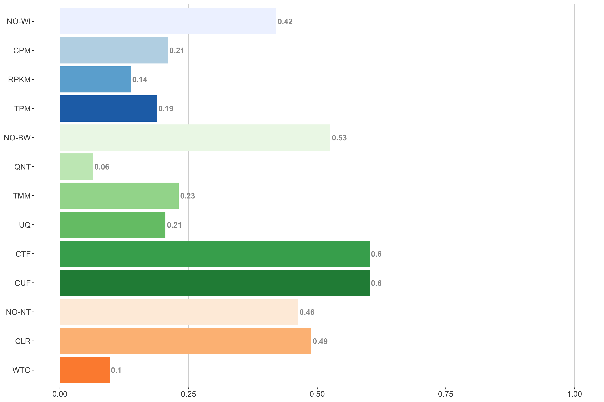
```

## 7 samples {.tabset .tabset-fade .tabset-pills}

### Tissue-naive Standard
```{r echo=FALSE, fig.cap="**Impact of individual methods on performance of workflows.** Each bar in the barplot corresponds to a specific method, showing the proportion of times (x-axis) that workflows including that particular method (y-axis) were significantly better than other workflows. In order to make the comparison of between-sample normalization methods fair, workflows also including CPM, RPKM, or TPM were left out because it is not possible to pair them with TMM or UQ normalization. Similarly, TMM and UQ methods are not included for “no within-sample normalization” (NO–WI).", out.width="100%"}
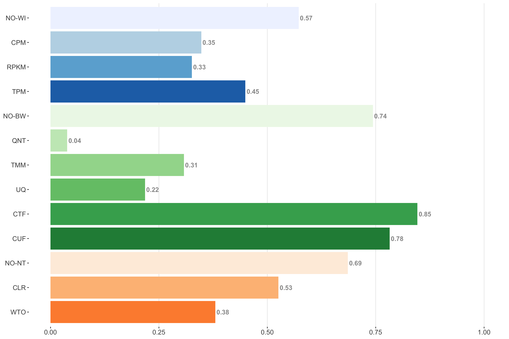
```

### Tissue-aware Standard
```{r echo=FALSE, fig.cap="**Impact of individual methods on performance of workflows.** Each bar in the barplot corresponds to a specific method, showing the proportion of times (x-axis) that workflows including that particular method (y-axis) were significantly better than other workflows. In order to make the comparison of between-sample normalization methods fair, workflows also including CPM, RPKM, or TPM were left out because it is not possible to pair them with TMM or UQ normalization. Similarly, TMM and UQ methods are not included for “no within-sample normalization” (NO–WI).", out.width="100%"}
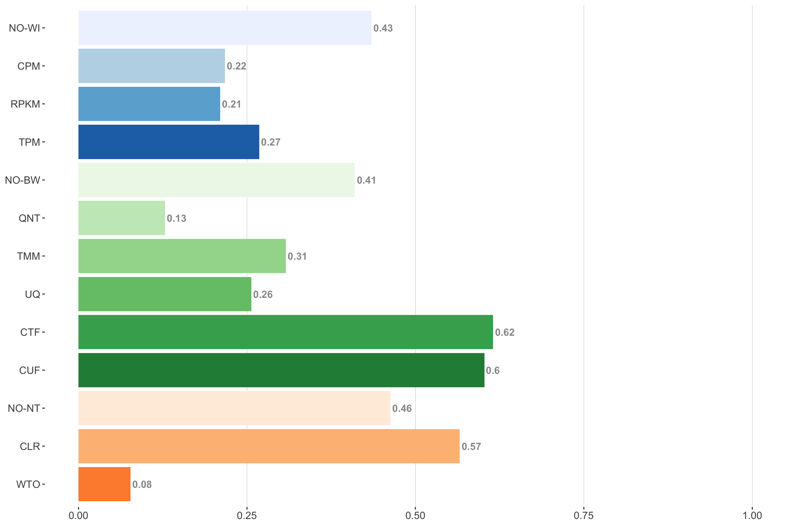
```

## 9 samples {.tabset .tabset-fade .tabset-pills}

### Tissue-naive Standard
```{r echo=FALSE, fig.cap="**Impact of individual methods on performance of workflows.** Each bar in the barplot corresponds to a specific method, showing the proportion of times (x-axis) that workflows including that particular method (y-axis) were significantly better than other workflows. In order to make the comparison of between-sample normalization methods fair, workflows also including CPM, RPKM, or TPM were left out because it is not possible to pair them with TMM or UQ normalization. Similarly, TMM and UQ methods are not included for “no within-sample normalization” (NO–WI).", out.width="100%"}
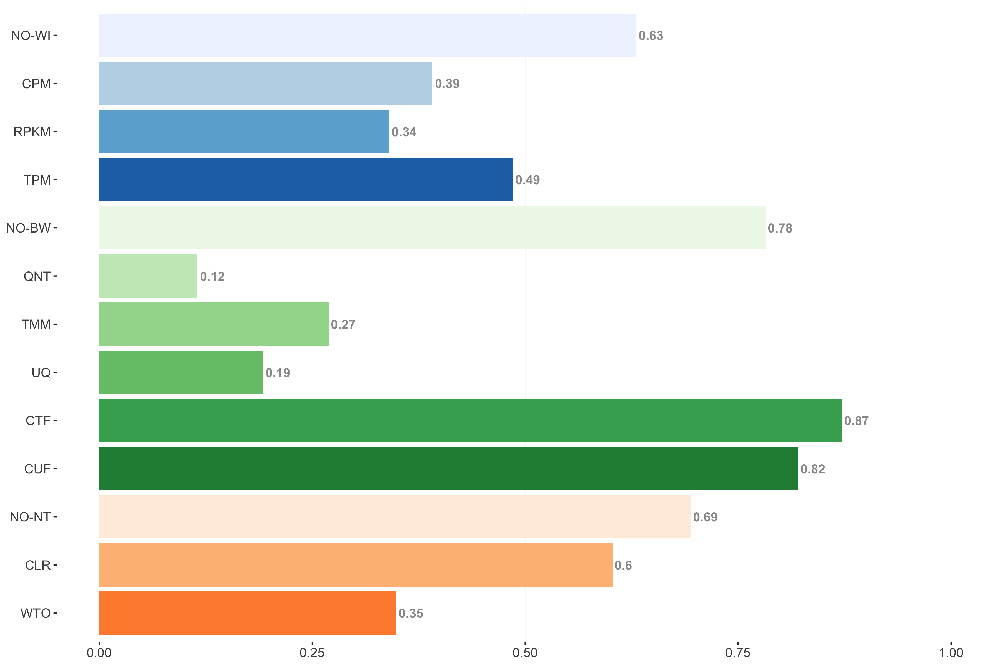
```

### Tissue-aware Standard
```{r echo=FALSE, fig.cap="**Impact of individual methods on performance of workflows.** Each bar in the barplot corresponds to a specific method, showing the proportion of times (x-axis) that workflows including that particular method (y-axis) were significantly better than other workflows. In order to make the comparison of between-sample normalization methods fair, workflows also including CPM, RPKM, or TPM were left out because it is not possible to pair them with TMM or UQ normalization. Similarly, TMM and UQ methods are not included for “no within-sample normalization” (NO–WI).", out.width="100%"}
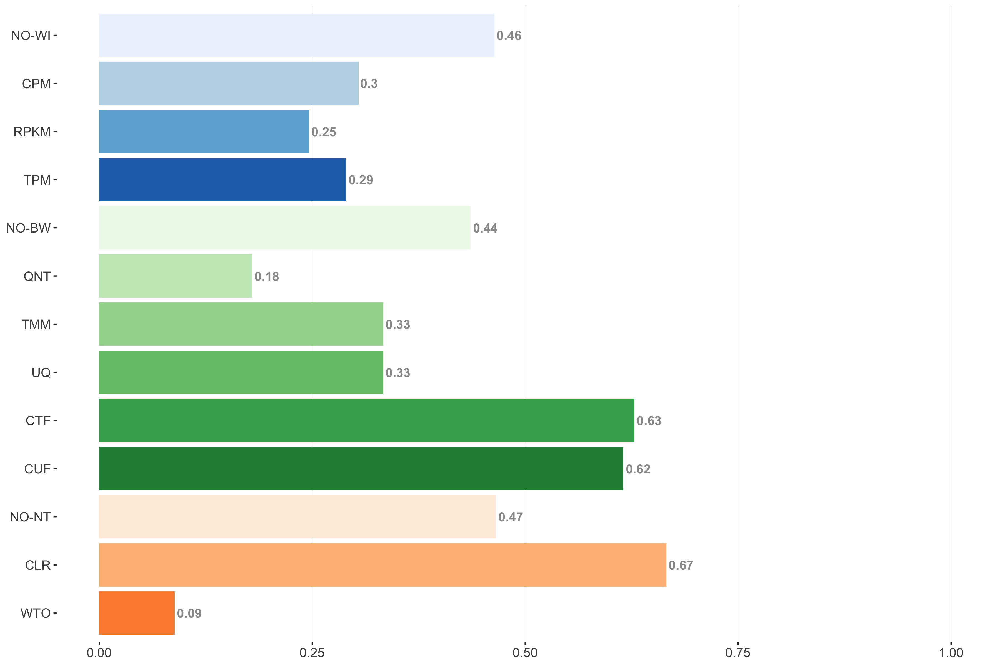 
```

## 11 samples {.tabset .tabset-fade .tabset-pills}

### Tissue-naive Standard
```{r echo=FALSE, fig.cap="**Impact of individual methods on performance of workflows.** Each bar in the barplot corresponds to a specific method, showing the proportion of times (x-axis) that workflows including that particular method (y-axis) were significantly better than other workflows. In order to make the comparison of between-sample normalization methods fair, workflows also including CPM, RPKM, or TPM were left out because it is not possible to pair them with TMM or UQ normalization. Similarly, TMM and UQ methods are not included for “no within-sample normalization” (NO–WI).", out.width="100%"}
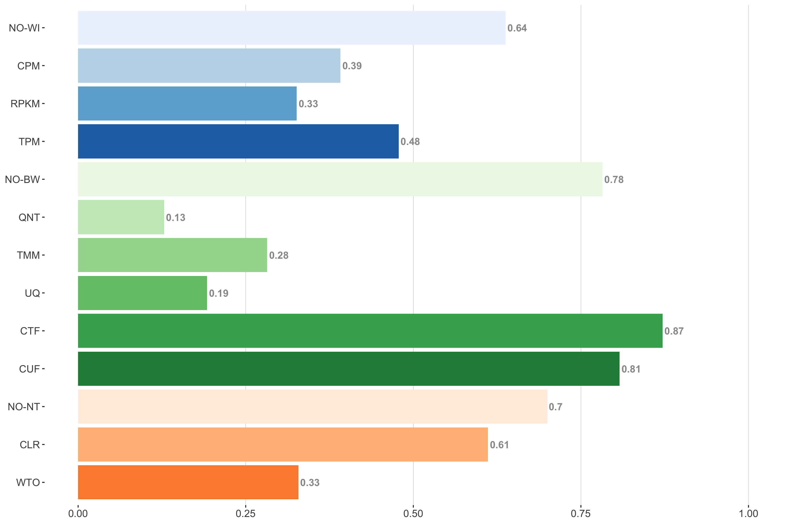 
```

### Tissue-aware Standard
```{r echo=FALSE, fig.cap="**Impact of individual methods on performance of workflows.** Each bar in the barplot corresponds to a specific method, showing the proportion of times (x-axis) that workflows including that particular method (y-axis) were significantly better than other workflows. In order to make the comparison of between-sample normalization methods fair, workflows also including CPM, RPKM, or TPM were left out because it is not possible to pair them with TMM or UQ normalization. Similarly, TMM and UQ methods are not included for “no within-sample normalization” (NO–WI).", out.width="100%"}

```

## 13 samples {.tabset .tabset-fade .tabset-pills}

### Tissue-naive Standard
```{r echo=FALSE, fig.cap="**Impact of individual methods on performance of workflows.** Each bar in the barplot corresponds to a specific method, showing the proportion of times (x-axis) that workflows including that particular method (y-axis) were significantly better than other workflows. In order to make the comparison of between-sample normalization methods fair, workflows also including CPM, RPKM, or TPM were left out because it is not possible to pair them with TMM or UQ normalization. Similarly, TMM and UQ methods are not included for “no within-sample normalization” (NO–WI).", out.width="100%"}
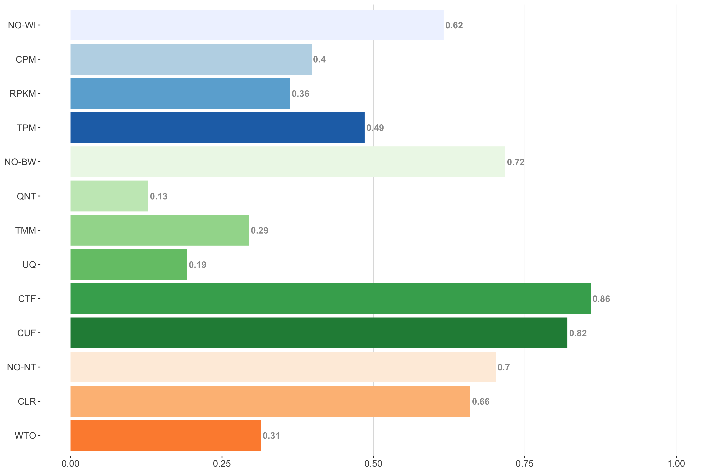
```

### Tissue-aware Standard
```{r echo=FALSE, fig.cap="**Impact of individual methods on performance of workflows.** Each bar in the barplot corresponds to a specific method, showing the proportion of times (x-axis) that workflows including that particular method (y-axis) were significantly better than other workflows. In order to make the comparison of between-sample normalization methods fair, workflows also including CPM, RPKM, or TPM were left out because it is not possible to pair them with TMM or UQ normalization. Similarly, TMM and UQ methods are not included for “no within-sample normalization” (NO–WI).", out.width="100%"}
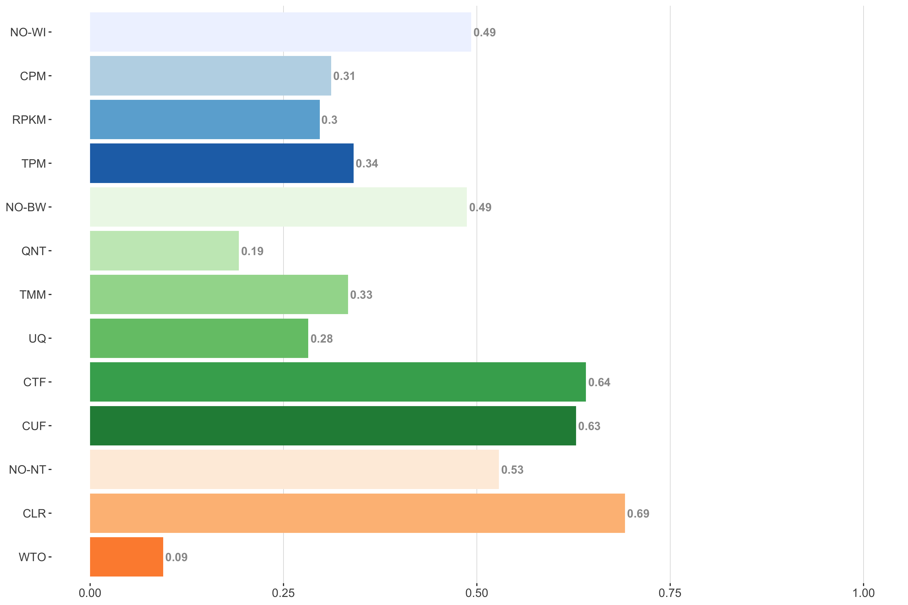
```

## 16 samples {.tabset .tabset-fade .tabset-pills}

### Tissue-naive Standard
```{r echo=FALSE, fig.cap="**Impact of individual methods on performance of workflows.** Each bar in the barplot corresponds to a specific method, showing the proportion of times (x-axis) that workflows including that particular method (y-axis) were significantly better than other workflows. In order to make the comparison of between-sample normalization methods fair, workflows also including CPM, RPKM, or TPM were left out because it is not possible to pair them with TMM or UQ normalization. Similarly, TMM and UQ methods are not included for “no within-sample normalization” (NO–WI).", out.width="100%"}
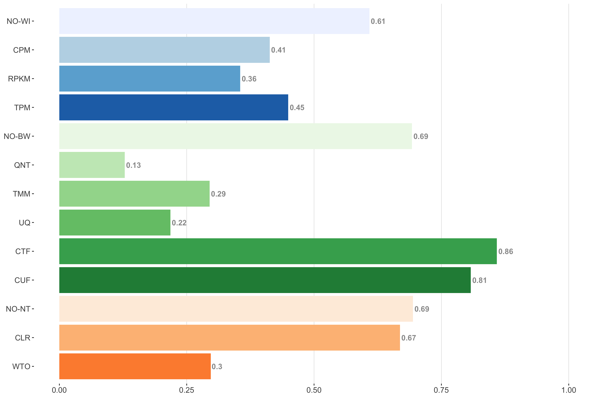
```

### Tissue-aware Standard
```{r echo=FALSE, fig.cap="**Impact of individual methods on performance of workflows.** Each bar in the barplot corresponds to a specific method, showing the proportion of times (x-axis) that workflows including that particular method (y-axis) were significantly better than other workflows. In order to make the comparison of between-sample normalization methods fair, workflows also including CPM, RPKM, or TPM were left out because it is not possible to pair them with TMM or UQ normalization. Similarly, TMM and UQ methods are not included for “no within-sample normalization” (NO–WI).", out.width="100%"}
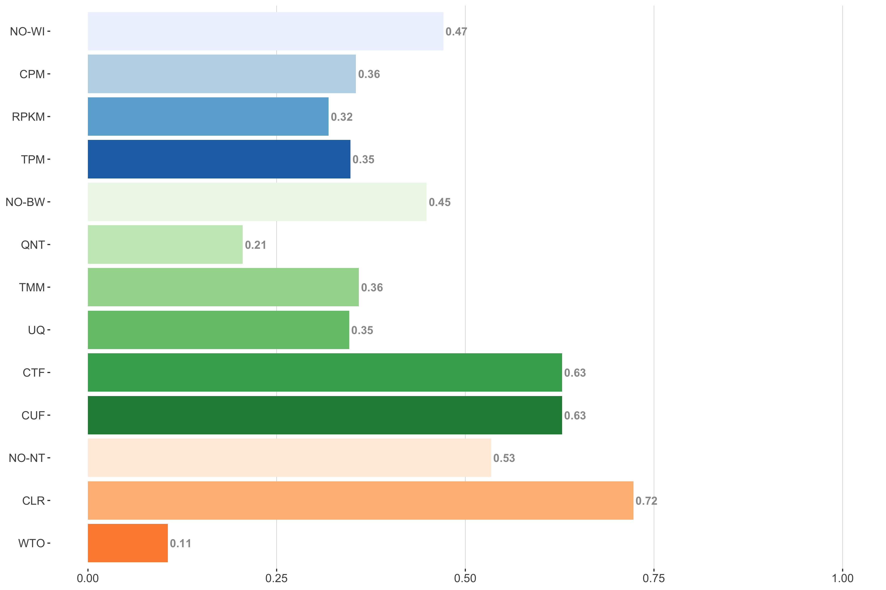
```

## 25 samples {.tabset .tabset-fade .tabset-pills}

### Tissue-naive Standard
```{r echo=FALSE, fig.cap="**Impact of individual methods on performance of workflows.** Each bar in the barplot corresponds to a specific method, showing the proportion of times (x-axis) that workflows including that particular method (y-axis) were significantly better than other workflows. In order to make the comparison of between-sample normalization methods fair, workflows also including CPM, RPKM, or TPM were left out because it is not possible to pair them with TMM or UQ normalization. Similarly, TMM and UQ methods are not included for “no within-sample normalization” (NO–WI).", out.width="100%"}
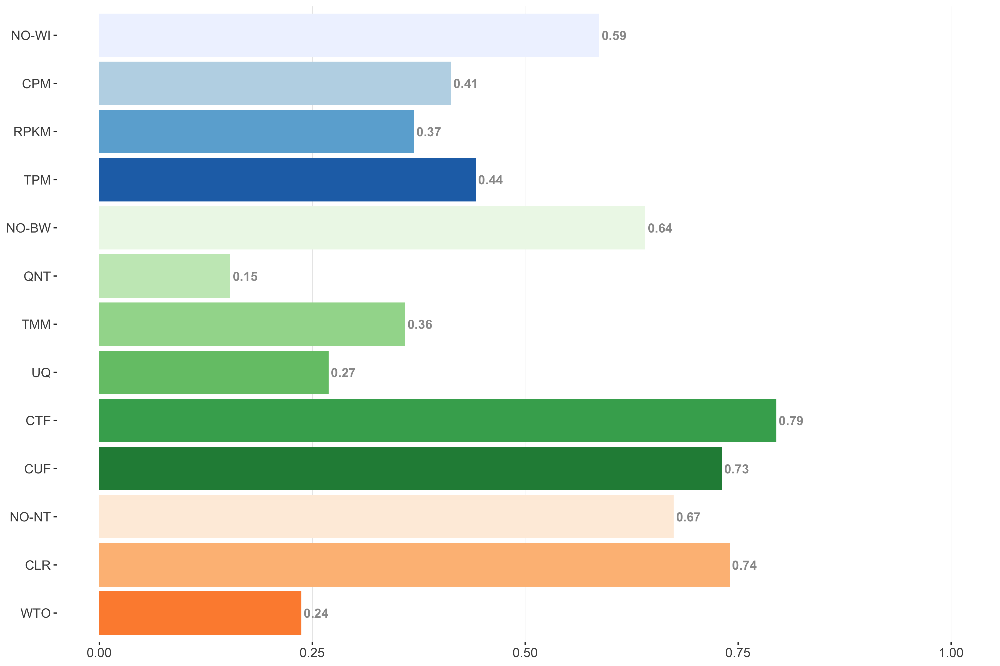
```

### Tissue-aware Standard
```{r echo=FALSE, fig.cap="**Impact of individual methods on performance of workflows.** Each bar in the barplot corresponds to a specific method, showing the proportion of times (x-axis) that workflows including that particular method (y-axis) were significantly better than other workflows. In order to make the comparison of between-sample normalization methods fair, workflows also including CPM, RPKM, or TPM were left out because it is not possible to pair them with TMM or UQ normalization. Similarly, TMM and UQ methods are not included for “no within-sample normalization” (NO–WI).", out.width="100%"}
 
```

## 40 samples {.tabset .tabset-fade .tabset-pills}

### Tissue-naive Standard
```{r echo=FALSE, fig.cap="**Impact of individual methods on performance of workflows.** Each bar in the barplot corresponds to a specific method, showing the proportion of times (x-axis) that workflows including that particular method (y-axis) were significantly better than other workflows. In order to make the comparison of between-sample normalization methods fair, workflows also including CPM, RPKM, or TPM were left out because it is not possible to pair them with TMM or UQ normalization. Similarly, TMM and UQ methods are not included for “no within-sample normalization” (NO–WI).", out.width="100%"}
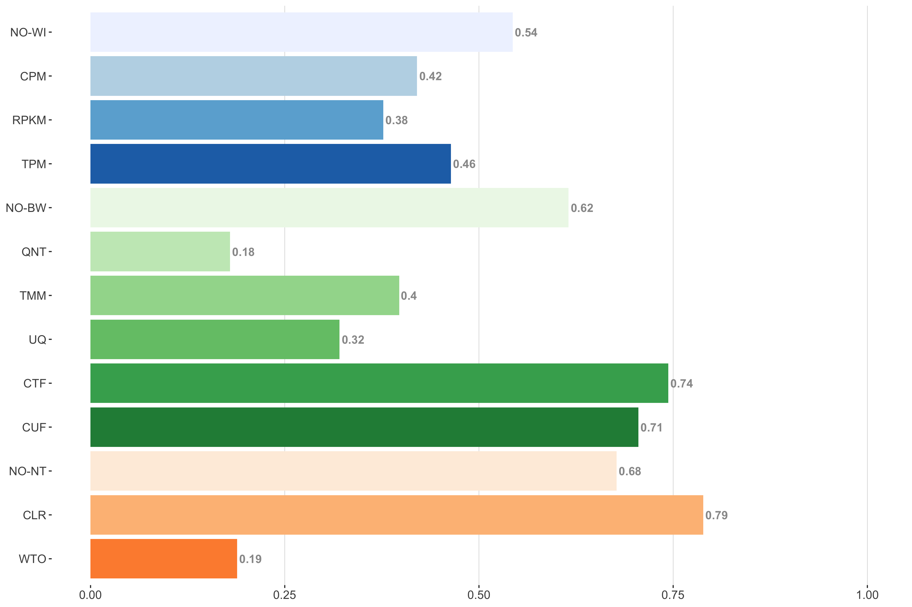
```

### Tissue-aware Standard
```{r echo=FALSE, fig.cap="**Impact of individual methods on performance of workflows.** Each bar in the barplot corresponds to a specific method, showing the proportion of times (x-axis) that workflows including that particular method (y-axis) were significantly better than other workflows. In order to make the comparison of between-sample normalization methods fair, workflows also including CPM, RPKM, or TPM were left out because it is not possible to pair them with TMM or UQ normalization. Similarly, TMM and UQ methods are not included for “no within-sample normalization” (NO–WI).", out.width="100%"}
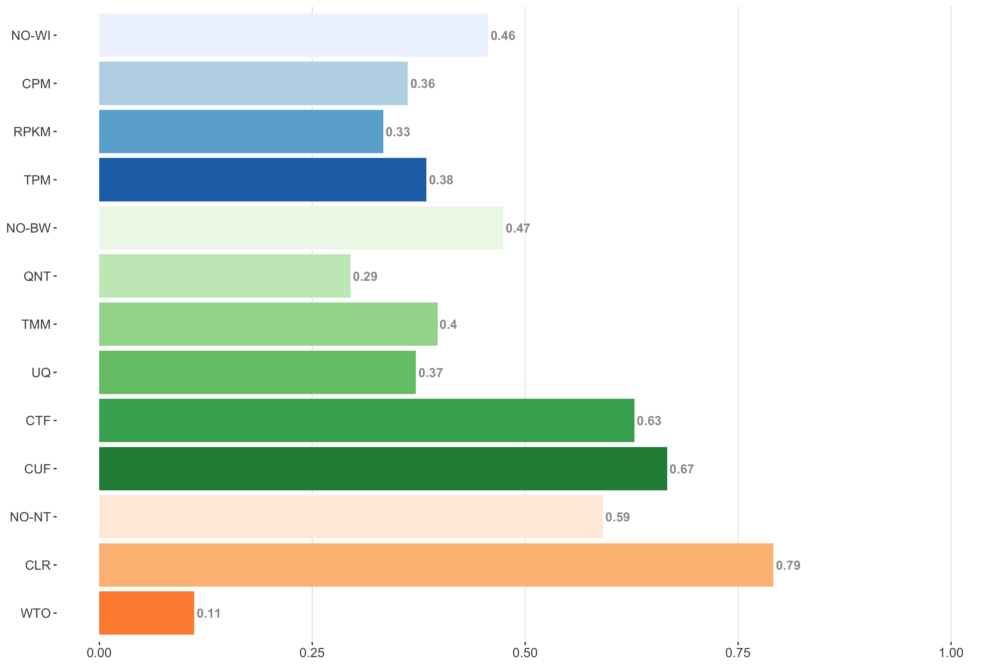
```

# Consistency of Workflows with Varying Sample Size {.tabset .tabset-fade .tabset-pills}
Sample size refers to the number of samples used to create a network.

## Tissue-naive Standard
```{r echo=FALSE, fig.cap="The heatmap shows the number of times (cell color) each workflow (row) outperforms other workflows as sample size varies (columns), when the resulting coexpression networks are evaluated based on the tissue-naive gold standard. The darkest colors indicate workflows that are significantly better than the most other workflows. In addition, the top 5 workflows in each column are marked with their rank, with ties given minimum rank.", out.width = '100%'}
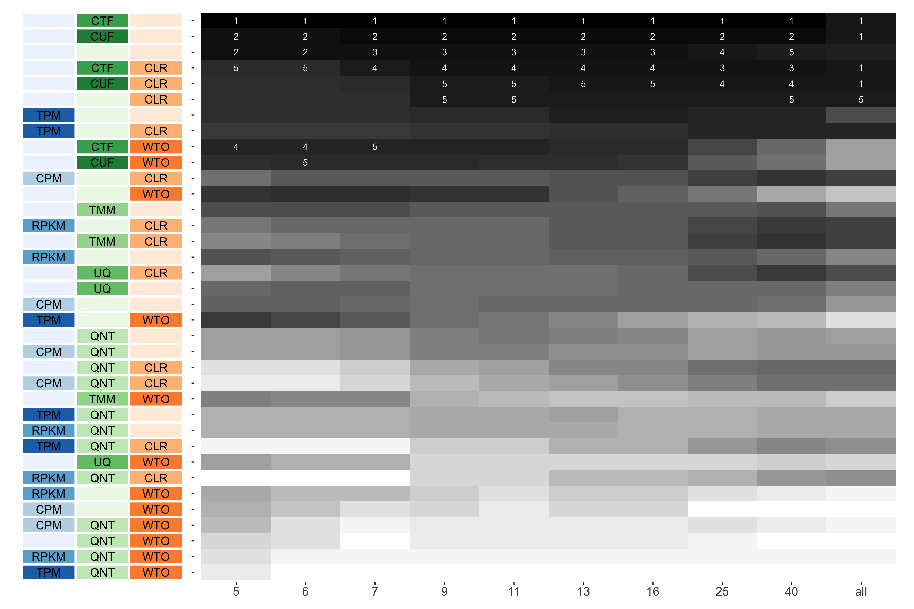
```

## Tissue-aware Standard
```{r echo=FALSE, fig.cap="The heatmap shows the number of times (cell color) each workflow (row) outperforms other workflows as sample size varies (columns), when the resulting coexpression networks are evaluated based on the tissue-aware gold standard. The darkest colors indicate workflows that are significantly better than the most other workflows. In addition, the top 5 workflows in each column are marked with their rank, with ties given minimum rank.", out.width = '100%'}
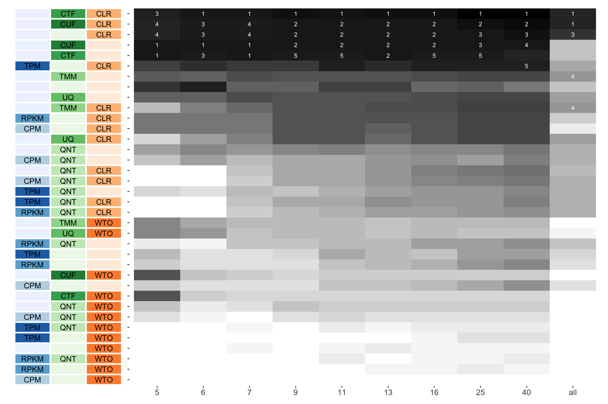
```

# Consistency of Workflows with Varying Sample Similarity {.tabset .tabset-fade .tabset-pills}
Sample gene expression similarity is determined by subsetting all samples to the 50% most variable genes in the tissue it came from, then calculating the spearman correlation between all sample pairs in the experiment and taking the median value.

## Tissue-naive Standard
```{r echo=FALSE, fig.cap="The heatmap shows the number of times (cell color) each workflow (row) outperforms other workflows as sample similarity varies (columns), when the resulting coexpression networks are evaluated based on the tissue-naive gold standard. The darkest colors indicate workflows that are significantly better than the most other workflows. In addition, the top 5 workflows in each column are marked with their rank, with ties given minimum rank.", out.width = '100%'}
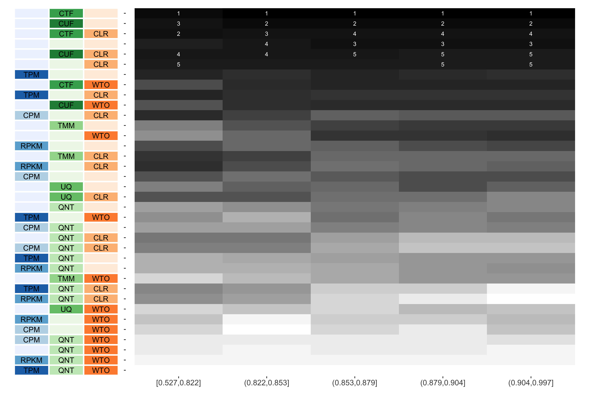
```

## Tissue-aware Standard
```{r echo=FALSE, fig.cap="The heatmap shows the number of times (cell color) each workflow (row) outperforms other workflows as sample similarity varies (columns), when the resulting coexpression networks are evaluated based on the tissue-aware gold standard. The darkest colors indicate workflows that are significantly better than the most other workflows. In addition, the top 5 workflows in each column are marked with their rank, with ties given minimum rank.", out.width = '100%'}
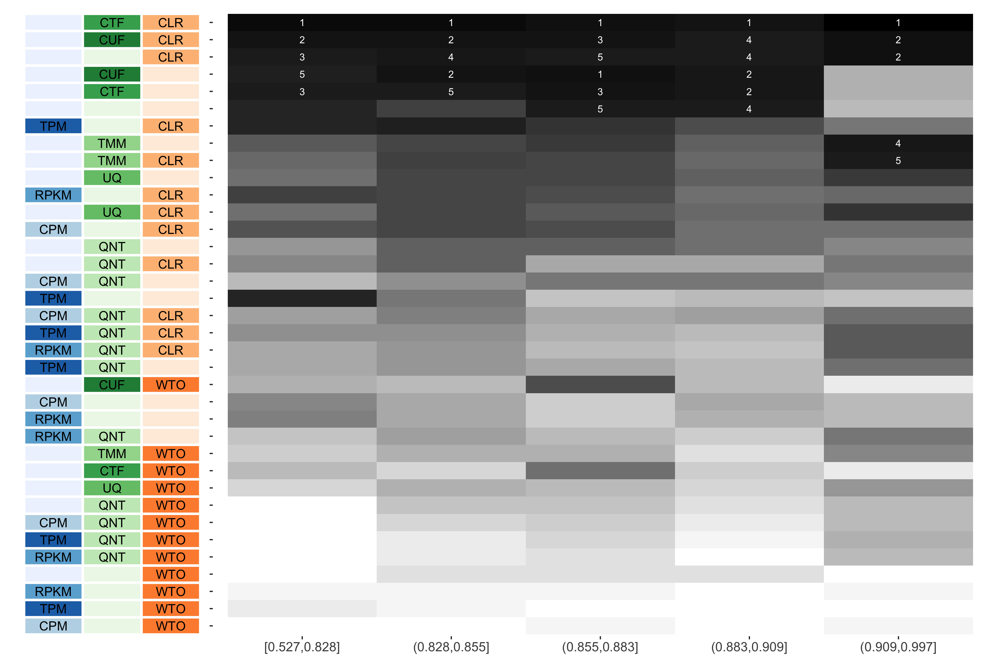
```

# Consistency of Workflows with Varying Read Count Diversity {.tabset .tabset-fade .tabset-pills}
Count sum diversity is calulated for a given experiment by taking the standard deviation of the sum of counts in each sample.

## Tissue-naive Standard
```{r echo=FALSE, fig.cap="The heatmap shows the number of times (cell color) each workflow (row) outperforms other workflows as read count diversity varies (columns), when the resulting coexpression networks are evaluated based on the tissue-naive gold standard. The darkest colors indicate workflows that are significantly better than the most other workflows. In addition, the top 5 workflows in each column are marked with their rank, with ties given minimum rank.", out.width = '100%'}
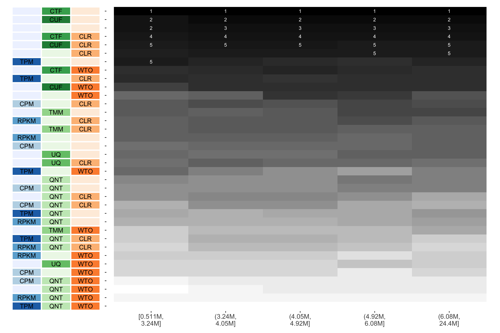
```

## Tissue-aware Standard
```{r echo=FALSE, fig.cap="The heatmap shows the number of times (cell color) each workflow (row) outperforms other workflows as read count diversity varies (columns), when the resulting coexpression networks are evaluated based on the tissue-aware gold standard. The darkest colors indicate workflows that are significantly better than the most other workflows. In addition, the top 5 workflows in each column are marked with their rank, with ties given minimum rank.", out.width = '100%'}
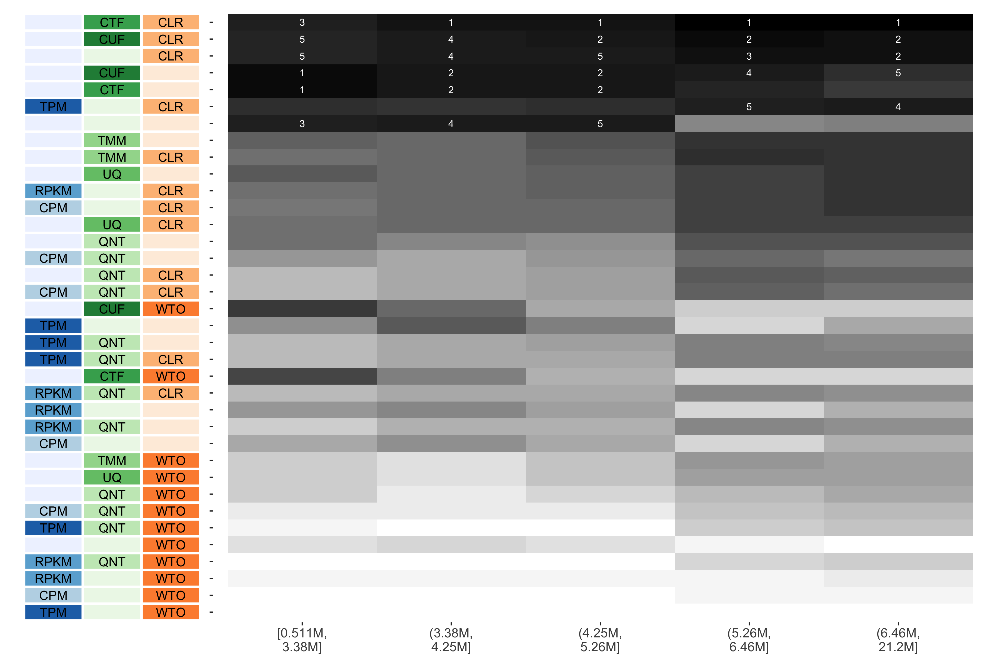
```

# Consistency of Workflows with Varying Tissue {.tabset .tabset-fade .tabset-pills}
Tissue refers to the tissue that the samples were taken from.

## Tissue-naive Standard
```{r echo=FALSE, fig.cap="The heatmap shows the number of times (cell color) each workflow (row) outperforms other workflows in different tissues (columns), when the resulting coexpression networks are evaluated based on the tissue-naive gold standard. The darkest colors indicate workflows that are significantly better than the most other workflows. In addition, the top 5 workflows in each column are marked with their rank, with ties given minimum rank.", out.width = '100%'}
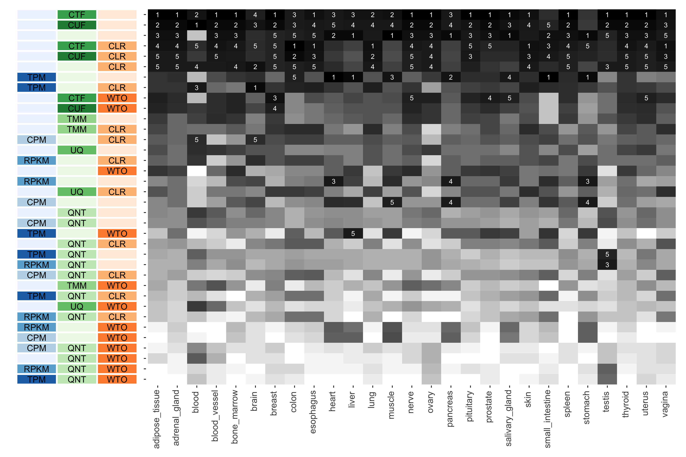
```

## Tissue-aware Standard
```{r echo=FALSE, fig.cap="The heatmap shows the number of times (cell color) each workflow (row) outperforms other workflows in different tissues (columns), when the resulting coexpression networks are evaluated based on the tissue-aware gold standard. The darkest colors indicate workflows that are significantly better than the most other workflows. In addition, the top 5 workflows in each column are marked with their rank, with ties given minimum rank.", out.width = '100%'}
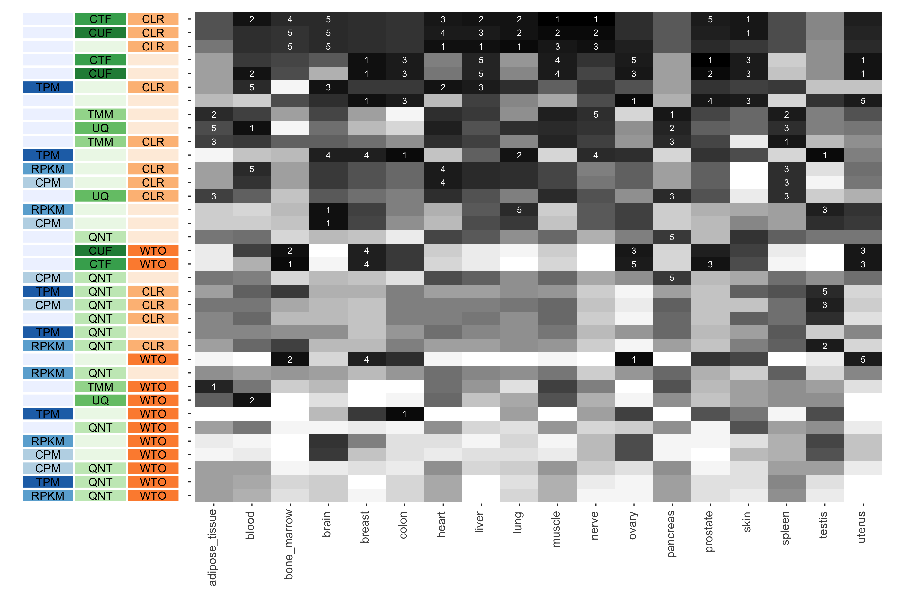
```