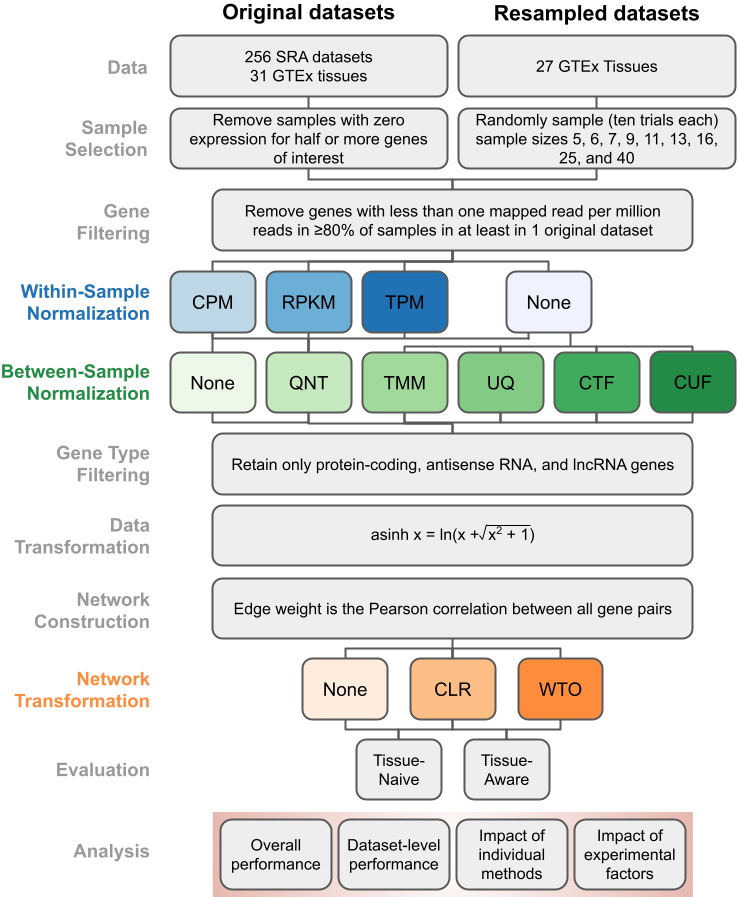

```{r include=FALSE}
library(rmarkdown)
library(knitr)
```

<div class = "row">
  
<div class = "col-md-6">
<br><br><br><br>
```{r echo=FALSE, out.width = "100%"}

```
</div>
  
<div class = "col-md-6">
## Overview
This website contains all the results from our paper _Robust normalization and transformation techniques for constructing gene coexpression networks from RNA-seq data_, along with several additional results. These results are based on extensive benchmarking and analysis. Using the pipeline illustrated on the left (←),  we built over 80,000 coexpression networks using every combination of normalization and transformation methods to identify the best workflows for creating an accurate gene coexpression network from any typical RNA-seq experiment.

Results are divided by data source: the Genotype-Tissue Expression (GTEx) project, the Sequence Read Archive (SRA), and new datasets created by resampling samples from GTEx datasets (GTEx Resampling).

Researchers can use this website to easily examine the performance of various workflows and make appropriate choices for coexpression analysis based on the properties of their RNA-seq dataset of interest.

## Data & Networks
We obtained all the gene expression datasets from the Recount2 database. Recount2 contains data from both the GTEx project and the SRA repository that have been uniformly quality-controlled, aligned, and quantified to the number of reads per gene in the genome.

- Datasets from the **GTEx** project allowed us to assess method performance on **large, relatively homogeneous datasets with high-sequencing depth and quality.**
- Datasets from **SRA**, on the other hand, were representative of **heterogeneous, mostly small experiments (median of 12 samples) that are generated by individual labs, with a range of sequencing depths and qualities.**

In total, for each of the 287 datasets from GTEx and SRA, we built one coexpression network per dataset using each of the 30 workflows, resulting in 8,610 coexpression networks. Later on, we create 2,430 additional datasets generated by resampling GTEx that, which when run through all the workflows, resulted in another 72,900 networks. Each GTEx network contains 20,418 genes while each SRA network contains 22,084 genes, and all networks are fully connected with edges weighted by their strength of correlation. Each of these networks were evaluated using the tissue-naive gold-standard and, whenever applicable, the tissue-aware gold-standard.

## Evaluation
In all cases, each network was evaluated for its ability to recapitulate experimentally-verified gene co-annotations to specific Biological Process terms in the Gene Ontology. Further, since the goal of measuring transcriptomes is to capture both generic and tissue-aware events, we also tested these networks on tissue-aware standards in as many tissues as possible by using genes known to be expressed in a given tissue to subset the naive gold standard. We quantified the accuracy of each network based on both naive and tissue-aware standards using three different performance measures: Log~2~(auPRC/prior), auROC, and Log~2~(p20r/prior), where auPRC is the area under the Precision-Recall Curve, prior is the expected auPRC from a random classifier, auROC is the area under the ROC Curve, and p20r is precision at 20% recall. We chose to use Log~2~(auPRC/prior) in the main paper, as it is a better indicator of overall performance when the negative examples vastly outnumber the positive examples in the gold standard (as is the case in gene functional relationships) than a measure like auROC, but have displayed results by other measures for select figures here.


</div>
</div>

